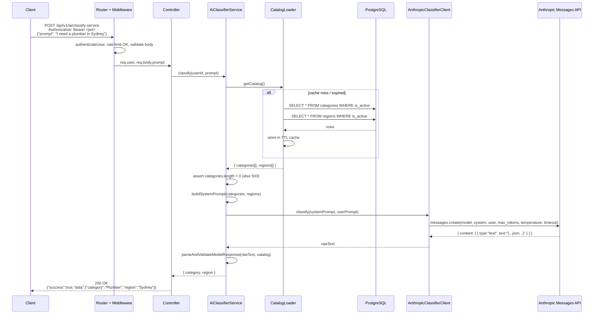
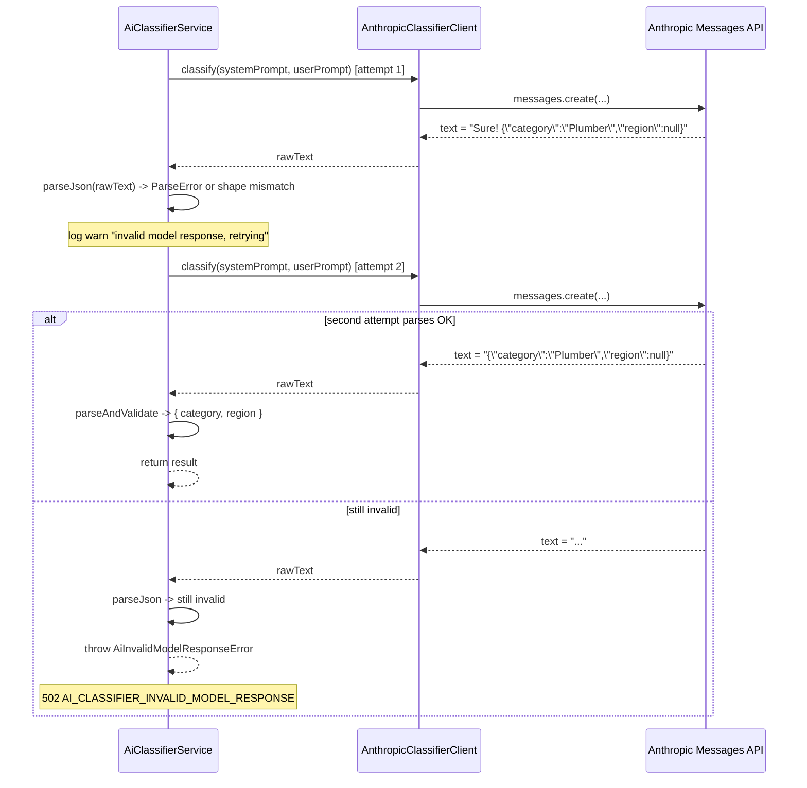

# Design Document

## Overview

The AI Service Classifier is a new backend module (`src/modules/ai-classifier/`) that exposes a single authenticated endpoint, `POST /api/v1/ai/classify-service`, which turns a free-text user prompt into a structured `{ category, region }` pair where each value is either the canonical `name` of an active row in the catalog tables or `null`.

Internally the request flows through:

1. **Auth + per-user rate limiter** (Express middleware reused / extended from existing infrastructure).
2. **Validation** (Joi) — rejects malformed bodies before any external call is made.
3. **Controller** — adapts Express request/response to the service layer.
4. **Service** — orchestrates catalog loading, prompt construction, Anthropic call, response parsing, and catalog validation.
5. **Catalog Loader** — reads active Categories and Regions from PostgreSQL via Sequelize, with an optional in-memory TTL cache.
6. **Anthropic Client** — a thin wrapper around `@anthropic-ai/sdk` exposing a single `classify(...)` method so that tests can substitute a mock.

The module deliberately mirrors the file layout, naming, dependency-injection style, and error envelope of the existing `category` and `region` modules so it is consistent with the rest of the codebase.

### Goals

- A single LLM-backed endpoint that returns only catalog-valid values (or `null`).
- Strict input validation and per-user rate limiting so we never burn Anthropic quota on bad or abusive traffic.
- Observability without leaking prompt content into INFO-level logs.
- Configurability of model, timeouts, token budget, temperature, rate limit, and catalog cache TTL via environment variables.
- Testability: the Anthropic SDK is fully replaceable with a mock, so we can run property-based and integration tests deterministically.

### Non-Goals

- No streaming responses — we use a single-shot Messages API call.
- No persistence of classifier requests or responses to the database.
- No multi-language or multi-tenant prompt customization (one canonical English system prompt).
- No fine-tuning or function-calling. The output contract is enforced by prompt + post-validation.

## Architecture

### Component Diagram

```mermaid
flowchart LR
    Client[API Client]

    subgraph Express[Express App]
        Router[/api/v1/ai/classify-service/]
        AuthMW[authenticateUser]
        RateMW[aiClassifierRateLimiter]
        ValidMW[validate aiClassifyBodySchema]
        Controller[AiClassifierController]
    end

    subgraph Module[ai-classifier module]
        Service[AiClassifierService]
        CatalogLoader[CatalogLoader<br/>+ in-memory TTL cache]
        AnthropicClient[AnthropicClassifierClient<br/>wraps @anthropic-ai/sdk]
        PromptBuilder[buildSystemPrompt]
        ResponseParser[parseAndValidate<br/>ModelResponse]
    end

    subgraph DB[(PostgreSQL)]
        Categories[(categories<br/>is_active = true)]
        Regions[(regions<br/>is_active = true)]
    end

    Anthropic[Anthropic Messages API]

    Client -->|POST /ai/classify-service| Router
    Router --> AuthMW --> RateMW --> ValidMW --> Controller
    Controller --> Service
    Service --> CatalogLoader
    Service --> PromptBuilder
    Service --> AnthropicClient
    Service --> ResponseParser
    CatalogLoader --> Categories
    CatalogLoader --> Regions
    AnthropicClient --> Anthropic
    Service -->|"{ category, region }"| Controller
    Controller -->|200 JSON| Client
```

### Sequence: Successful Classify Request



### Sequence: JSON Retry Path



The retry budget is exactly **one** retry per request, as specified in Requirement 6.8–6.10. Retries use the same system prompt and user prompt; we do not append "please reply in JSON" reminders, because a deterministic prompt makes the retry meaningfully different only with `temperature > 0`. Operators can raise temperature via `AI_CLASSIFIER_TEMPERATURE` if they want retries to differ.

## Components and Interfaces

### Module Layout

```
src/modules/ai-classifier/
├── ai-classifier.controller.ts      # Express controller
├── ai-classifier.service.ts         # Orchestration
├── ai-classifier.routes.ts          # Express router (mounted at /ai)
├── ai-classifier.validation.ts      # Joi schema for the request body
├── ai-classifier.swagger.ts         # JSDoc-style swagger annotations
├── ai-classifier.interface.ts       # DTOs and shared types
├── ai-classifier.errors.ts          # Module-specific error classes + error codes enum
├── ai-classifier.rate-limiter.ts    # express-rate-limit keyed by user id
├── anthropic-client.ts              # Wrapper around @anthropic-ai/sdk
├── catalog-loader.ts                # Sequelize-backed loader with optional TTL cache
├── prompt-builder.ts                # Pure function: builds the system prompt
├── response-parser.ts               # Pure function: parses + validates model output
└── index.ts                         # Barrel: exports `aiClassifierRoutes`, classes
```

The router is mounted in `src/routes/v1/index.ts`:

```ts
// src/routes/v1/index.ts (added)
import { aiClassifierRoutes } from '../../modules/ai-classifier';
// ...
router.use('/ai', aiClassifierRoutes);
```

### Public Interfaces

```ts
// ai-classifier.interface.ts

export interface ClassifyRequestBody {
  prompt: string;
}

export interface ClassificationResult {
  category: string | null;
  region: string | null;
}

export interface CatalogSnapshot {
  categories: ReadonlyArray<CatalogCategory>;
  regions: ReadonlyArray<CatalogRegion>;
  loadedAt: number; // epoch ms — used to compute TTL freshness
}

export interface CatalogCategory {
  name: string;
  description: string | null;
}

export interface CatalogRegion {
  name: string;
}
```

```ts
// ai-classifier.service.ts

export class AiClassifierService {
  constructor(deps: {
    catalogLoader: CatalogLoader;
    anthropicClient: AnthropicClassifierClient;
    logger?: typeof import('../../common/utils/logger').logger;
  });

  classify(input: { userId: string; prompt: string; requestId: string }): Promise<ClassificationResult>;
}
```

The service constructor takes its dependencies as an object, which makes it trivial to construct with a fake Anthropic client and an in-memory catalog loader inside tests.

### Controller

```ts
// ai-classifier.controller.ts (sketch)

export class AiClassifierController {
  private service: AiClassifierService;
  constructor(service?: AiClassifierService) {
    this.service = service ?? buildDefaultAiClassifierService();
  }

  classify = asyncHandler(async (req: Request, res: Response) => {
    const authReq = req as AuthenticatedRequest;
    const result = await this.service.classify({
      userId: authReq.user.userId,
      prompt: (req.body as ClassifyRequestBody).prompt,
      requestId: (req.headers['x-request-id'] as string | undefined) ?? randomUUID(),
    });
    ApiResponse.success(res, result, 'Service classified successfully');
  });
}
```

`buildDefaultAiClassifierService()` is a small factory that wires up `createAnthropicClassifierClient(...)` and `createCatalogLoader(...)` from the env config. Using a factory (rather than calling `new` inside the constructor) keeps the controller test-friendly and avoids running env-validation side effects during unit tests of pure helpers.

### Routes

```ts
// ai-classifier.routes.ts (sketch)

import { Router, type RequestHandler } from 'express';
import { authenticateUser, validate } from '../../middleware';
import { aiClassifierRateLimiter } from './ai-classifier.rate-limiter';
import { classifyServiceBodySchema } from './ai-classifier.validation';
import { AiClassifierController } from './ai-classifier.controller';

const router = Router();
const controller = new AiClassifierController();

router.use(authenticateUser as unknown as RequestHandler);
router.post(
  '/classify-service',
  aiClassifierRateLimiter,
  validate(classifyServiceBodySchema, 'body'),
  controller.classify,
);

export default router;
```

The `authenticateUser` middleware (defined in `src/middleware/auth.middleware.ts`) is applied at the router level so every endpoint added to this module in the future is authenticated by default. Validation runs **after** auth and rate-limit, which guarantees that unauthenticated or rate-limited requests never reach Joi (and therefore never reach the Anthropic SDK either, satisfying Req 1.6, 2.6, 7.3).

### Anthropic SDK Wrapper

```ts
// anthropic-client.ts — interface-first so tests can mock

export interface AnthropicClassifierClient {
  classify(input: {
    systemPrompt: string;
    userPrompt: string;
    /** Override per call; falls back to client defaults from env. */
    timeoutMs?: number;
  }): Promise<{ rawText: string; modelId: string; latencyMs: number }>;
}

export interface AnthropicClientOptions {
  apiKey: string;
  model: string;          // ANTHROPIC_CLASSIFIER_MODEL, default 'claude-haiku-4-5'
  maxTokens: number;      // AI_CLASSIFIER_MAX_TOKENS, default 256
  temperature: number;    // AI_CLASSIFIER_TEMPERATURE, default 0
  timeoutMs: number;      // AI_CLASSIFIER_TIMEOUT_MS, default 15000
}

export function createAnthropicClassifierClient(
  options: AnthropicClientOptions,
): AnthropicClassifierClient;
```

#### Construction

```ts
import Anthropic from '@anthropic-ai/sdk';

export function createAnthropicClassifierClient(
  options: AnthropicClientOptions,
): AnthropicClassifierClient {
  const sdk = new Anthropic({
    apiKey: options.apiKey,
    timeout: options.timeoutMs, // SDK-level default; can be overridden per call
  });

  return {
    async classify({ systemPrompt, userPrompt, timeoutMs }) {
      const startedAt = Date.now();
      try {
        const response = await sdk.messages.create(
          {
            model: options.model,
            max_tokens: options.maxTokens,
            temperature: options.temperature,
            system: systemPrompt,
            messages: [{ role: 'user', content: userPrompt }],
          },
          { timeout: timeoutMs ?? options.timeoutMs },
        );
        const block = response.content.find((b) => b.type === 'text');
        const rawText = block && block.type === 'text' ? block.text : '';
        return {
          rawText,
          modelId: response.model,
          latencyMs: Date.now() - startedAt,
        };
      } catch (err) {
        throw normalizeAnthropicError(err); // see Error Handling
      }
    },
  };
}
```

#### Why an Interface

Defining `AnthropicClassifierClient` as an interface — and constructing the real implementation through a factory — gives us three properties at once:

- **Mockability**: tests build a fake `{ classify: jest.fn() }` and inject it into `AiClassifierService`. No SDK module mocking, no network sockets, no env vars required to run unit tests.
- **Determinism for PBT**: the fake client can return canned strings in response to specific inputs, so property tests over the service layer don't depend on Anthropic's behaviour.
- **Replaceability**: if the SDK is renamed or replaced, only `anthropic-client.ts` changes.

#### Timeout Handling

The `@anthropic-ai/sdk` constructor accepts `timeout` (ms), and `messages.create` accepts a per-call `{ timeout }`. The classifier sets both to `AI_CLASSIFIER_TIMEOUT_MS` (default 15 s). When the timeout fires, the SDK throws an `APIConnectionTimeoutError`, which `normalizeAnthropicError` maps to `AiProviderTimeoutError` → HTTP 504 (Req 5.8).

#### Retry Handling

The `@anthropic-ai/sdk` performs its own automatic retries on transient errors (configurable via `maxRetries`); we **leave SDK retries at default (2)** since these handle transport-level flakes. Application-level retries (the JSON-retry path) are owned by `AiClassifierService` and are limited to exactly one extra attempt as specified in Req 6.8.

#### Startup Configuration Check

In `src/config/env.ts` we add `ANTHROPIC_API_KEY` to the Joi schema (optional, so dev environments without the key don't fail to boot). The classifier module's `index.ts` performs a one-time check at module load:

```ts
if (!env.aiClassifier.anthropicApiKey) {
  logger.error('ANTHROPIC_API_KEY is not set; AI classifier endpoint will return 503');
}
```

This satisfies Req 5.7. Requests still reach the route, but the service short-circuits with a 503 + code `AI_CLASSIFIER_PROVIDER_ERROR`. We deliberately do not crash the whole backend; the rest of the API stays up.

### Catalog Loader

```ts
// catalog-loader.ts

export interface CatalogLoader {
  getCatalog(): Promise<CatalogSnapshot>;
  /** Test-only; clears the in-memory cache. */
  invalidate(): void;
}

export interface CatalogLoaderOptions {
  cacheTtlMs: number; // AI_CLASSIFIER_CATALOG_CACHE_TTL_MS, default 60000; 0 disables cache
}

export function createCatalogLoader(options: CatalogLoaderOptions): CatalogLoader;
```

#### Sequelize Queries

```ts
import { Category, Region } from '../../models';

async function fetchFresh(): Promise<CatalogSnapshot> {
  const [categories, regions] = await Promise.all([
    Category.findAll({
      where: { isActive: true },
      attributes: ['name', 'description'],
      order: [['sortOrder', 'ASC'], ['name', 'ASC']],
    }),
    Region.findAll({
      where: { isActive: true },
      attributes: ['name'],
      order: [['name', 'ASC']],
    }),
  ]);

  return {
    categories: categories.map((c) => ({ name: c.name, description: c.description })),
    regions: regions.map((r) => ({ name: r.name })),
    loadedAt: Date.now(),
  };
}
```

Both queries use the existing Sequelize models. We select only the fields we render into the system prompt; this keeps the in-memory snapshot small and the prompt deterministic.

#### TTL Cache

```ts
export function createCatalogLoader(options: CatalogLoaderOptions): CatalogLoader {
  let cached: CatalogSnapshot | null = null;
  let inFlight: Promise<CatalogSnapshot> | null = null;

  async function getCatalog() {
    const now = Date.now();
    if (cached && options.cacheTtlMs > 0 && now - cached.loadedAt < options.cacheTtlMs) {
      return cached;
    }
    if (inFlight) return inFlight; // single-flight: collapse concurrent refreshes
    inFlight = fetchFresh()
      .then((snap) => {
        cached = snap;
        return snap;
      })
      .finally(() => {
        inFlight = null;
      });
    return inFlight;
  }

  return {
    getCatalog,
    invalidate: () => {
      cached = null;
    },
  };
}
```

Behaviour:

- `cacheTtlMs = 0` disables caching (every request hits the database). Useful for tests or for environments where admin-edited catalogs need to be visible immediately.
- `cacheTtlMs > 0` (default 60_000 ms) serves cached results until expiry, then refreshes on the next request.
- Single-flight: if 50 requests arrive while the cache is cold, only one DB round-trip is in flight; the other 49 await the same promise.
- `invalidate()` is exported only for tests. Admin-side mutations to categories/regions take effect within `cacheTtlMs`, which we accept as an explicit Req 3.6 trade-off.
- DB errors propagate up. The service catches them and maps to HTTP 503 + `AI_CLASSIFIER_CATALOG_UNAVAILABLE` (Req 3.7).

### Prompt Builder

```ts
// prompt-builder.ts

export function buildClassifierSystemPrompt(catalog: CatalogSnapshot): string;
```

A pure function. Given a catalog snapshot it returns a deterministic string (so tests can assert on its contents). The catalog is rendered as bullet lists, with the category description (if present) included as guidance.

#### System Prompt Template

The template is fully deterministic given the same catalog input.

```text
You are a service classifier for LocalLoom, an Australian platform connecting customers with local
tradies. You receive a single user message describing the service the customer needs.

Your job is to map the user's message to two fields drawn from fixed catalogs:

  - "category": the single best-matching service category from the CATEGORY LIST below,
    or null if no category is a reasonable match.
  - "region": the region from the REGION LIST below that the user explicitly mentions,
    or null if the user did not mention a region or the mentioned location is not in the list.

Rules:
  1. The "category" value MUST be either null or an exact, case-sensitive name from the CATEGORY LIST.
  2. The "region" value MUST be either null or an exact, case-sensitive name from the REGION LIST.
  3. Do NOT invent categories or regions. Do NOT translate, abbreviate, or pluralize them.
  4. If the user's message contains no clear service intent, return {"category": null, "region": null}.
  5. Return ONLY a single JSON object on one line, with exactly the keys "category" and "region",
     and no surrounding prose, markdown, code fences, or commentary.

CATEGORY LIST:
  - "<name 1>" — <description 1 if present>
  - "<name 2>" — <description 2 if present>
  ...

REGION LIST:
  - "<region name 1>"
  - "<region name 2>"
  ...

Output format (this exact shape, nothing else):
{"category": <string|null>, "region": <string|null>}
```

Notes on the template:

- Categories are rendered as `- "<name>" — <description>` when a description exists, otherwise just `- "<name>"`.
- Regions are rendered as a simple bulleted list of names since the `regions` table only stores names.
- Names are double-quoted to make their boundaries unambiguous (important when names contain spaces, e.g. `"North Shore"`).
- The instruction to use exact catalog names is reinforced by post-validation in `response-parser.ts` — the prompt is best-effort, the parser is the actual guardrail.
- An empty `REGION LIST` is allowed and is rendered as the literal text `(no regions configured)`. The instructions still tell the model to return `null` for region in that case.
- An empty `CATEGORY LIST` MUST NOT reach this builder — the service short-circuits with HTTP 503 before calling Anthropic (Requirement 12.1).

### Response Parser

```ts
// response-parser.ts

export interface ParsedModelResponse {
  category: string | null;
  region: string | null;
}

/**
 * Parses raw model text into a ParsedModelResponse, or throws if invalid.
 * Throws AiInvalidModelResponseError for any of:
 *   - text is not parseable JSON
 *   - parsed value is not an object
 *   - parsed object lacks `category` or `region` keys
 *   - `category` or `region` is not string|null
 *
 * Then resolves catalog membership (case-insensitive) into canonical names.
 */
export function parseAndValidateModelResponse(
  rawText: string,
  catalog: CatalogSnapshot,
): ParsedModelResponse;
```

Catalog matching is case-insensitive: the parser builds two `Map<string, string>` lookups (lowercased name → canonical name) from the catalog and uses them to resolve the model's output. Anything not found is mapped to `null`, satisfying Req 6.4–6.7.

### Configuration

#### `env.ts` Additions

The classifier-specific config is grouped under `env.aiClassifier`:

```ts
// inside env.ts schema
ANTHROPIC_API_KEY: Joi.string().allow('').default(''),
ANTHROPIC_CLASSIFIER_MODEL: Joi.string().default('claude-haiku-4-5'),
AI_CLASSIFIER_MAX_TOKENS: Joi.number().integer().min(1).default(256),
AI_CLASSIFIER_TEMPERATURE: Joi.number().min(0).max(1).default(0),
AI_CLASSIFIER_TIMEOUT_MS: Joi.number().integer().min(1).default(15000),
AI_CLASSIFIER_RATE_LIMIT_MAX: Joi.number().integer().min(1).default(30),
AI_CLASSIFIER_RATE_LIMIT_WINDOW_MS: Joi.number().integer().min(1).default(60000),
AI_CLASSIFIER_CATALOG_CACHE_TTL_MS: Joi.number().integer().min(0).default(60000),
AI_CLASSIFIER_DEBUG_LOG_PROMPT: Joi.boolean().truthy('true').falsy('false').default(false),

// inside the exported `env` object
aiClassifier: {
  anthropicApiKey: envVars.ANTHROPIC_API_KEY as string,
  model: envVars.ANTHROPIC_CLASSIFIER_MODEL as string,
  maxTokens: envVars.AI_CLASSIFIER_MAX_TOKENS as number,
  temperature: envVars.AI_CLASSIFIER_TEMPERATURE as number,
  timeoutMs: envVars.AI_CLASSIFIER_TIMEOUT_MS as number,
  rateLimitMax: envVars.AI_CLASSIFIER_RATE_LIMIT_MAX as number,
  rateLimitWindowMs: envVars.AI_CLASSIFIER_RATE_LIMIT_WINDOW_MS as number,
  catalogCacheTtlMs: envVars.AI_CLASSIFIER_CATALOG_CACHE_TTL_MS as number,
  debugLogPrompt: envVars.AI_CLASSIFIER_DEBUG_LOG_PROMPT as boolean,
},
```

#### `.env.example` Additions

Append to the existing `.env.example`:

```dotenv
# AI Classifier (Anthropic Claude)
# Required for the /api/v1/ai/classify-service endpoint to function in production.
ANTHROPIC_API_KEY=
# Model identifier. Default keeps us on the cheap, fast Haiku tier.
ANTHROPIC_CLASSIFIER_MODEL=claude-haiku-4-5
# Token budget per classify call. 256 is plenty for {"category":..., "region":...}.
AI_CLASSIFIER_MAX_TOKENS=256
# 0 = fully deterministic. Increase for diversity on JSON retries.
AI_CLASSIFIER_TEMPERATURE=0
# Anthropic call timeout in ms.
AI_CLASSIFIER_TIMEOUT_MS=15000
# Per-authenticated-user rate limit.
AI_CLASSIFIER_RATE_LIMIT_MAX=30
AI_CLASSIFIER_RATE_LIMIT_WINDOW_MS=60000
# In-memory TTL for the active categories+regions catalog. 0 disables the cache.
AI_CLASSIFIER_CATALOG_CACHE_TTL_MS=60000
# Set to true to log full user prompts at DEBUG level (PII risk; off by default).
AI_CLASSIFIER_DEBUG_LOG_PROMPT=false
```

### Rate Limiting

We add a new middleware in `ai-classifier.rate-limiter.ts` that uses `express-rate-limit` keyed by the authenticated user ID:

```ts
// ai-classifier.rate-limiter.ts
import rateLimit from 'express-rate-limit';
import { env } from '../../config/env';
import { AuthenticatedRequest } from '../../common/interfaces';
import { COMMON_MESSAGES } from '../../common/constants';

export const aiClassifierRateLimiter = rateLimit({
  windowMs: env.aiClassifier.rateLimitWindowMs,
  max: env.aiClassifier.rateLimitMax,
  standardHeaders: true,
  legacyHeaders: false,
  keyGenerator: (req) => {
    const authReq = req as AuthenticatedRequest;
    // authenticateUser has already run, so req.user.userId is set.
    return `ai-classifier:${authReq.user.userId}`;
  },
  handler: (_req, res) => {
    res.status(429).json({
      success: false,
      statusCode: 429,
      message: COMMON_MESSAGES.TOO_MANY_REQUESTS,
      errors: { code: 'AI_CLASSIFIER_RATE_LIMITED' },
    });
  },
});
```

- Defaults: 30 requests / 60 seconds / user (Req 7.1, 7.2).
- Order in the route: `authenticateUser` → `aiClassifierRateLimiter` → `validate` → `controller.classify`. This guarantees a 429 short-circuits before any DB or Anthropic work (Req 7.3).
- The global `apiLimiter` continues to apply at `app.ts` level (Req 7.4); the per-user limiter adds on top of it.
- Storage is the default in-memory store. For multi-instance deployments this is sufficient because each user is sticky to one node behind the load balancer. A Redis store can be added in a future iteration without changing the surface.

### Logging

We reuse the existing `winston` logger from `src/common/utils/logger.ts`. Every classify request emits a structured log entry tagged with `module: 'ai-classifier'`.

#### What IS Logged

| Level | Field                     | Example                                              | Reason                                |
|-------|---------------------------|------------------------------------------------------|---------------------------------------|
| info  | `userId`                  | `"a1b2c3d4-..."`                                     | Req 8.1                               |
| info  | `requestId`               | `"4f9c..."`                                          | Req 8.1                               |
| info  | `model`                   | `"claude-haiku-4-5"`                                 | Req 8.1                               |
| info  | `latencyMs`               | `412`                                                | Req 8.1                               |
| info  | `outcome`                 | `"ok" \| "validation_error" \| "provider_timeout" \| ...` | Req 8.1                          |
| info  | `promptLength`            | `47`                                                 | Req 8.2                               |
| info  | `categoryReturned`        | `"Plumber" \| null`                                  | Useful for analytics, not PII         |
| info  | `regionReturned`          | `"Sydney" \| null`                                   | Useful for analytics, not PII         |
| info  | `retried`                 | `true \| false`                                      | JSON-retry path observability         |
| error | `anthropicErrorType`      | `"rate_limit_error"`                                 | Req 8.5                               |
| error | `anthropicHttpStatus`     | `429`                                                | Req 8.5                               |
| debug | `prompt` (full text)      | `"I need a plumber in Sydney"`                       | **Only** if `AI_CLASSIFIER_DEBUG_LOG_PROMPT=true` AND log level is `debug` (Req 8.4) |

#### What IS NOT Logged

- The full `prompt` text at `info` level or below (Req 8.3).
- The Anthropic API response body verbatim (it can echo prompt content).
- The value of `ANTHROPIC_API_KEY` — never logged, never included in error metadata (Req 8.6).

#### Implementation Sketch

```ts
// inside AiClassifierService.classify
const startedAt = Date.now();
const baseLog = { module: 'ai-classifier', userId, requestId, promptLength: prompt.length };
logger.info('classify_request_received', baseLog);

if (env.aiClassifier.debugLogPrompt) {
  logger.debug('classify_request_prompt', { ...baseLog, prompt });
}

try {
  // ... do work
  logger.info('classify_request_completed', {
    ...baseLog,
    model,
    latencyMs: Date.now() - startedAt,
    outcome: 'ok',
    categoryReturned: result.category,
    regionReturned: result.region,
    retried,
  });
  return result;
} catch (err) {
  logger.error('classify_request_failed', {
    ...baseLog,
    latencyMs: Date.now() - startedAt,
    outcome: classifyOutcomeForError(err),
    anthropicErrorType: extractAnthropicErrorType(err),
    anthropicHttpStatus: extractAnthropicHttpStatus(err),
  });
  throw err;
}
```

## Data Models

### Existing Sequelize Models (Read-Only Use)

The classifier reads — but never writes — the following existing models in `src/models/`:

- `Category` — fields used: `name`, `description`, `isActive`, `sortOrder`.
- `Region` — fields used: `name`, `isActive`.

No new database tables, columns, or migrations are introduced by this feature.

### In-Memory DTOs

```ts
// ai-classifier.interface.ts

export interface ClassifyRequestBody {
  prompt: string;
}

export interface ClassificationResult {
  category: string | null;
  region: string | null;
}

export interface CatalogCategory {
  name: string;
  description: string | null;
}

export interface CatalogRegion {
  name: string;
}

export interface CatalogSnapshot {
  categories: ReadonlyArray<CatalogCategory>;
  regions: ReadonlyArray<CatalogRegion>;
  loadedAt: number;
}
```

### Validation Schema

```ts
// ai-classifier.validation.ts

import Joi from 'joi';

export const classifyServiceBodySchema = Joi.object<ClassifyRequestBody>({
  prompt: Joi.string()
    .trim()
    .min(1)
    .max(2000)
    .required()
    .messages({
      'string.empty': '"prompt" is required',
      'string.min': '"prompt" must be at least 1 character after trimming',
      'string.max': '"prompt" must be at most 2000 characters',
      'any.required': '"prompt" is required',
    }),
}).options({
  // Strip extra fields to satisfy Req 2.5: ignore non-`prompt` fields.
  stripUnknown: true,
  abortEarly: false,
});
```

The shared `validate(schema, 'body')` middleware already trims, strips unknown fields, and throws `BadRequestException` when validation fails — that exception turns into a 400 via the global error handler.

## Correctness Properties

*A property is a characteristic or behavior that should hold true across all valid executions of a system — essentially, a formal statement about what the system should do. Properties serve as the bridge between human-readable specifications and machine-verifiable correctness guarantees.*

### Property 1: Response shape is exact

*For any* successful (HTTP 200) classify response from `POST /api/v1/ai/classify-service`, the body's `data` object SHALL have exactly two keys, `category` and `region`, with no additional keys, and each value SHALL be either a string or `null`.

**Validates: Requirements 1.3, 6.3**

### Property 2: Returned category is catalog-valid or null

*For any* successful classify response, the returned `category` value SHALL be either `null` or equal to the `name` of some Category whose `is_active = true` at request-handling time.

**Validates: Requirements 1.4, 6.6**

### Property 3: Returned region is catalog-valid or null

*For any* successful classify response, the returned `region` value SHALL be either `null` or equal to the `name` of some Region whose `is_active = true` at request-handling time. *In particular*, when the active-Regions catalog is empty, the returned `region` SHALL always be `null`.

**Validates: Requirements 1.5, 6.7, 12.2**

### Property 4: Validation rejects non-conforming bodies without invoking Anthropic

*For any* request body that is not of shape `{ "prompt": s, ... }` where `s` is a string with `1 ≤ s.trim().length` and `s.length ≤ 2000`, the endpoint SHALL respond with HTTP 400 and SHALL NOT invoke the Anthropic client.

**Validates: Requirements 1.2, 2.1, 2.2, 2.3, 2.4, 2.6**

### Property 5: Catalog matching is case-insensitive and symmetric

*For any* active Category with `name = N` and *for any* string `S` such that `S.toLowerCase() === N.toLowerCase()`, when the model returns `S` the parser SHALL set the resolved `category` to `N`. *Symmetrically, for any* string that does not case-insensitively match any active Category name, the parser SHALL set the resolved `category` to `null`. The same property holds for Regions.

**Validates: Requirements 6.4, 6.5, 6.6, 6.7**

### Property 6: Empty-categories catalog yields 503

*For any* request, when the active-Categories catalog is empty at request-handling time, the endpoint SHALL respond with HTTP 503 and `error.code = "AI_CLASSIFIER_CATALOG_UNAVAILABLE"`, and SHALL NOT invoke the Anthropic client. *The same outcome holds* when the catalog loader throws a database error.

**Validates: Requirements 3.7, 12.1**

### Property 7: JSON-retry path is bounded and deterministic in outcome

*For any* sequence of two model responses `(s1, s2)` where `s1` is not a JSON object containing both keys `category` and `region` with string-or-null values:

- If `s2` is a valid such object, the endpoint SHALL respond 200 with the validated `{ category, region }` and SHALL invoke the Anthropic client exactly twice.
- If `s2` is also invalid, the endpoint SHALL respond 502 with `error.code = "AI_CLASSIFIER_INVALID_MODEL_RESPONSE"` and SHALL invoke the Anthropic client exactly twice — never more.

**Validates: Requirements 6.8, 6.9, 6.10**

### Property 8: Provider failures map to documented HTTP statuses

*For any* request where the Anthropic client throws a timeout / connection failure, the endpoint SHALL respond with HTTP 504 and `error.code = "AI_CLASSIFIER_PROVIDER_TIMEOUT"`. *For any* request where the Anthropic client throws an HTTP-error-class failure (any non-2xx response from Anthropic), the endpoint SHALL respond with HTTP 502 and `error.code = "AI_CLASSIFIER_PROVIDER_ERROR"`.

**Validates: Requirements 5.8, 5.9, 11.3**

### Property 9: Auth gate is enforced before any external call

*For any* request without a valid user bearer token, the endpoint SHALL respond with HTTP 401, SHALL NOT invoke the Anthropic client, and SHALL NOT load the catalog from the database.

**Validates: Requirements 1.6, 9.4**

### Property 10: Per-user rate limit is enforced before any external call

*For any* authenticated user `U` and *any* sequence of more than `AI_CLASSIFIER_RATE_LIMIT_MAX` classify requests within `AI_CLASSIFIER_RATE_LIMIT_WINDOW_MS`, all requests beyond the limit SHALL respond with HTTP 429 and `error.code = "AI_CLASSIFIER_RATE_LIMITED"`, and SHALL NOT invoke the Anthropic client.

**Validates: Requirements 7.1, 7.2, 7.3**

### Property 11: Extra request fields are ignored, not rejected

*For any* request body of shape `{ "prompt": p, ...extraFields }` with valid `p`, the endpoint SHALL behave identically to a request whose body is `{ "prompt": p }` — same status, same `data`, same number of Anthropic invocations.

**Validates: Requirement 2.5**

### Property 12: Prompt length is logged but full prompt is not at info level

*For any* request, the structured log entry emitted at INFO level for that request SHALL contain a numeric `promptLength` field equal to the user prompt's character length, and *for any* INFO/WARN/ERROR log entry emitted for that request, no field's stringified value SHALL contain the full user prompt as a substring (when `AI_CLASSIFIER_DEBUG_LOG_PROMPT` is `false`).

**Validates: Requirements 8.2, 8.3**

## Error Handling

### Module-Specific Error Classes

```ts
// ai-classifier.errors.ts

import { HttpException } from '../../common/exceptions';

export const AiClassifierErrorCode = {
  ValidationError:        'AI_CLASSIFIER_VALIDATION_ERROR',
  Unauthorized:           'AI_CLASSIFIER_UNAUTHORIZED',
  RateLimited:            'AI_CLASSIFIER_RATE_LIMITED',
  ProviderError:          'AI_CLASSIFIER_PROVIDER_ERROR',
  ProviderTimeout:        'AI_CLASSIFIER_PROVIDER_TIMEOUT',
  InvalidModelResponse:   'AI_CLASSIFIER_INVALID_MODEL_RESPONSE',
  CatalogUnavailable:     'AI_CLASSIFIER_CATALOG_UNAVAILABLE',
} as const;

export type AiClassifierErrorCodeValue =
  typeof AiClassifierErrorCode[keyof typeof AiClassifierErrorCode];

export class AiClassifierException extends HttpException {
  public readonly code: AiClassifierErrorCodeValue;
  constructor(statusCode: number, code: AiClassifierErrorCodeValue, message: string) {
    super(statusCode, message);
    this.code = code;
  }
}

export class AiCatalogUnavailableError extends AiClassifierException {
  constructor(message = 'Service catalog is not available') {
    super(503, AiClassifierErrorCode.CatalogUnavailable, message);
  }
}

export class AiProviderTimeoutError extends AiClassifierException {
  constructor(message = 'Upstream AI provider timed out') {
    super(504, AiClassifierErrorCode.ProviderTimeout, message);
  }
}

export class AiProviderError extends AiClassifierException {
  constructor(message = 'Upstream AI provider returned an error') {
    super(502, AiClassifierErrorCode.ProviderError, message);
  }
}

export class AiInvalidModelResponseError extends AiClassifierException {
  constructor(message = 'AI provider returned an invalid response') {
    super(502, AiClassifierErrorCode.InvalidModelResponse, message);
  }
}
```

### Global Error Envelope Compatibility

`AiClassifierException` extends the existing `HttpException`, so the global `errorHandler` middleware already converts it to the canonical envelope:

```json
{
  "success": false,
  "statusCode": 502,
  "message": "AI provider returned an invalid response",
  "errors": { "code": "AI_CLASSIFIER_INVALID_MODEL_RESPONSE" }
}
```

To make `error.code` part of the envelope, we extend `errorHandler` slightly to forward a `code` field when the exception carries one:

```ts
// error-handler.middleware.ts (additive change)
if (err instanceof HttpException) {
  const code = (err as { code?: string }).code;
  ApiResponse.error(res, err.message, err.statusCode, code ? { code } : undefined);
  return;
}
```

This is an additive change — non-classifier errors are unaffected because they don't carry a `code` field — and it keeps the rest of the API's error envelope unchanged (Req 11.1, 11.2).

### Error Mapping Table

| Failure mode                                              | HTTP status | `error.code`                            | Source                                              |
|-----------------------------------------------------------|-------------|-----------------------------------------|-----------------------------------------------------|
| Missing/invalid bearer token                              | 401         | `AI_CLASSIFIER_UNAUTHORIZED`            | `authenticateUser` middleware                       |
| Body missing `prompt`, wrong type, empty after trim, > 2000 chars | 400  | `AI_CLASSIFIER_VALIDATION_ERROR`        | `validate` middleware (Joi)                         |
| Per-user rate limit exceeded                              | 429         | `AI_CLASSIFIER_RATE_LIMITED`            | `aiClassifierRateLimiter`                           |
| Database error while loading catalog                      | 503         | `AI_CLASSIFIER_CATALOG_UNAVAILABLE`     | `CatalogLoader` → service                           |
| Zero active categories                                    | 503         | `AI_CLASSIFIER_CATALOG_UNAVAILABLE`     | Service guard (Req 12.1)                            |
| `ANTHROPIC_API_KEY` not configured                        | 503         | `AI_CLASSIFIER_PROVIDER_ERROR`          | Service guard (Req 5.7)                             |
| Anthropic SDK timeout / network error                     | 504         | `AI_CLASSIFIER_PROVIDER_TIMEOUT`        | `normalizeAnthropicError` (Req 5.8)                 |
| Anthropic API HTTP error (4xx/5xx from upstream)          | 502         | `AI_CLASSIFIER_PROVIDER_ERROR`          | `normalizeAnthropicError` (Req 5.9)                 |
| Model response not valid JSON, after one retry            | 502         | `AI_CLASSIFIER_INVALID_MODEL_RESPONSE`  | `response-parser` + service retry (Req 6.9)         |
| Model JSON missing `category` or `region` keys, after retry | 502       | `AI_CLASSIFIER_INVALID_MODEL_RESPONSE`  | `response-parser` + service retry (Req 6.10)        |
| Parsed `category` / `region` null or unmatched            | 200         | (no error)                              | Mapped to `null` by post-validation (Req 6.6, 6.7)  |
| Zero active regions, valid category                       | 200         | (no error)                              | `region` always `null` (Req 12.2)                   |

### `normalizeAnthropicError` Detail

The `@anthropic-ai/sdk` exports typed errors. We map them as follows:

```ts
function normalizeAnthropicError(err: unknown): Error {
  if (err instanceof Anthropic.APIConnectionTimeoutError) return new AiProviderTimeoutError();
  if (err instanceof Anthropic.APIConnectionError)        return new AiProviderTimeoutError(); // network
  if (err instanceof Anthropic.APIError)                  return new AiProviderError(`Anthropic API error: ${err.status}`);
  return err as Error; // unknown — bubble up to global handler as 500
}
```

`APIConnectionError` is treated as a timeout-class failure (504) because both indicate the request never produced a response from Anthropic. `APIError` (any non-2xx HTTP status from Anthropic, including 429) maps to 502 as required by Req 5.9.

## Testing Strategy

### Test Type Mix

- **Unit tests** for pure functions (`buildClassifierSystemPrompt`, `parseAndValidateModelResponse`, `normalizeAnthropicError`, the case-insensitive catalog matcher).
- **Service-layer tests with a mocked Anthropic client and an in-memory catalog loader** to verify orchestration, the retry path, error mapping, and logging.
- **Property-based tests** (using `fast-check`, the standard PBT library for the Node/TypeScript ecosystem) for the properties listed above. Each property test runs a minimum of 100 iterations and is tagged with a comment of the form `// Feature: ai-service-classifier, Property N: <text>`.
- **Integration tests** using `supertest` against the Express app with the Anthropic client replaced by a fake — these cover the full middleware stack (auth, rate limit, validation, error handler) and Swagger registration.
- **One smoke integration test** against a real Anthropic call, gated behind an env flag `RUN_LIVE_ANTHROPIC_TESTS=true`. Not run in CI by default.

### Why a Property Test for a String → JSON Endpoint

The classifier is a small but interesting target for PBT because it is, at heart, a parser-and-validator wrapped around a non-deterministic oracle. Properties 1–12 above are universal statements over the input space (any prompt, any catalog, any sequence of model responses) and are the fastest way to flush out:

- forgotten edge cases in `parseAndValidateModelResponse` (e.g., model returns `{"category":"PLUMBER"}` with the wrong key set),
- catalog matching that is accidentally case-sensitive,
- a rate limiter or auth middleware that runs out of order,
- a logger that accidentally logs the full prompt at INFO level.

We use mocks for the Anthropic client throughout, so 100+ iterations per property cost milliseconds, not Anthropic dollars.

### `fast-check` Generators

```ts
// test fixtures (sketch)
const arbValidPrompt = fc.string({ minLength: 1, maxLength: 2000 })
  .filter((s) => s.trim().length >= 1);

const arbInvalidPromptBody = fc.oneof(
  fc.constant({}),                                         // missing field
  fc.record({ prompt: fc.integer() }),                     // wrong type
  fc.record({ prompt: fc.constantFrom('', '   ', '\t\n') }), // empty after trim
  fc.record({ prompt: fc.string({ minLength: 2001, maxLength: 3000 }) }), // too long
);

const arbCategory = fc.record({
  name: fc.string({ minLength: 1, maxLength: 50 }).filter((s) => s.trim().length > 0),
  description: fc.option(fc.string({ maxLength: 200 }), { nil: null }),
});

const arbRegion = fc.record({
  name: fc.string({ minLength: 1, maxLength: 50 }).filter((s) => s.trim().length > 0),
});

const arbCatalog = fc.record({
  categories: fc.uniqueArray(arbCategory, { minLength: 1, maxLength: 30, selector: (c) => c.name.toLowerCase() }),
  regions:    fc.uniqueArray(arbRegion,    { minLength: 0, maxLength: 30, selector: (r) => r.name.toLowerCase() }),
});
```

### Mocked Anthropic Client

```ts
function makeFakeAnthropicClient(scriptedResponses: string[]): AnthropicClassifierClient {
  let i = 0;
  return {
    async classify() {
      const text = scriptedResponses[Math.min(i, scriptedResponses.length - 1)];
      i += 1;
      return { rawText: text, modelId: 'fake-model', latencyMs: 1 };
    },
  };
}
```

This is the lever that makes Property 7 (retry path) trivial to test: we script `["not json", '{"category":null,"region":null}']` and assert the service returned successfully on the second attempt.

### Test Layout

```
src/modules/ai-classifier/__tests__/
├── prompt-builder.test.ts           # unit
├── response-parser.test.ts          # unit + property (P1, P5)
├── catalog-loader.test.ts           # unit (with sequelize mocked)
├── ai-classifier.service.test.ts    # service-layer + property (P2, P3, P6, P7, P8, P12)
├── ai-classifier.routes.test.ts     # supertest integration + property (P4, P9, P10, P11)
└── ai-classifier.live.test.ts       # opt-in real-Anthropic smoke
```

### Coverage Goals

- 100% branch coverage on `response-parser.ts` and `prompt-builder.ts` (pure functions, easy targets).
- All Property 1–12 statements above implemented as `fast-check` properties with at least 100 runs each.
- One supertest test per row of the error-mapping table to confirm the canonical envelope and `error.code` value.

### Property → Test File Mapping

| Property | Where it lives                                  | Notes                                                            |
|----------|-------------------------------------------------|------------------------------------------------------------------|
| P1       | `response-parser.test.ts`, `routes.test.ts`     | Asserted at both parser and HTTP layer                           |
| P2, P3   | `service.test.ts`                               | Run with rigged catalog + scripted Anthropic responses           |
| P4       | `routes.test.ts`                                | supertest with `arbInvalidPromptBody`; spy on `classify`         |
| P5       | `response-parser.test.ts`                       | Pure-function property; perturb-case generator                   |
| P6       | `service.test.ts`                               | Catalog with zero categories OR loader that throws               |
| P7       | `service.test.ts`                               | Scripted `(s1, s2)` pairs from generators                        |
| P8       | `service.test.ts`                               | Rigged client throws `APIConnectionTimeoutError` / `APIError`    |
| P9       | `routes.test.ts`                                | supertest without auth header; spy on `classify`                 |
| P10      | `routes.test.ts`                                | Reduced limits; drive over-limit; spy on `classify`              |
| P11      | `routes.test.ts`                                | Equivalence: `{prompt, ...extras}` vs `{prompt}` deep-equal      |
| P12      | `service.test.ts`                               | Capture `logger` calls; assert no field contains the prompt      |
