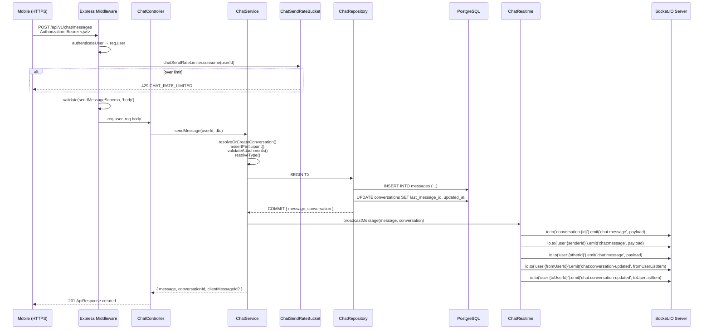
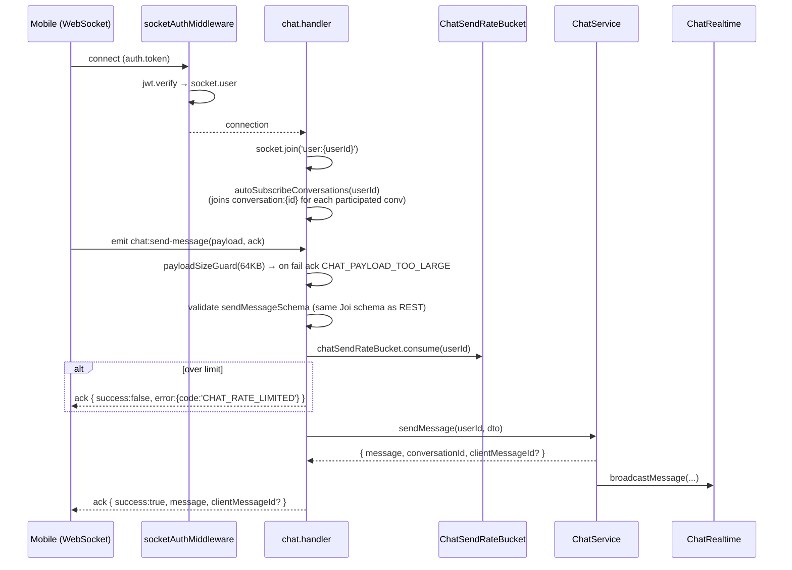

# Design Document

## Overview

The Chat Module adds real-time 1:1 messaging between any two distinct LocalLoom users to the existing Node.js / Express / TypeScript / Sequelize / PostgreSQL backend. It is implemented as a single module under `src/modules/chat/` and a Socket.IO handler under `src/socket/handlers/chat.handler.ts`. Conversation, message, attachment, read-receipt, typing-indicator, and online-status flows are exposed both as a REST surface mounted at `/api/v1/chat` and as a typed Socket.IO event surface that shares the same `ChatService` write path. Mobile clients are the primary consumer; admin and web are out of scope for this iteration.

This design is the implementation blueprint for the requirements at `localloom-backend/.kiro/specs/chat-module/requirements.md`. Every numbered Acceptance Criterion (R1–R20) is addressed by a section, an interface, a property, or a logged exclusion below.

### Goals

- Single canonical write path (`ChatService.sendMessage`) shared by REST `POST /messages` and Socket.IO `chat:send-message`, so persistence, authorization, rate-limiting, and fan-out are not duplicated.
- Keyset-paginated message history that stays performant on long conversations.
- Conversation list assembled in a single query without N+1 lookups against `users` or `messages`.
- Atomic `messages` insert + `conversations.last_message_id` + `conversations.updated_at` update inside one transaction.
- Typed, idempotent real-time fan-out via two room types: `conversation:{id}` (in-chat presence) and `user:{id}` (per-device fallback).
- Strict per-MIME attachment validation, with images and videos sharing one upload endpoint but separate size budgets.
- Module-specific error codes that flow through the existing global error handler unchanged for non-chat consumers.

### Non-Goals

- No group chat, multi-party threads, or chat rooms with more than two participants.
- No message editing, hard delete, or admin-side message moderation in this iteration.
- No end-to-end encryption.
- No server-side video transcoding or thumbnail extraction (`thumbnailUrl` is client-supplied only).
- No push-notification wiring beyond the existing `notification:new` Socket.IO channel; push-notification triggers for chat are explicitly deferred (R20.4).
- No mobile-side or admin-side documentation; that is a separate `.md` artefact (R20.5).

## Architecture

### REST + Socket.IO Component Diagram

```mermaid
flowchart LR
    Mobile[Mobile Client]

    subgraph Express[Express App]
        Router[/api/v1/chat router/]
        AuthMW[authenticateUser]
        ValidMW[validate Joi schema]
        SendLimiter[chatSendRateLimiter]
        UploadLimiter[chatUploadRateLimiter]
        UploadMW[createChatAttachmentUpload]
        Controller[ChatController]
    end

    subgraph SocketIO[Socket.IO Server]
        SockAuth[socketAuthMiddleware]
        Handler[chat.handler.ts]
        TypingThrottle[per-socket typing throttle]
    end

    subgraph Module[chat module]
        Service[ChatService]
        Realtime[ChatRealtime emitter]
        Repo[ChatRepository]
        Errors[chat.errors.ts]
        SendBucket[ChatSendRateBucket - shared]
    end

    subgraph DB[(PostgreSQL)]
        Conversations[(conversations)]
        Messages[(messages)]
        Users[(users)]
    end

    Mobile -->|HTTPS REST| Router
    Router --> AuthMW
    AuthMW --> SendLimiter
    AuthMW --> UploadLimiter
    AuthMW --> ValidMW
    UploadLimiter --> UploadMW
    SendLimiter --> ValidMW
    ValidMW --> Controller
    UploadMW --> Controller
    Controller --> Service

    Mobile -.->|WebSocket| SockAuth
    SockAuth --> Handler
    Handler --> TypingThrottle
    Handler --> Service
    Handler --> SendBucket
    SendLimiter --> SendBucket

    Service --> Repo
    Service --> Realtime
    Repo --> Conversations
    Repo --> Messages
    Repo --> Users
    Realtime -->|emit to rooms| SocketIO
    SocketIO -.->|push| Mobile
```

The two transports converge at `ChatService`. The REST path runs validation and rate-limiting as Express middleware before the controller; the socket path runs equivalent checks inline in the handler. Both call `ChatService.sendMessage`, and both reach the same `ChatSendRateBucket` so a user cannot exceed the combined 60-message-per-minute limit by mixing transports (R5.15, R9.13, R19.1).

### Sequence: REST `POST /messages`



### Sequence: Socket.IO `chat:send-message`



### Real-Time Fan-Out Map

```mermaid
flowchart TB
    subgraph Rooms[Socket.IO Rooms]
        ConvRoom[conversation:{id}<br/>members: every socket of every Participant<br/>currently subscribed to this conversation]
        SenderRoom[user:{senderId}<br/>members: every socket belonging to the sender<br/>across all of the sender's devices]
        OtherRoom[user:{otherId}<br/>members: every socket belonging to the other Participant<br/>across all of their devices]
    end

    NewMessage[Message persisted]
    NewMessage -->|chat:message| ConvRoom
    NewMessage -->|chat:message| SenderRoom
    NewMessage -->|chat:message| OtherRoom
    NewMessage -->|chat:conversation-updated<br/>perspective: from-user| RoomFrom[user:{fromUserId}]
    NewMessage -->|chat:conversation-updated<br/>perspective: to-user| RoomTo[user:{toUserId}]

    MarkRead[Last_Read_At updated]
    MarkRead -->|chat:read| ConvRoom
    MarkRead -->|chat:conversation-updated<br/>unreadCount=0| RequesterRoom[user:{requesterId}]

    Typing[chat:typing event from socket S]
    Typing -->|chat:typing<br/>excluding S| ConvRoom

    StopTyping[chat:stop-typing event from socket S]
    StopTyping -->|chat:stop-typing<br/>excluding S| ConvRoom

    ConvCreated[Conversation created via R3]
    ConvCreated -->|chat:conversation-updated| RoomFrom2[user:{fromUserId}]
    ConvCreated -->|chat:conversation-updated| RoomTo2[user:{toUserId}]
    ConvCreated -.->|optional<br/>(handled by autoSubscribe<br/>at next connect)| ConvRoom
```

The map encodes R5.13, R5.14, R7.8, R7.9, R10.1–R10.7, R18.1, R18.5. `chat:conversation-updated` is always delivered to the user-room (per-device fan-out) rather than the conversation-room, because a Participant's conversation list lives outside any single chat window and we want updates to land even when the receiver is not currently looking at the chat.

### Shared Write Path

`POST /api/v1/chat/messages` and Socket.IO `chat:send-message` deliberately funnel through `ChatService.sendMessage(userId, dto)` so that authorization, conversation resolution, attachment validation, type-resolution, transactional persistence, rate-limit accounting, and real-time fan-out are implemented once. The differences between the two transports are confined to:

- How `dto` is parsed (Express `req.body` vs Socket.IO event payload).
- How errors are surfaced (HTTP status + `error.code` body vs Ack callback `{ success:false, error:{ code, message } }`).
- Which limiter object the request is metered through (both meter against the same in-memory `ChatSendRateBucket`, see Rate Limiting Design).

This satisfies R9.6, R14.9, and (operationally) R5.15 / R9.13 — there is exactly one rate-limit accumulator per user.


## Module Layout

The chat module follows the same layout as `tradie`, `review`, and `category` (R14.1), with two new files (`chat.errors.ts`, `chat.realtime.ts`) and the existing placeholder files (`chat.controller.ts`, `chat.service.ts`, `chat.repository.ts`, etc.) replaced with real implementations.

```
src/modules/chat/
├── chat.controller.ts        [Modified] — replaces empty placeholder; exposes asyncHandler arrow methods
├── chat.service.ts           [Modified] — replaces empty placeholder; canonical write path
├── chat.repository.ts        [Modified] — replaces empty placeholder; Sequelize + raw SQL
├── chat.routes.ts            [Modified] — replaces empty router; mounts all REST endpoints
├── chat.validation.ts        [Modified] — extends current Joi schemas
├── chat.interface.ts         [Modified] — extends current DTOs with payload + descriptor types
├── chat.swagger.ts           [Modified] — adds full @swagger blocks for endpoints + free-text socket docs
├── chat.errors.ts            [Created]  — chat-specific error codes + ChatException subclass set (R16.2)
├── chat.realtime.ts          [Created]  — typed emitter wrapper around Socket.IO Server
└── index.ts                  [Modified] — barrel exports

src/socket/handlers/
└── chat.handler.ts           [Modified] — auto-subscribe + per-event handlers + typing throttle + 64KB guard

src/socket/
└── socket.types.ts           [Modified] — extended ServerToClientEvents / ClientToServerEvents + new payload types

src/services/
└── file-upload.service.ts    [Modified] — adds createChatAttachmentUpload(fieldName='files')

src/models/
├── conversation.model.ts     [Modified] — renames customerId/tradieId to fromUserId/toUserId; adds fromLastReadAt / toLastReadAt fields
└── message.model.ts          [Modified] — narrows attachments typing to Attachment_Descriptor[] | null

src/database/migrations/
└── 20260520120001-add-chat-read-state.js   [Created] — see Migration Strategy

src/common/constants/
└── messages.ts               [Modified] — extends CHAT_MESSAGES (additive)

src/routes/v1/
└── index.ts                  [Unchanged] — chat router is already mounted at /chat

src/socket/
└── index.ts                  [Unchanged] — already calls registerChatHandlers; existing online-status broadcast stays
```

The migration timestamp `20260520120001` continues the existing `YYYYMMDD<HHmmss>` convention seen in `20260415100017-create-conversations.js`. Implementation should pick the next concrete time within that day (anything ≥ `20260520120001` is acceptable as long as it is the highest timestamp in the migrations directory at deploy time).

## Data Model

### Attachment_Descriptor (R12)

```ts
// chat.interface.ts

export type AttachmentKind = 'image' | 'video';

export interface Attachment_Descriptor {
  /** Public URL path. MUST start with '/public/chat-attachments/' (R12.5). */
  url: string;
  /** Discriminator. R12.2 / R12.4. */
  type: AttachmentKind;
  /** Original MIME type as observed by multer. */
  mime: string;
  /** File size in bytes; integer ≥ 0 (R12.2). */
  size: number;

  /** Optional client-supplied (R6.10, R12.3). */
  thumbnailUrl?: string;
  width?: number;
  height?: number;
  durationMs?: number;
}
```

### Updated Conversation Model (R11.5)

```ts
// conversation.model.ts (additions)

export interface IConversationAttributes {
  id: string;
  fromUserId: string;
  toUserId: string;
  fromLastReadAt?: Date | null;       // NEW (R11.1, R11.5)
  toLastReadAt?: Date | null;         // NEW (R11.1, R11.5)
  status: string;
  lastMessageId?: string | null;
  createdAt: Date;
  updatedAt: Date;
}

export type IConversationCreationAttributes = Optional<
  IConversationAttributes,
  | 'id'
  | 'status'
  | 'lastMessageId'
  | 'fromLastReadAt'
  | 'toLastReadAt'
  | 'createdAt'
  | 'updatedAt'
>;
```

The Sequelize `init()` call gains:

```ts
fromUserId: {
  type: DataTypes.UUID,
  allowNull: false,
  field: 'from_user_id',
},
toUserId: {
  type: DataTypes.UUID,
  allowNull: false,
  field: 'to_user_id',
},
fromLastReadAt: {
  type: DataTypes.DATE,
  allowNull: true,
  field: 'from_last_read_at',
  defaultValue: null,
},
toLastReadAt: {
  type: DataTypes.DATE,
  allowNull: true,
  field: 'to_last_read_at',
  defaultValue: null,
},
```

The two `User` associations on `Conversation` are registered in `src/models/index.ts` as `Conversation.belongsTo(User, { foreignKey: 'fromUserId', as: 'fromUser' })` and `Conversation.belongsTo(User, { foreignKey: 'toUserId', as: 'toUser' })`. The reverse `User.hasMany(Conversation, ...)` aliases become `as: 'sentConversations'` (keyed by `fromUserId`) and `as: 'receivedConversations'` (keyed by `toUserId`).

### Updated Message Model (R11.6, R12.1)

```ts
// message.model.ts (delta)

import type { Attachment_Descriptor } from '../modules/chat/chat.interface';

export interface IMessageAttributes {
  // ...
  attachments?: Attachment_Descriptor[] | null;   // was: string[] | null
}
```

The Sequelize column stays `JSONB` and `allowNull: true`; only the static type changes. The default value is changed from `[]` to `null` so that "no attachments" is represented by SQL `NULL` rather than an empty array, which makes the keyset count cheaper and matches the wire shape (R4.11 still says return `[]` to clients when stored value is `null`, which is handled in the response mapper).

Note that the `messages.sender_id` column (mapped to `senderId`) is intentionally not renamed alongside the conversation rename. The "from" of an individual Message is the message's sender, and the "to" is implicit — it is whichever Conversation participant is not the sender. Renaming `senderId` to `fromUserId` would also clash conceptually with `conversations.from_user_id`, which addresses a different concept (the canonical insert direction of a Conversation pair).

### MessagePayload, ConversationListItem, MessageListMeta (R4.9, R1.7, R4.12)

```ts
// chat.interface.ts

export interface SenderSummary {
  id: string;
  name: string;
  avatar: string | null;
}

export interface OtherParticipantSummary {
  id: string;
  name: string;
  avatar: string | null;
  /**
   * Literal `users.role` of the other participant. This is **informational metadata only**:
   * the chat module does not read, branch on, or enforce anything based on this value.
   * It is exposed purely so mobile / web clients can render a role badge if they wish.
   */
  role: string;
}

export interface MessagePayload {
  id: string;
  conversationId: string;
  sender: SenderSummary;
  content: string;
  type: 'text' | 'image' | 'video' | 'mixed';
  attachments: Attachment_Descriptor[];   // never null on the wire (R4.11)
  status: string;                         // 'sent' for now
  createdAt: string;                      // ISO-8601 (R10.9)
  updatedAt: string;
  /** Echoed back when the originating call supplied one (R18.3). */
  clientMessageId?: string;
}

export interface LastMessagePreview {
  id: string;
  content: string;
  type: string;
  attachmentCount: number;
  senderId: string;
  createdAt: string;
}

export interface ConversationListItem {
  id: string;
  /** The participant whose id ≠ the requester's id. */
  otherParticipant: OtherParticipantSummary;
  lastMessage: LastMessagePreview | null;       // null when conversation has no messages (R1.9)
  lastMessageAt: string;                        // last message createdAt OR conversation.createdAt (R1.10)
  unreadCount: number;                          // requester-perspective unread (R1.11)
  createdAt: string;
  updatedAt: string;
}

export interface MessageListMeta {
  limit: number;
  count: number;
  hasMore: boolean;
  nextBefore: string | null;                    // R4.12
}
```

`role` is the literal `users.role` of the other participant, returned for display only; the chat module does not branch on it. It is informational metadata, not used for any chat-module logic.

### Send Message DTO

```ts
// chat.interface.ts (replaces existing SendMessageDto)

export interface SendMessageDto {
  conversationId?: string;
  recipientId?: string;
  content?: string;
  type?: 'text' | 'image' | 'video' | 'mixed';
  attachments?: Attachment_Descriptor[];
  clientMessageId?: string;
}

export interface CreateConversationDto {
  otherUserId: string;     // R3.1
}

export interface MarkReadDto {
  lastReadMessageId?: string;
}
```

### Migration: `20260520120001-add-chat-read-state.js`

The migration performs the column rename, the canonical-ordering data fix, the index swap, the CHECK constraint, the per-participant read-state columns, and the `messages` index/widening swap, in that exact order, all inside a single transaction so a partial failure cannot leave the schema in a half-renamed state.

```js
'use strict';

const NEW_INDEX_NAME = 'idx_messages_conversation_created_desc';
const OLD_INDEX_NAME = 'messages_conversation_id_created_at';
const NEW_UNIQUE_NAME = 'unique_from_to_conversation';
const OLD_UNIQUE_NAME = 'unique_customer_tradie_conversation';
const CHECK_NAME = 'chk_conversations_from_lt_to';

/** @type {import('sequelize-cli').Migration} */
module.exports = {
  async up(queryInterface, Sequelize) {
    const tx = await queryInterface.sequelize.transaction();
    try {
      // 1. Rename customer_id → from_user_id (R11.8) — data-preserving, no rewrite.
      await queryInterface.renameColumn('conversations', 'customer_id', 'from_user_id', { transaction: tx });

      // 2. Rename tradie_id → to_user_id.
      await queryInterface.renameColumn('conversations', 'tradie_id', 'to_user_id', { transaction: tx });

      // 3. Drop the existing unique index on the old (customer_id, tradie_id) pair.
      //    After rename, the index logically references (from_user_id, to_user_id) under
      //    its old name; we drop it explicitly so the new uniqueness rule is unambiguous.
      await queryInterface.removeIndex('conversations', OLD_UNIQUE_NAME, { transaction: tx });

      // 4. Drop the existing simple per-column indexes. Older deployments may have these
      //    named after the original column names; the catch() makes the removal idempotent
      //    across environments.
      await queryInterface.removeIndex('conversations', ['from_user_id'], { transaction: tx }).catch(() => {});
      await queryInterface.removeIndex('conversations', ['to_user_id'], { transaction: tx }).catch(() => {});
      // Catch the auto-named legacy variants too, just in case.
      await queryInterface.removeIndex('conversations', 'conversations_customer_id', { transaction: tx }).catch(() => {});
      await queryInterface.removeIndex('conversations', 'conversations_tradie_id', { transaction: tx }).catch(() => {});

      // 5. One-time data fix BEFORE the CHECK constraint is added.
      //    Existing rows where customer_id > tradie_id (now from_user_id > to_user_id) would
      //    violate the new CHECK constraint `from_user_id < to_user_id`. We canonicalise
      //    them by swapping the two columns, which is safe because the chat module is
      //    role-agnostic — neither column has any read or write semantic distinction
      //    after this migration. NOTE: this swap is non-reversible; the down step cannot
      //    restore the original `customer_id` vs `tradie_id` distinction. See "Migration
      //    Strategy" and "Open Questions / Risks" for the full discussion.
      await queryInterface.sequelize.query(
        `UPDATE conversations
            SET from_user_id = to_user_id, to_user_id = from_user_id
          WHERE from_user_id > to_user_id;`,
        { transaction: tx },
      );

      // 6. Add CHECK constraint enforcing canonical (lesser, greater) ordering.
      await queryInterface.sequelize.query(
        `ALTER TABLE conversations
            ADD CONSTRAINT ${CHECK_NAME} CHECK (from_user_id < to_user_id);`,
        { transaction: tx },
      );

      // 7. Create the new unique index on the canonically-ordered pair.
      await queryInterface.addIndex('conversations', ['from_user_id', 'to_user_id'], {
        unique: true,
        name: NEW_UNIQUE_NAME,
        transaction: tx,
      });

      // 8. Re-create the simple per-column indexes against the new column names.
      await queryInterface.addIndex('conversations', ['from_user_id'], { transaction: tx });
      await queryInterface.addIndex('conversations', ['to_user_id'], { transaction: tx });

      // 9. Add per-participant read-state columns (R11.1).
      await queryInterface.addColumn(
        'conversations',
        'from_last_read_at',
        { type: Sequelize.DATE, allowNull: true, defaultValue: null },
        { transaction: tx },
      );
      await queryInterface.addColumn(
        'conversations',
        'to_last_read_at',
        { type: Sequelize.DATE, allowNull: true, defaultValue: null },
        { transaction: tx },
      );

      // 10. Widen messages.type (R11.4).
      await queryInterface.changeColumn(
        'messages',
        'type',
        { type: Sequelize.STRING(20), allowNull: false, defaultValue: 'text' },
        { transaction: tx },
      );

      // 11. Swap the messages descending composite index (R11.3).
      await queryInterface.sequelize.query(
        `CREATE INDEX IF NOT EXISTS ${NEW_INDEX_NAME}
           ON messages (conversation_id, created_at DESC, id DESC);`,
        { transaction: tx },
      );
      await queryInterface.sequelize.query(
        `DROP INDEX IF EXISTS ${OLD_INDEX_NAME};`,
        { transaction: tx },
      );

      await tx.commit();
    } catch (err) {
      await tx.rollback();
      throw err;
    }
  },

  async down(queryInterface, Sequelize) {
    const tx = await queryInterface.sequelize.transaction();
    try {
      // Reverse step 11 — re-add the old ascending index, drop the new descending one.
      await queryInterface.sequelize.query(
        `CREATE INDEX IF NOT EXISTS ${OLD_INDEX_NAME}
           ON messages (conversation_id, created_at);`,
        { transaction: tx },
      );
      await queryInterface.sequelize.query(
        `DROP INDEX IF EXISTS ${NEW_INDEX_NAME};`,
        { transaction: tx },
      );

      // Reverse step 10 — narrow messages.type back to STRING(10).
      await queryInterface.changeColumn(
        'messages',
        'type',
        { type: Sequelize.STRING(10), allowNull: false, defaultValue: 'text' },
        { transaction: tx },
      );

      // Reverse step 9 — drop the read-state columns (to_last_read_at first, then from_last_read_at).
      await queryInterface.removeColumn('conversations', 'to_last_read_at', { transaction: tx });
      await queryInterface.removeColumn('conversations', 'from_last_read_at', { transaction: tx });

      // Reverse step 8 — drop the simple per-column indexes against the new column names.
      await queryInterface.removeIndex('conversations', ['to_user_id'], { transaction: tx }).catch(() => {});
      await queryInterface.removeIndex('conversations', ['from_user_id'], { transaction: tx }).catch(() => {});

      // Reverse step 7 — drop the new unique index.
      await queryInterface.removeIndex('conversations', NEW_UNIQUE_NAME, { transaction: tx });

      // Reverse step 6 — drop the CHECK constraint.
      await queryInterface.sequelize.query(
        `ALTER TABLE conversations DROP CONSTRAINT IF EXISTS ${CHECK_NAME};`,
        { transaction: tx },
      );

      // Reverse step 5 — the canonical-ordering swap is intentionally NOT reversed.
      //   We have lost the original customer_id vs tradie_id distinction for any row that
      //   was swapped, and we cannot recover it from the schema alone. The down step
      //   restores column NAMES but the row values that were swapped will end up in the
      //   "wrong" column relative to the pre-up state. This is acceptable because the
      //   chat module is role-agnostic by design; it is documented in
      //   "Open Questions / Risks: Canonical ordering rollback irreversibility".

      // Reverse step 4 — restore the simple indexes against the legacy column names.
      //   These run AFTER the column rename below, so we add them by column name from the
      //   post-rename perspective.

      // Reverse step 3 — restore the original unique index. Add it AFTER the column rename
      //   below so the index references the legacy column names.

      // Reverse step 2 — rename to_user_id back to tradie_id.
      await queryInterface.renameColumn('conversations', 'to_user_id', 'tradie_id', { transaction: tx });

      // Reverse step 1 — rename from_user_id back to customer_id.
      await queryInterface.renameColumn('conversations', 'from_user_id', 'customer_id', { transaction: tx });

      // Now restore the legacy unique + simple indexes (deferred from steps 3 / 4 above).
      await queryInterface.addIndex('conversations', ['customer_id', 'tradie_id'], {
        unique: true,
        name: OLD_UNIQUE_NAME,
        transaction: tx,
      });
      await queryInterface.addIndex('conversations', ['customer_id'], { transaction: tx });
      await queryInterface.addIndex('conversations', ['tradie_id'], { transaction: tx });

      await tx.commit();
    } catch (err) {
      await tx.rollback();
      throw err;
    }
  },
};
```

**Index decision call.** The existing `messages(conversation_id, created_at)` index (auto-named `messages_conversation_id_created_at`) is dropped because:

- The keyset pagination query orders by `(created_at DESC, id DESC)`. PostgreSQL B-tree indexes can scan in either direction, so a single descending composite covers both the keyset query and the `last_message_id` lookup used by the conversation list.
- Keeping both indexes wastes write throughput on every `INSERT INTO messages`.
- No other current query needs the older index — `getOrCreateConversation` filters on `conversations`, not `messages`, and admin-side moderation queries are out of scope.

If future profiling reveals a query that benefits from an ascending index (e.g., a forward-scrolling chat replay), it can be re-added in a later migration without touching this one.


## REST API Design

All endpoints sit under `/api/v1/chat` and are gated by `authenticateUser` at the router level (R14.2). Joi schemas live in `chat.validation.ts` and are wired through the existing `validate` middleware. Success bodies use `ApiResponse.success` / `ApiResponse.created` / `ApiResponse.paginated`. Error bodies are produced by the global error handler from `ChatException` subclasses (see Error Handling) and conform to R16.1.

### Joi Schemas (`chat.validation.ts`)

```ts
// chat.validation.ts

import Joi from 'joi';

const uuid = Joi.string().uuid({ version: 'uuidv4' });

export const conversationIdParamSchema = Joi.object({
  conversationId: uuid.required(),
});

export const listConversationsQuerySchema = Joi.object({
  page: Joi.number().integer().min(1).optional(),
  limit: Joi.number().integer().min(1).max(100).optional(),
  search: Joi.string().trim().max(100).optional().allow(''),
  sort: Joi.string().optional(),     // ignored — list is always (updated_at DESC, id DESC)
  order: Joi.string().optional(),
});

export const createConversationSchema = Joi.object({
  // The schema only enforces UUID syntax. The remaining acceptance rules — that
  // `otherUserId` refers to an existing non-deleted user, and that it is not the
  // requester — are enforced by `ChatService.getOrCreateConversation`. There is
  // no role-based pairing rule (R3.5): any two distinct active LocalLoom users
  // may chat, regardless of their `users.role` value.
  otherUserId: uuid.required(),
});

export const messagesListQuerySchema = Joi.object({
  limit: Joi.number().integer().min(1).max(100).default(100),
  before: uuid.optional(),
});

const attachmentDescriptorSchema = Joi.object({
  url: Joi.string().pattern(/^\/public\/chat-attachments\//).required(),
  type: Joi.string().valid('image', 'video').required(),
  mime: Joi.string().min(1).required(),
  size: Joi.number().integer().min(0).required(),
  thumbnailUrl: Joi.string().optional(),
  width: Joi.number().integer().min(1).optional(),
  height: Joi.number().integer().min(1).optional(),
  durationMs: Joi.number().integer().min(0).optional(),
});

export const sendMessageSchema = Joi.object({
  conversationId: uuid.optional(),
  recipientId: uuid.optional(),
  content: Joi.string().trim().max(5000).optional().allow(''),
  type: Joi.string().valid('text', 'image', 'video', 'mixed').optional(),
  attachments: Joi.array().items(attachmentDescriptorSchema).max(5).optional(),
  clientMessageId: Joi.string().max(64).optional(),
})
  .or('conversationId', 'recipientId')                 // R5.2
  .custom((value, helpers) => {
    const trimmed = (value.content ?? '').trim();
    const hasAttachments = Array.isArray(value.attachments) && value.attachments.length > 0;
    if (!trimmed && !hasAttachments) {
      return helpers.error('any.invalid', { message: 'content or attachments required' });
    }
    if (
      (value.type === 'image' || value.type === 'video' || value.type === 'mixed') &&
      !hasAttachments
    ) {
      return helpers.error('any.invalid', { message: 'attachments required for media messages' });
    }
    return value;
  });

export const messageUploadFieldsSchema = Joi.object({
  // multipart-paired metadata; supplied as form fields named width[i], height[i], etc.
  // Validation happens after multer accepts the files; details are described in
  // "Attachment Upload Design" below.
}).unknown(true);

export const markReadSchema = Joi.object({
  lastReadMessageId: uuid.optional(),
});
```

`messageUploadFieldsSchema` is intentionally permissive at the Joi layer because multer parses form fields heterogeneously; the controller validates each paired metadata field by name pattern after multer has run.

### Endpoint Catalog

| # | Method | Path | Auth | Validation | Controller method | R |
|---|--------|------|------|------------|-------------------|---|
| 1 | `GET`  | `/api/v1/chat/conversations` | `authenticateUser` | `listConversationsQuerySchema` (`'query'`) | `listConversations` | R1 |
| 2 | `GET`  | `/api/v1/chat/conversations/:conversationId` | `authenticateUser` | `conversationIdParamSchema` (`'params'`) | `getConversation` | R2 |
| 3 | `POST` | `/api/v1/chat/conversations` | `authenticateUser` | `createConversationSchema` | `createOrGetConversation` | R3 |
| 4 | `GET`  | `/api/v1/chat/conversations/:conversationId/messages` | `authenticateUser` | `conversationIdParamSchema` (`'params'`) + `messagesListQuerySchema` (`'query'`) | `listMessages` | R4 |
| 5 | `POST` | `/api/v1/chat/messages` | `authenticateUser` + `chatSendRateLimiter` | `sendMessageSchema` | `sendMessage` | R5 |
| 6 | `POST` | `/api/v1/chat/messages/upload` | `authenticateUser` + `chatUploadRateLimiter` + `createChatAttachmentUpload('files')` | (multer + post-multer field check) | `uploadAttachments` | R6 |
| 7 | `POST` | `/api/v1/chat/conversations/:conversationId/read` | `authenticateUser` | `conversationIdParamSchema` (`'params'`) + `markReadSchema` (`'body'`) | `markRead` | R7 |

### Controller (`chat.controller.ts`)

```ts
import { Request, Response } from 'express';
import { ChatService } from './chat.service';
import { ApiResponse, asyncHandler, parsePaginationQuery } from '../../common/utils';
import { AuthenticatedRequest } from '../../common/interfaces';
import { CHAT_MESSAGES } from '../../common/constants';
import {
  CreateConversationDto,
  SendMessageDto,
  MarkReadDto,
} from './chat.interface';

export class ChatController {
  private service: ChatService;

  constructor(service?: ChatService) {
    this.service = service ?? new ChatService();
  }

  listConversations = asyncHandler(async (req: Request, res: Response) => {
    const { userId } = (req as AuthenticatedRequest).user;
    const { page, limit } = parsePaginationQuery(req.query);
    const search = (req.query.search as string | undefined)?.trim() || undefined;
    const result = await this.service.listConversations(userId, { page, limit, search });
    ApiResponse.paginated(res, result.data, result.meta, CHAT_MESSAGES.LIST_FETCHED);
  });

  getConversation = asyncHandler(async (req: Request, res: Response) => {
    const { userId } = (req as AuthenticatedRequest).user;
    const item = await this.service.getConversation(userId, req.params.conversationId);
    ApiResponse.success(res, item, CHAT_MESSAGES.FETCHED);
  });

  createOrGetConversation = asyncHandler(async (req: Request, res: Response) => {
    const { userId } = (req as AuthenticatedRequest).user;
    const dto = req.body as CreateConversationDto;
    const { conversation, created } = await this.service.getOrCreateConversation(userId, dto.otherUserId);
    if (created) ApiResponse.created(res, conversation, CHAT_MESSAGES.CREATED);
    else ApiResponse.success(res, conversation, CHAT_MESSAGES.FETCHED);
  });

  listMessages = asyncHandler(async (req: Request, res: Response) => {
    const { userId } = (req as AuthenticatedRequest).user;
    const limit = Number(req.query.limit) || 100;
    const before = req.query.before as string | undefined;
    const { items, meta } = await this.service.listMessages(userId, req.params.conversationId, { limit, before });
    ApiResponse.success(res, { items, meta }, CHAT_MESSAGES.MESSAGES_FETCHED);
  });

  sendMessage = asyncHandler(async (req: Request, res: Response) => {
    const { userId } = (req as AuthenticatedRequest).user;
    const dto = req.body as SendMessageDto;
    const result = await this.service.sendMessage(userId, dto);
    ApiResponse.created(res, result, CHAT_MESSAGES.MESSAGE_SENT);
  });

  uploadAttachments = asyncHandler(async (req: Request, res: Response) => {
    const { userId } = (req as AuthenticatedRequest).user;
    const files = (req.files as Express.Multer.File[] | undefined) ?? [];
    const descriptors = await this.service.buildAttachmentDescriptors(userId, files, req.body);
    ApiResponse.created(res, descriptors, CHAT_MESSAGES.UPLOADED);
  });

  markRead = asyncHandler(async (req: Request, res: Response) => {
    const { userId } = (req as AuthenticatedRequest).user;
    const dto = req.body as MarkReadDto;
    const result = await this.service.markRead(userId, req.params.conversationId, dto.lastReadMessageId);
    ApiResponse.success(res, result, CHAT_MESSAGES.MESSAGES_READ);
  });
}
```

### Routes (`chat.routes.ts`)

```ts
import { Router, type RequestHandler } from 'express';
import { ChatController } from './chat.controller';
import { authenticateUser, validate } from '../../middleware';
import { createChatAttachmentUpload } from '../../services/file-upload.service';
import { chatSendRateLimiter, chatUploadRateLimiter } from './chat.rate-limit';
import {
  conversationIdParamSchema,
  listConversationsQuerySchema,
  createConversationSchema,
  messagesListQuerySchema,
  sendMessageSchema,
  markReadSchema,
} from './chat.validation';

const router = Router();
const controller = new ChatController();

router.use(authenticateUser as unknown as RequestHandler);

router.get('/conversations', validate(listConversationsQuerySchema, 'query'), controller.listConversations);
router.post('/conversations', validate(createConversationSchema), controller.createOrGetConversation);
router.get('/conversations/:conversationId', validate(conversationIdParamSchema, 'params'), controller.getConversation);
router.get(
  '/conversations/:conversationId/messages',
  validate(conversationIdParamSchema, 'params'),
  validate(messagesListQuerySchema, 'query'),
  controller.listMessages,
);
router.post(
  '/conversations/:conversationId/read',
  validate(conversationIdParamSchema, 'params'),
  validate(markReadSchema),
  controller.markRead,
);
router.post(
  '/messages',
  chatSendRateLimiter,
  validate(sendMessageSchema),
  controller.sendMessage,
);
router.post(
  '/messages/upload',
  chatUploadRateLimiter,
  createChatAttachmentUpload('files'),
  controller.uploadAttachments,
);

export default router;
```

### Example Request / Response Payloads

#### `GET /api/v1/chat/conversations?limit=20&page=1&search=jane`

```json
{
  "success": true,
  "statusCode": 200,
  "message": "Conversations fetched successfully",
  "data": [
    {
      "id": "9e1b...",
      "otherParticipant": { "id": "a23c...", "name": "Jane Doe", "avatar": "/public/avatar/...png", "role": "tradie" },
      "lastMessage": {
        "id": "f55d...",
        "content": "On my way",
        "type": "text",
        "attachmentCount": 0,
        "senderId": "a23c...",
        "createdAt": "2026-05-20T12:01:33.421Z"
      },
      "lastMessageAt": "2026-05-20T12:01:33.421Z",
      "unreadCount": 2,
      "createdAt": "2026-05-19T08:14:00.000Z",
      "updatedAt": "2026-05-20T12:01:33.421Z"
    }
  ],
  "meta": { "page": 1, "limit": 20, "total": 1, "totalPages": 1, "hasNextPage": false, "hasPrevPage": false }
}
```

#### `POST /api/v1/chat/messages`

Request:

```json
{
  "recipientId": "a23c...",
  "content": "Hi, can you come tomorrow?",
  "clientMessageId": "tmp-2026-05-20-001"
}
```

Response (`201`):

```json
{
  "success": true,
  "statusCode": 201,
  "message": "Message sent successfully",
  "data": {
    "message": {
      "id": "1f9a...",
      "conversationId": "9e1b...",
      "sender": { "id": "u-self", "name": "You", "avatar": null },
      "content": "Hi, can you come tomorrow?",
      "type": "text",
      "attachments": [],
      "status": "sent",
      "createdAt": "2026-05-20T12:03:00.000Z",
      "updatedAt": "2026-05-20T12:03:00.000Z",
      "clientMessageId": "tmp-2026-05-20-001"
    },
    "conversationId": "9e1b...",
    "clientMessageId": "tmp-2026-05-20-001"
  }
}
```

#### Error Response (e.g. R5.7 missing content + attachments)

```json
{
  "success": false,
  "statusCode": 400,
  "message": "content or attachments required",
  "errors": { "code": "CHAT_VALIDATION_ERROR" }
}
```


## Service Layer Design

`ChatService` is the canonical write path. Every method is a pure orchestration step that delegates persistence to `ChatRepository` and fan-out to `ChatRealtime`. The service is constructed with default dependencies but can be re-constructed with stubs in tests.

```ts
// chat.service.ts (constructor sketch)

export class ChatService {
  constructor(
    private readonly repo: ChatRepository = new ChatRepository(),
    private readonly realtime: ChatRealtime = new ChatRealtime(),
    private readonly sendBucket: ChatSendRateBucket = sharedSendBucket,
  ) {}
  // ...
}
```

### `listConversations`

```ts
listConversations(
  userId: string,
  opts: { page: number; limit: number; search?: string },
): Promise<PaginatedResult<ConversationListItem>>;
```

| Throws | When |
|---|---|
| `ChatValidationException` | `opts.search` longer than 100 chars (defensive — Joi already enforces) |

Steps:

1. Call `repo.listConversationsForUser(userId, opts)` which returns a `{ rows, total }` aggregate.
2. Map each row into a `ConversationListItem` using `repo.toConversationListItem(row, userId)` — this is the one place the from/to perspective is applied (R1.8): the `otherParticipant` is whichever Participant's id is not the requester's id.
3. Wrap into `PaginatedResult` via `buildPaginationMeta(total, page, limit)`.

Validates: R1.3, R1.4, R1.5, R1.6, R1.7, R1.8, R1.9, R1.10, R1.11, R1.12.

### `getConversation`

```ts
getConversation(userId: string, conversationId: string): Promise<ConversationListItem>;
```

| Throws | When |
|---|---|
| `ChatNotFoundException` (404) | Conversation does not exist |
| `ChatForbiddenException` (403) | User is neither `from_user_id` nor `to_user_id` of the conversation (R2.4) |

Steps:

1. `const conv = await repo.findConversationByIdRaw(conversationId)` — returns the same projection as the list query for a single id.
2. If `conv == null` → `ChatNotFoundException`.
3. `assertParticipant(userId, conv)` — throws `ChatForbiddenException` if not a participant.
4. Return `repo.toConversationListItem(conv, userId)`.

Validates: R2.2, R2.3, R2.4, R2.5.

### `getOrCreateConversation`

```ts
getOrCreateConversation(
  userId: string,
  otherUserId: string,
): Promise<{ conversation: ConversationListItem; created: boolean }>;
```

| Throws | When |
|---|---|
| `ChatValidationException` (400) | `otherUserId === userId` (R3.3) |
| `ChatNotFoundException` (404) | Other user does not exist or `users.status === 'deleted'` (R3.4) |

Both users must exist and have `users.status <> 'deleted'`. The two users must be distinct. There is no role-based pairing rule; any two distinct active users may chat.

Steps:

1. Reject self-conversation with `ChatValidationException` (R3.3).
2. Load both `users` rows in a single `User.findAll({ where: { id: [userId, otherUserId] } })`. If either is missing or has `status === 'deleted'`, throw `ChatNotFoundException` (R3.4). No role-pair check is applied — any two distinct, non-deleted users are eligible (R3.5).
3. **Canonical ordering.** Sort the two UUIDs lexicographically. Let `lo = min(userId, otherUserId)` and `hi = max(userId, otherUserId)`; assign the lesser to `from_user_id` and the greater to `to_user_id`. The unique index `unique_from_to_conversation` together with the CHECK constraint `from_user_id < to_user_id` guarantees uniqueness in either direction — `(A,B)` and `(B,A)` collapse to the same canonical key, so concurrent inserts cannot produce duplicates.
4. Initial lookup using the canonical pair: `const existing = await repo.findConversationByPair(lo, hi)`. If `existing` is found, return it with `created: false`.
5. Optimistic-create with the canonical insert direction:
   ```ts
   try {
     const conv = await repo.createConversation({ fromUserId: lo, toUserId: hi });
     return { conversation: repo.toConversationListItem(conv, userId), created: true };
   } catch (e) {
     if (isUniqueViolation(e, 'unique_from_to_conversation')) {
       // Concurrent insert won the race; re-read with the canonical-ordered pair.
       const existing = await repo.findConversationByPair(lo, hi);
       return { conversation: repo.toConversationListItem(existing!, userId), created: false };
     }
     throw e;
   }
   ```
6. On `created === true`, emit `chat:conversation-updated` to both participants' user-rooms (R10.7).

Validates: R3.2, R3.3, R3.4, R3.6, R3.7, R3.8, R3.9, R10.7 (creation trigger).

### `listMessages`

```ts
listMessages(
  userId: string,
  conversationId: string,
  opts: { limit: number; before?: string },
): Promise<{ items: MessagePayload[]; meta: MessageListMeta }>;
```

| Throws | When |
|---|---|
| `ChatNotFoundException` (404) | Conversation does not exist |
| `ChatForbiddenException` (403) | Requester is not a participant (R4.2) |
| `ChatValidationException` (400) | `before` references a message that does not exist or belongs to another conversation (R4.7) |

Steps:

1. Load the conversation via `repo.findConversationByIdRaw(conversationId)`. Throw 404 if missing.
2. `assertParticipant(userId, conv)` — throws `ChatForbiddenException`.
3. Hydrate cursor: if `opts.before` is supplied, fetch `messages.id, messages.created_at` for that id. If not found or `conversation_id` mismatches → throw `ChatValidationException` (R4.7).
4. Call `repo.listMessagesByCursor(conversationId, { limit, cursor })`.
5. Compute `meta`:
   - `count = items.length`
   - `hasMore` = does any older non-deleted message exist with `(created_at, id) < (oldestReturned.created_at, oldestReturned.id)`. The repository returns this as part of the same batch (see Repository Layer Design).
   - `nextBefore` = oldest item id when `hasMore`, else `null`.
6. Map each row into `MessagePayload` via `repo.toMessagePayload(row)` which collapses `attachments == null` to `[]` (R4.11).

Validates: R4.2, R4.3, R4.4, R4.5, R4.6, R4.7, R4.8, R4.9, R4.10, R4.11, R4.12, R17.1.

### `sendMessage`

```ts
sendMessage(
  userId: string,
  dto: SendMessageDto,
): Promise<{ message: MessagePayload; conversationId: string; clientMessageId?: string }>;
```

| Throws | When |
|---|---|
| `ChatValidationException` (400) | DTO failed cross-field rules not catchable by Joi (e.g., resolved type inconsistent with attachments) |
| `ChatRateLimitedException` (429) | `sendBucket.consume(userId)` returns false |
| `ChatNotFoundException` (404) | `recipientId` user not found / deleted |
| `ChatForbiddenException` (403) | Requester is not a participant of the resolved conversation (R5.5) |

Steps:

1. **Rate limit (combined REST + Socket).** `if (!this.sendBucket.consume(userId)) throw new ChatRateLimitedException('CHAT_RATE_LIMITED')`. The exception is mapped to HTTP 429 by REST callers and to an Ack failure by socket callers (R5.15, R9.13, R19.1).
2. **Resolve conversation.** Three cases:
   - Both `conversationId` and `recipientId` supplied: load the conversation; verify `recipientId === otherParticipant.id` of that conversation. Otherwise `ChatValidationException` (R5.3).
   - Only `conversationId` supplied: load the conversation; assert the requester is a participant.
   - Only `recipientId` supplied: delegate to `getOrCreateConversation(userId, recipientId)` (R5.4). All authz enforcement (self-check, deleted-user rejection) is reused.
3. **Authorize sender.** `assertParticipant(userId, conv)` (R5.5, R15.4).
4. **Validate attachments.** `validateAttachments(dto.attachments ?? [])` (R12 rules — see helper below).
5. **Resolve type.** `const resolvedType = resolveMessageType(dto.type, dto.attachments)` (R5.9):
   - Empty attachments → `'text'`.
   - All attachments `image` → `'image'` (regardless of supplied `type`).
   - All attachments `video` → `'video'`.
   - Mixed image+video → `'mixed'`.
   - If supplied `type` is a media type, it must agree with the resolved-from-attachments type; otherwise `ChatValidationException`.
6. **Persist atomically.** `const { message, conversation } = await repo.insertMessageInTransaction({ conversationId: conv.id, senderId: userId, content: (dto.content ?? '').trim(), type: resolvedType, attachments: dto.attachments ?? null })` (R5.10, R5.11, R17.4).
7. **Build payload.** `const payload = repo.toMessagePayload(message, dto.clientMessageId)` (R18.3).
8. **Real-time fan-out.** Build the perspective-correct list items via `repo.toConversationListItem(conv, conv.fromUserId)` and `repo.toConversationListItem(conv, conv.toUserId)`, then call `await this.realtime.broadcastMessage({ message: payload, fromUserId: conv.fromUserId, toUserId: conv.toUserId, senderId: userId, fromUserListItem, toUserListItem })`. This fans out `chat:message` to `conversation:{id}`, `user:{senderId}`, and `user:{otherId}`, then emits `chat:conversation-updated` to `user:{fromUserId}` and `user:{toUserId}` with each receiver's perspective (R5.13, R5.14, R10.1, R10.7, R18.5).
9. Return `{ message: payload, conversationId: conv.id, clientMessageId: dto.clientMessageId }`.

Validates: R5.4, R5.5, R5.6, R5.9, R5.10, R5.11, R5.12, R5.13, R5.14, R5.15, R9.13 (via shared bucket), R12.x, R17.4, R18.3, R18.4, R18.5.

### `markRead`

```ts
markRead(
  userId: string,
  conversationId: string,
  lastReadMessageId?: string,
): Promise<{ conversationId: string; lastReadAt: string; unreadCount: number }>;
```

| Throws | When |
|---|---|
| `ChatNotFoundException` (404) | Conversation does not exist |
| `ChatForbiddenException` (403) | Requester is not a participant (R7.2) |
| `ChatValidationException` (400) | `lastReadMessageId` belongs to a different conversation (R7.5) |

Steps:

1. Load conversation; assert participant.
2. Resolve target `lastReadAt`:
   - If `lastReadMessageId` supplied: fetch that message's `created_at`. If the message is not found or `conversation_id !== conversationId` → `ChatValidationException` (R7.5). Otherwise `lastReadAt = message.created_at` (R7.3).
   - If omitted: read the most recent message's `created_at` from `repo.findLatestMessageCreatedAt(conversationId)`. If the conversation is empty, `lastReadAt = new Date()` (R7.4).
3. Determine the from/to-routed column:
   - `userId === conv.fromUserId` → `from_last_read_at`.
   - `userId === conv.toUserId` → `to_last_read_at`.
4. **Never-decrease guard (R7.7).** `await repo.bumpLastReadAt(conversationId, column, lastReadAt)` runs:
   ```sql
   UPDATE conversations
   SET <column> = GREATEST(COALESCE(<column>, 'epoch'::timestamp), $1)
   WHERE id = $2
   RETURNING <column> AS last_read_at;
   ```
   The returned `last_read_at` is what was actually persisted (could be older than `lastReadAt` if the existing column was newer). The service uses the **persisted** value going forward.
5. Recompute `unreadCount` for the requester via the same correlated count used by the conversation list (`repo.countUnreadFor(userId, conversationId, persistedLastReadAt)`).
6. Fan-out:
   - `chat:read` to `conversation:{id}` with `{ conversationId, userId, lastReadMessageId, lastReadAt: persistedLastReadAt.toISOString() }` (R7.8).
   - `chat:conversation-updated` to `user:{userId}` with the freshly computed `ConversationListItem` from the requester's perspective (with `unreadCount: 0` if the requester read up to the latest) (R7.9, R10.6, R10.7).
7. Return `{ conversationId, lastReadAt: persistedLastReadAt.toISOString(), unreadCount }`.

Validates: R7.2, R7.3, R7.4, R7.5, R7.6, R7.7, R7.8, R7.9, R7.10.

### `getUnreadCounts` (internal)

```ts
getUnreadCounts(
  userId: string,
  conversationIds: string[],
): Promise<Map<string, number>>;
```

Used by `listConversations` and `markRead` recomputation. Implemented as a single aggregate query (see Repository Layer Design).

### `assertParticipant` (internal helper)

```ts
private assertParticipant(userId: string, conv: { fromUserId: string; toUserId: string }): void {
  if (userId !== conv.fromUserId && userId !== conv.toUserId) {
    throw new ChatForbiddenException('Not a participant of this conversation');
  }
}
```

Centralises the rule for R2.4, R4.2, R5.5, R7.2, R15.1, R15.2, R15.4.

### `validateAttachments` (internal helper, R12)

```ts
private validateAttachments(arr: Attachment_Descriptor[]): void {
  if (arr.length > 5) {
    throw new ChatValidationException('A message may have at most 5 attachments');   // R12.8 / R19.6
  }
  for (const a of arr) {
    if (a.type !== 'image' && a.type !== 'video') {
      throw new ChatValidationException('Attachment type must be "image" or "video"');   // R12.4
    }
    if (!a.url || !a.url.startsWith('/public/chat-attachments/')) {
      throw new ChatValidationException('Attachment url must reference /public/chat-attachments/');   // R12.5
    }
    if (typeof a.size !== 'number' || a.size < 0) {
      throw new ChatValidationException('Attachment size must be a non-negative integer');   // R12.2
    }
    if (typeof a.mime !== 'string' || a.mime.length === 0) {
      throw new ChatValidationException('Attachment mime is required');                      // R12.2
    }
  }
}
```

`validateAttachments` is intentionally separate from the Joi schema because the same validation needs to run on the socket path as well, where the inbound payload is not run through the REST `validate` middleware.

### `buildAttachmentDescriptors`

```ts
buildAttachmentDescriptors(
  userId: string,
  files: Express.Multer.File[],
  formFields: Record<string, unknown>,
): Promise<Attachment_Descriptor[]>;
```

See Attachment Upload Design below.


## Repository Layer Design

`ChatRepository` issues all SQL through Sequelize. Where a Sequelize-native query would force per-row N+1 lookups, the repository drops to `sequelize.query` raw SQL. All raw queries use parameter binding (`replacements` or `bind`) — never string concatenation.

### `listConversationsForUser`

```ts
listConversationsForUser(
  userId: string,
  opts: { page: number; limit: number; search?: string },
): Promise<{ rows: ConversationRowProjection[]; total: number }>;
```

The single-statement query (R1.12, R17.2, R17.3):

```sql
WITH base AS (
  SELECT
    c.id,
    c.from_user_id,
    c.to_user_id,
    c.status,
    c.last_message_id,
    c.from_last_read_at,
    c.to_last_read_at,
    c.created_at,
    c.updated_at,
    -- Other-participant projection, denormalised in-line via two LEFT JOINs:
    CASE WHEN c.from_user_id = :userId THEN tu.id          ELSE fu.id          END AS other_id,
    CASE WHEN c.from_user_id = :userId THEN tu.name        ELSE fu.name        END AS other_name,
    CASE WHEN c.from_user_id = :userId THEN tu.avatar      ELSE fu.avatar      END AS other_avatar,
    CASE WHEN c.from_user_id = :userId THEN tu.role        ELSE fu.role        END AS other_role,
    -- Last message projection (small columns only — R17.5):
    lm.id          AS last_message_id_full,
    lm.content     AS last_message_content,
    lm.type        AS last_message_type,
    lm.sender_id   AS last_message_sender_id,
    lm.created_at  AS last_message_created_at,
    COALESCE(jsonb_array_length(lm.attachments), 0) AS last_message_attachment_count,
    -- Unread count, computed per-row via correlated subquery against the new descending index:
    (
      SELECT COUNT(*)::int
      FROM messages m
      WHERE m.conversation_id = c.id
        AND m.is_deleted = false
        AND m.sender_id <> :userId
        AND m.created_at > COALESCE(
              CASE WHEN c.from_user_id = :userId THEN c.from_last_read_at ELSE c.to_last_read_at END,
              'epoch'::timestamp
            )
    ) AS unread_count
  FROM conversations c
  INNER JOIN users fu ON fu.id = c.from_user_id AND fu.status <> 'deleted'
  INNER JOIN users tu ON tu.id = c.to_user_id   AND tu.status <> 'deleted'
  LEFT  JOIN messages lm ON lm.id = c.last_message_id
  WHERE c.status <> 'deleted'
    AND (c.from_user_id = :userId OR c.to_user_id = :userId)
)
SELECT * FROM base
WHERE :search::text IS NULL OR other_name ILIKE :searchPattern
ORDER BY updated_at DESC, id DESC
LIMIT :limit OFFSET :offset;
```

The `total` count is a separate query against the same `WHERE` clause (without `LIMIT/OFFSET/ORDER BY`):

```sql
SELECT COUNT(*)::int AS total
FROM conversations c
INNER JOIN users fu ON fu.id = c.from_user_id AND fu.status <> 'deleted'
INNER JOIN users tu ON tu.id = c.to_user_id   AND tu.status <> 'deleted'
WHERE c.status <> 'deleted'
  AND (c.from_user_id = :userId OR c.to_user_id = :userId)
  AND (
    :search::text IS NULL OR
    (CASE WHEN c.from_user_id = :userId THEN tu.name ELSE fu.name END) ILIKE :searchPattern
  );
```

**Why this avoids N+1.**

- Other participant: resolved in the same `SELECT` via the `CASE WHEN` switch over `from_user_id` / `to_user_id`, joined once.
- Last message: a single `LEFT JOIN messages lm ON lm.id = c.last_message_id`, returning only the few small columns we render. The full `content` field is included but the query never visits older messages (R17.5).
- Unread count: one correlated subquery per conversation row, but since the subquery is bounded by `(conversation_id, created_at DESC, id DESC)` and `created_at > <constant>`, it walks the new descending index in O(unreadCount) time. For the typical case of 0–10 unread messages this is a few index reads. This satisfies "single batched query strategy" of R1.12 / R17.3 — no second round-trip is issued from the application code.

A simpler alternative is to fold the unread count into a `LEFT JOIN LATERAL (SELECT count(*) ...) u ON true`, which Postgres optimises identically. The repository may use either form interchangeably; this design picks the correlated-subquery form because it reads more naturally next to the `CASE WHEN` projection.

`search` is bound to the parameter `:search` and `:searchPattern = '%' || :search || '%'`. When `opts.search` is empty / undefined, both bindings are `NULL` and the `WHERE` clause short-circuits.

### `findConversationByIdRaw` and `findConversationByPair`

Both reuse the same `WITH base AS (...)` subquery as `listConversationsForUser` minus pagination, with a `WHERE c.id = :id` (for `findConversationByIdRaw`) or `WHERE c.from_user_id = :lo AND c.to_user_id = :hi` (for `findConversationByPair`, where `:lo`/`:hi` is the canonically-ordered pair) clause replacing the userId-based participant filter. The user-perspective fields (other_*) are not computed by these queries — the service computes them after the fact from the row's `from_user_id` / `to_user_id` — because `getOrCreateConversation` may need to project the row from each participant's perspective on the same call (for the dual-`chat:conversation-updated` fan-out, one item per participant).

The `findConversationByPair(loUserId, hiUserId)` signature takes the canonical-ordered pair (lesser UUID first, greater UUID second). The service is responsible for sorting the two ids before calling, so the repository's WHERE clause is a single equality match in canonical direction:

```ts
findConversationByPair(loUserId: string, hiUserId: string): Promise<ConversationRowProjection | null>;
// Implementation issues: WHERE from_user_id = :lo AND to_user_id = :hi
```

There is no `(B,A)` lookup branch — the CHECK constraint guarantees every row is stored as `(lesser, greater)`, so a single direction suffices.

### `listMessagesByCursor` (keyset pagination, R4.6, R17.1)

```ts
listMessagesByCursor(
  conversationId: string,
  opts: { limit: number; cursor: { createdAt: Date; id: string } | null },
): Promise<{ items: MessageRow[]; hasMore: boolean }>;
```

```sql
SELECT
  m.id, m.conversation_id, m.sender_id, m.content, m.type, m.status,
  m.attachments, m.is_deleted, m.created_at, m.updated_at,
  u.id AS sender_user_id, u.name AS sender_name, u.avatar AS sender_avatar
FROM messages m
INNER JOIN users u ON u.id = m.sender_id
WHERE m.conversation_id = :conversationId
  AND m.is_deleted = false
  AND (
    :cursorCreatedAt::timestamptz IS NULL
    OR (m.created_at, m.id) < (:cursorCreatedAt, :cursorId::uuid)
  )
ORDER BY m.created_at DESC, m.id DESC
LIMIT :limit + 1;
```

`hasMore = result.length > limit`. If true, the repository drops the last row before returning so the page size is exactly `limit` (R4.5, R4.6). The `is_deleted = false` predicate is part of the query, so deleted messages are skipped without affecting the cursor (R4.8).

The composite tuple comparison `(m.created_at, m.id) < (:cursorCreatedAt, :cursorId)` uses the standard SQL row-value comparison and aligns exactly with the new descending composite index `idx_messages_conversation_created_desc`.

#### Cursor hydration

```ts
async hydrateCursor(conversationId: string, beforeId: string): Promise<{ createdAt: Date; id: string } | null> {
  const row = await Message.findOne({
    where: { id: beforeId, conversationId, isDeleted: false },
    attributes: ['id', 'createdAt'],
  });
  return row ? { id: row.id, createdAt: row.createdAt } : null;
}
```

Returning `null` lets the service throw `ChatValidationException` for R4.7 (cursor not found OR not in this conversation). One indexed lookup, served by the descending composite index.

### `insertMessageInTransaction` (atomic write, R5.11, R17.4)

```ts
async insertMessageInTransaction(
  input: {
    conversationId: string;
    senderId: string;
    content: string;
    type: 'text' | 'image' | 'video' | 'mixed';
    attachments: Attachment_Descriptor[] | null;
  },
): Promise<{ message: Message; conversation: ConversationRowProjection }> {
  return sequelize.transaction(async (tx) => {
    const message = await Message.create(
      {
        conversationId: input.conversationId,
        senderId: input.senderId,
        content: input.content,
        type: input.type,
        status: 'sent',
        attachments: input.attachments,
        isDeleted: false,
      },
      { transaction: tx },
    );

    await Conversation.update(
      { lastMessageId: message.id, updatedAt: message.createdAt },
      { where: { id: input.conversationId }, transaction: tx, silent: false },
    );

    const conversation = await this.findConversationByIdRaw(input.conversationId, { transaction: tx });
    if (!conversation) {
      throw new InternalServerException('Conversation disappeared during send');
    }
    return { message, conversation };
  });
}
```

If either statement throws, the transaction rolls back and no row is observable to other readers. This is the only place where `messages` is inserted from the chat module.

### `createConversation` (optimistic, R3.9)

```ts
/**
 * Insert a new Conversation row. The caller MUST supply the pair already in
 * canonical order, i.e. `fromUserId < toUserId` lexicographically. The CHECK
 * constraint `chk_conversations_from_lt_to` enforces this at the database
 * level; passing the pair out of order will raise SQLSTATE 23514, not 23505.
 */
async createConversation(input: { fromUserId: string; toUserId: string }): Promise<Conversation> {
  return Conversation.create({
    fromUserId: input.fromUserId,
    toUserId: input.toUserId,
    status: 'active',
    fromLastReadAt: null,
    toLastReadAt: null,
  });
}
```

The unique index `unique_from_to_conversation` on `(from_user_id, to_user_id)` causes Postgres to raise SQLSTATE `23505` if another transaction inserted the same canonical pair concurrently. The service catches this and reroutes to `findConversationByPair`. `isUniqueViolation(err, 'unique_from_to_conversation')` inspects the Sequelize `UniqueConstraintError` class and the constraint name to avoid swallowing unrelated unique violations.

### `bumpLastReadAt` (never-decrease, R7.7)

The raw SQL form is the simplest correct expression:

```ts
async bumpLastReadAt(
  conversationId: string,
  column: 'from_last_read_at' | 'to_last_read_at',
  candidate: Date,
): Promise<Date> {
  const [rows] = await sequelize.query(
    `
      UPDATE conversations
      SET ${column} = GREATEST(COALESCE(${column}, 'epoch'::timestamp), :candidate)
      WHERE id = :conversationId
      RETURNING ${column} AS last_read_at;
    `,
    { replacements: { candidate, conversationId } },
  );
  return new Date((rows[0] as { last_read_at: string }).last_read_at);
}
```

`GREATEST` makes the persisted value monotonically non-decreasing without needing a `SELECT … FOR UPDATE` round-trip. Allow-listing the `column` parameter to exactly two literals (`'from_last_read_at'` / `'to_last_read_at'`) removes the SQL-injection risk that would otherwise be present when interpolating column names.

### `countUnreadFor`

```ts
async countUnreadFor(userId: string, conversationId: string, lastReadAt: Date | null): Promise<number>;
```

Single SQL `SELECT COUNT(*)`:

```sql
SELECT COUNT(*)::int FROM messages
WHERE conversation_id = :conversationId
  AND is_deleted = false
  AND sender_id <> :userId
  AND created_at > COALESCE(:lastReadAt, 'epoch'::timestamp);
```

Used after `bumpLastReadAt` to compute the unread count returned to the client and used in the `chat:conversation-updated` payload.

### `findLatestMessageCreatedAt`

```ts
async findLatestMessageCreatedAt(conversationId: string): Promise<Date | null>;
```

```sql
SELECT created_at FROM messages
WHERE conversation_id = :conversationId AND is_deleted = false
ORDER BY created_at DESC, id DESC
LIMIT 1;
```

Used by `markRead` when no `lastReadMessageId` is supplied (R7.4). The query rides the new descending composite index for an O(1) lookup.

### Mappers

```ts
toConversationListItem(row, perspectiveUserId): ConversationListItem
toMessagePayload(row, clientMessageId?): MessagePayload
```

Both live on the repository (next to the SQL projections so the column-to-field mapping is in one place). They centralise:

- `attachments == null → []` collapse (R4.11).
- `Date → ISO-8601` conversion for all timestamp fields (R10.9).
- From/to perspective for `otherParticipant` — the participant whose id ≠ the requester's id (R1.8).
- `lastMessageAt = lastMessage?.createdAt ?? conversation.createdAt` (R1.10).
- `clientMessageId` echo, when supplied (R18.3).


## Socket.IO Layer Design

### Extended Socket Type Surface (`src/socket/socket.types.ts`)

```ts
import { Socket } from 'socket.io';
import { AuthPayload } from '../common/interfaces';
import type { Attachment_Descriptor, MessagePayload, ConversationListItem } from '../modules/chat/chat.interface';

export interface AuthenticatedSocket extends Socket {
  user: AuthPayload;
}

// ─── Shared payload types ────────────────────────────────────────────────────
export interface SendMessagePayload {
  conversationId?: string;
  recipientId?: string;
  content?: string;
  type?: 'text' | 'image' | 'video' | 'mixed';
  attachments?: Attachment_Descriptor[];
  clientMessageId?: string;
}

export interface ChatMessageEmitPayload extends MessagePayload {
  // MessagePayload already includes conversationId and optional clientMessageId.
}

export interface TypingPayload {
  conversationId: string;
  userId: string;
  name: string;
}

export interface ReadPayload {
  conversationId: string;
  userId: string;
  lastReadMessageId: string | null;
  lastReadAt: string;
}

export interface OnlineStatusPayload {
  userId: string;
  isOnline: boolean;
}

export interface ConversationUpdatedPayload {
  /** From the receiving user's perspective. */
  conversation: ConversationListItem;
}

export interface NotificationPayload {
  type: string;
  title: string;
  body: string;
  data?: Record<string, unknown>;
}

export interface ChatErrorPayload {
  /** R10.8 — code added to the existing error event. */
  message: string;
  code?: string;
}

// ─── Ack contracts ───────────────────────────────────────────────────────────
export interface SendMessageAckSuccess {
  success: true;
  message: ChatMessageEmitPayload;
  clientMessageId?: string;
}
export interface SendMessageAckFailure {
  success: false;
  error: { code: string; message: string };
}
export type SendMessageAck = SendMessageAckSuccess | SendMessageAckFailure;

export interface MarkReadAckSuccess {
  success: true;
  conversationId: string;
  lastReadAt: string;
  unreadCount: number;
}
export interface MarkReadAckFailure {
  success: false;
  error: { code: string; message: string };
}
export type MarkReadAck = MarkReadAckSuccess | MarkReadAckFailure;

// ─── Event maps ──────────────────────────────────────────────────────────────
export interface ServerToClientEvents {
  'chat:message': (data: ChatMessageEmitPayload) => void;
  'chat:typing': (data: TypingPayload) => void;
  'chat:stop-typing': (data: TypingPayload) => void;
  'chat:read': (data: ReadPayload) => void;
  'chat:online-status': (data: OnlineStatusPayload) => void;
  'chat:conversation-updated': (data: ConversationUpdatedPayload) => void;
  'notification:new': (data: NotificationPayload) => void;
  error: (data: ChatErrorPayload) => void;
}

export interface ClientToServerEvents {
  'chat:send-message': (data: SendMessagePayload, ack?: (resp: SendMessageAck) => void) => void;
  'chat:typing': (data: { conversationId: string }) => void;
  'chat:stop-typing': (data: { conversationId: string }) => void;
  'chat:join': (data: { conversationId: string }) => void;
  'chat:leave': (data: { conversationId: string }) => void;
  'chat:mark-read': (data: { conversationId: string; lastReadMessageId?: string }, ack?: (resp: MarkReadAck) => void) => void;
}
```

The `MessagePayload` exported from `chat.interface.ts` already carries `conversationId` and the optional `clientMessageId`, so the emit shape is identical to the REST response shape (R10.1, R12.6, R18.3).

### Handler Skeleton (`src/socket/handlers/chat.handler.ts`)

```ts
import { Server } from 'socket.io';
import {
  AuthenticatedSocket,
  ServerToClientEvents,
  ClientToServerEvents,
  SendMessagePayload,
  SendMessageAck,
  MarkReadAck,
} from '../socket.types';
import { logger } from '../../common/utils/logger';
import { ChatService } from '../../modules/chat/chat.service';
import { ChatRepository } from '../../modules/chat/chat.repository';
import { sendMessageSchema, conversationIdParamSchema, markReadSchema } from '../../modules/chat/chat.validation';
import { ChatTypingThrottle } from '../../modules/chat/chat.realtime';
import { sharedSendBucket } from '../../modules/chat/chat.rate-limit';
import { mapErrorToSocketAck } from '../../modules/chat/chat.errors';

const PAYLOAD_SIZE_LIMIT_BYTES = 64 * 1024;

export const registerChatHandlers = (
  io: Server<ClientToServerEvents, ServerToClientEvents>,
  socket: AuthenticatedSocket,
): void => {
  const userId = socket.user.userId;
  const service = new ChatService();
  const repo = new ChatRepository();
  const throttle = new ChatTypingThrottle();   // per-socket; lives in closure

  // R8.2 — also done by notification handler; calling join() twice is a no-op.
  socket.join(`user:${userId}`);

  // R8.3 / R8.5 — non-blocking auto-subscribe.
  void repo
    .listParticipatingConversationIds(userId)
    .then((ids) => {
      for (const id of ids) socket.join(`conversation:${id}`);
    })
    .catch((err) => {
      logger.error('chat.autoSubscribe failed', { userId, err });
      socket.emit('error', { message: 'Failed to subscribe to conversations', code: 'CHAT_AUTOSUBSCRIBE_FAILED' });
    });

  socket.on('chat:join', async (data) => { /* … see below */ });
  socket.on('chat:leave', async (data) => { /* … */ });
  socket.on('chat:send-message', async (data, ack) => { /* … */ });
  socket.on('chat:typing', (data) => { /* … */ });
  socket.on('chat:stop-typing', (data) => { /* … */ });
  socket.on('chat:mark-read', async (data, ack) => { /* … */ });
};

function payloadTooLarge(data: unknown): boolean {
  try {
    return Buffer.byteLength(JSON.stringify(data ?? {}), 'utf8') > PAYLOAD_SIZE_LIMIT_BYTES;
  } catch {
    return true;
  }
}
```

Each handler runs the same three steps in order:

1. `payloadTooLarge(data)` guard — if true, ack `{ success:false, error:{ code:'CHAT_PAYLOAD_TOO_LARGE', message } }` if `ack` is supplied, otherwise emit `error` with the same code (R9.14, R10.8, R19.3).
2. Joi validation (re-using REST schemas where applicable).
3. Delegation to `ChatService` or to `ChatRealtime`.

### Per-Event Handler Detail

#### `chat:join`

- Validate UUID via `conversationIdParamSchema` against `{ conversationId: data.conversationId }` (R9.1).
- Load the conversation; assert participant via `service.assertParticipant(userId, conv)` indirectly by calling a thin `service.canSubscribe(userId, conversationId)` helper.
- On success: `socket.join(\`conversation:\${conversationId}\`)` (R9.2).
- On failure: `socket.emit('error', { message, code: 'CHAT_JOIN_FORBIDDEN' })` and do **not** modify room membership (R9.3).

#### `chat:leave`

- Validate UUID; if valid, `socket.leave(\`conversation:\${conversationId}\`)` (R9.4). Always idempotent — leaving a room the socket isn't in is a no-op.

#### `chat:send-message`

```ts
socket.on('chat:send-message', async (data: SendMessagePayload, ack?: (resp: SendMessageAck) => void) => {
  try {
    if (payloadTooLarge(data)) {
      return ack?.({ success: false, error: { code: 'CHAT_PAYLOAD_TOO_LARGE', message: 'Payload exceeds 64KB' } });
    }

    const { value, error } = sendMessageSchema.validate(data, { stripUnknown: true });
    if (error) {
      return ack?.({ success: false, error: { code: 'CHAT_VALIDATION_ERROR', message: error.message } });
    }

    const result = await service.sendMessage(userId, value);
    ack?.({ success: true, message: result.message, clientMessageId: result.clientMessageId });
  } catch (err) {
    ack?.(mapErrorToSocketAck(err));    // routes ChatRateLimitedException → CHAT_RATE_LIMITED, etc.
  }
});
```

The inline schema run is identical to the REST `validate` middleware. The shared `sendBucket.consume(userId)` runs inside `service.sendMessage` so the limiter is enforced exactly once across both transports (R5.15, R9.13). On success, `ChatService` has already triggered `chat:message` and `chat:conversation-updated` fan-out via `ChatRealtime`; the handler's only remaining job is the ack.

#### `chat:typing` / `chat:stop-typing`

```ts
socket.on('chat:typing', (data) => {
  if (payloadTooLarge(data)) return socket.emit('error', { message: 'Payload too large', code: 'CHAT_PAYLOAD_TOO_LARGE' });
  if (!throttle.allow()) return;                                                       // R9.11 — silently drop
  const { error } = conversationIdParamSchema.validate(data);
  if (error) return;
  socket.to(`conversation:${data.conversationId}`).emit('chat:typing', {               // R9.9, R10.2
    conversationId: data.conversationId,
    userId,
    name: socket.user.name ?? '',
  });
});
```

`socket.to(...)` automatically excludes the originating socket. `chat:stop-typing` is structurally identical (R9.10, R10.3).

#### `chat:mark-read`

```ts
socket.on('chat:mark-read', async (data, ack?) => {
  try {
    if (payloadTooLarge(data)) return ack?.({ success: false, error: { code: 'CHAT_PAYLOAD_TOO_LARGE', message: 'Payload too large' } });
    const { value, error } = markReadSchema.validate(data);
    if (error) return ack?.({ success: false, error: { code: 'CHAT_VALIDATION_ERROR', message: error.message } });
    const result = await service.markRead(userId, data.conversationId, value.lastReadMessageId);
    ack?.({ success: true, ...result });
  } catch (err) {
    ack?.(mapErrorToSocketAck(err));
  }
});
```

### Typing Throttle (`ChatTypingThrottle`)

Implemented as a **token bucket** per socket, capacity 5, refilled at 5 tokens/second.

```ts
// chat.realtime.ts (excerpt)
export class ChatTypingThrottle {
  private tokens = 5;
  private lastRefill = Date.now();
  private readonly capacity = 5;
  private readonly refillRatePerMs = 5 / 1000;

  allow(): boolean {
    const now = Date.now();
    const elapsed = now - this.lastRefill;
    this.tokens = Math.min(this.capacity, this.tokens + elapsed * this.refillRatePerMs);
    this.lastRefill = now;
    if (this.tokens >= 1) {
      this.tokens -= 1;
      return true;
    }
    return false;
  }
}
```

One instance per socket connection (allocated inside `registerChatHandlers`), so it resets automatically on disconnect — no global map to reap. This is intentional: typing throttling is per-socket, not per-user, because the same user typing on two devices should be free to emit independently.

### Payload Size Guard

`payloadTooLarge` measures `Buffer.byteLength(JSON.stringify(data), 'utf8')`. Bytes (not characters) match the requirement wording for R19.3. The guard runs before validation so an oversized blob is rejected without spending CPU on Joi.

We deliberately do not raise Socket.IO's transport-level `maxHttpBufferSize` from its default; instead the application-level guard rejects anything `> 64KB`. This makes the limit visible to clients via a meaningful ack code instead of silent connection drops.

### `ChatRealtime` Helper (`src/modules/chat/chat.realtime.ts`)

```ts
import type { Server } from 'socket.io';
import type {
  ServerToClientEvents,
  ClientToServerEvents,
  ChatMessageEmitPayload,
  ReadPayload,
  ConversationUpdatedPayload,
} from '../../socket/socket.types';
import type { ConversationListItem, MessagePayload } from './chat.interface';
import type { Application } from 'express';

type ChatIo = Server<ClientToServerEvents, ServerToClientEvents>;

export class ChatRealtime {
  /**
   * The Socket.IO server is published by `server.ts` via `app.set('io', io)`.
   * `app` is shared in module scope by binding it once at startup via `bindChatRealtime(app)`.
   * Tests can call `setRealtimeIoForTest(io)` to inject a stub.
   */
  private getIo(): ChatIo | null {
    return chatIoRef;
  }

  broadcastMessage(args: {
    message: MessagePayload;
    fromUserId: string;
    toUserId: string;
    senderId: string;
    fromUserListItem: ConversationListItem;
    toUserListItem: ConversationListItem;
  }): void {
    const io = this.getIo();
    if (!io) return;       // Server not yet wired (e.g. tests without io). Silent no-op.

    const { message, fromUserId, toUserId, senderId, fromUserListItem, toUserListItem } = args;
    const otherId = senderId === fromUserId ? toUserId : fromUserId;

    // The conversation room, the sender's user-room, and the other participant's user-room
    // — symmetric and role-agnostic.
    io.to(`conversation:${message.conversationId}`).emit('chat:message', message);     // R5.13a / R10.1
    io.to(`user:${senderId}`).emit('chat:message', message);                            // R18.5
    if (otherId !== senderId) io.to(`user:${otherId}`).emit('chat:message', message);   // R5.13b

    io.to(`user:${fromUserId}`).emit('chat:conversation-updated', { conversation: fromUserListItem });   // R5.14, R10.6
    io.to(`user:${toUserId}`).emit('chat:conversation-updated', { conversation: toUserListItem });
  }

  broadcastRead(args: { conversationId: string; payload: ReadPayload; requesterId: string; requesterListItem: ConversationListItem }): void {
    const io = this.getIo();
    if (!io) return;
    io.to(`conversation:${args.conversationId}`).emit('chat:read', args.payload);                                // R7.8 / R10.4
    io.to(`user:${args.requesterId}`).emit('chat:conversation-updated', { conversation: args.requesterListItem }); // R7.9
  }

  broadcastConversationCreated(args: {
    fromUserId: string;
    toUserId: string;
    fromUserListItem: ConversationListItem;
    toUserListItem: ConversationListItem;
  }): void {
    const io = this.getIo();
    if (!io) return;
    io.to(`user:${args.fromUserId}`).emit('chat:conversation-updated', { conversation: args.fromUserListItem });
    io.to(`user:${args.toUserId}`).emit('chat:conversation-updated', { conversation: args.toUserListItem });
  }
}

let chatIoRef: ChatIo | null = null;
export function bindChatRealtime(app: Application): void {
  chatIoRef = (app.get('io') as ChatIo | undefined) ?? null;
}
export function setRealtimeIoForTest(io: ChatIo | null): void {
  chatIoRef = io;
}
```

**`io` resolution decision.** The two viable approaches were:

- (a) Look up `app.get('io')` on every emit.
- (b) Inject the Socket.IO `Server` once at startup.

This design picks **(b) inject at startup**: `server.ts` calls `bindChatRealtime(app)` immediately after `app.set('io', io)`. Pros: no per-emit map lookup, the binding is explicit, and tests can use `setRealtimeIoForTest(stub)` to inject a stub without booting Express. Cons: a single global `chatIoRef` makes parallel multi-app testing slightly harder, but the existing codebase has the same `app.set('io', io)` global pattern, so consistency wins.

### Existing `chat:online-status` Behaviour

`src/socket/index.ts` already broadcasts `chat:online-status` to **every** connected socket via `io.emit('chat:online-status', ...)`. This is preserved verbatim (R10.5) and is documented again here so the chat handler does not duplicate it. See "Open Questions / Risks" for the public-presence-leak follow-up note.


## Rate Limiting Design

The chat module needs two rate limits:

1. **Send-message limit** — 60 events / user / 60 s, **combined across REST and Socket.IO** (R5.15, R9.13, R19.1).
2. **Upload limit** — 30 requests / user / 60 s, REST-only (R6.12, R19.2).

### Strategy

In-memory **sliding-window counter**, keyed by `chat:send:<userId>` and `chat:upload:<userId>`. The chosen algorithm is the simple "buffered timestamps" sliding window: each user has a circular buffer of the last `N` timestamps; a `consume()` call drops timestamps older than the window, then accepts the new event iff the buffer is shorter than the limit.

```ts
// chat.rate-limit.ts

export interface RateBucketOptions {
  limit: number;
  windowMs: number;
}

export class ChatSlidingWindowBucket {
  private readonly buckets = new Map<string, number[]>();

  constructor(private readonly opts: RateBucketOptions) {}

  /** Returns true if the event is admitted (within limit), false if it is over the limit. */
  consume(userId: string): boolean {
    const now = Date.now();
    const cutoff = now - this.opts.windowMs;
    const arr = this.buckets.get(userId) ?? [];
    while (arr.length > 0 && arr[0] < cutoff) arr.shift();   // O(amortised 1)
    if (arr.length >= this.opts.limit) {
      this.buckets.set(userId, arr);
      return false;
    }
    arr.push(now);
    this.buckets.set(userId, arr);
    return true;
  }
}

export const sharedSendBucket = new ChatSlidingWindowBucket({ limit: 60, windowMs: 60_000 });
export const sharedUploadBucket = new ChatSlidingWindowBucket({ limit: 30, windowMs: 60_000 });
```

### Wiring

- **REST send (`POST /messages`)**: a thin Express middleware `chatSendRateLimiter` reads `req.user.userId`, calls `sharedSendBucket.consume(userId)`, and on `false` short-circuits the response with HTTP 429 + `error.code: 'CHAT_RATE_LIMITED'`. It is mounted in `chat.routes.ts` after `authenticateUser`.
- **Socket send (`chat:send-message`)**: `ChatService.sendMessage` calls `this.sendBucket.consume(userId)` as its very first step. The exception thrown is `ChatRateLimitedException`, mapped by `mapErrorToSocketAck` to the ack `{ success:false, error:{ code:'CHAT_RATE_LIMITED', message } }`.
- **REST upload (`POST /messages/upload`)**: middleware `chatUploadRateLimiter` runs **before** multer to ensure no file is written before the limit is checked.

The send-bucket is shared by passing the same `sharedSendBucket` instance into both code paths. The REST middleware and the service constructor receive the same module-scope export, so a user racing one REST request and one socket event sees a single accumulator (R5.15, R9.13).

### Why an in-memory counter

The rest of the codebase already uses `express-rate-limit`'s default in-memory store (see `apiLimiter` in `rate-limiter.middleware.ts`). The chat send-limit cannot be expressed cleanly with `express-rate-limit` alone because it must include socket events — those don't go through Express. A small purpose-built bucket lets us share the counter between transports without adding a new infrastructure dependency.

### Limitations and Future Migration

- **Not horizontally scalable.** If the backend is run as more than one Node process, each process has its own counter, so a user could exceed the cap by spreading traffic across instances. The current deployment is single-process, matching the existing `apiLimiter`.
- **No persistence.** Counters reset on restart. Acceptable for an anti-abuse limiter; a flagrant abuser is unaffected by a crash-loop, and a normal user only loses fairness for the first window after a deploy.
- **Migration path to Redis.** Swap `ChatSlidingWindowBucket` for a Redis-backed `ZSET`-of-timestamps implementation behind the same `consume(userId): Promise<boolean>` interface. The single seam (`sharedSendBucket`) confines the change to one file. This is the same migration path called out in the existing `apiLimiter` and is explicitly **out of scope** for this iteration.

## Attachment Upload Design

### `createChatAttachmentUpload(fieldName='files')` (R13)

Added to `src/services/file-upload.service.ts`. Accepts both image and video MIME types, applies per-MIME size limits before persistence, stores files under `public/chat-attachments/`, and returns a multer `.array(fieldName, 5)` middleware.

```ts
// file-upload.service.ts (additions)

const ALLOWED_CHAT_IMAGE_MIME = ['image/jpeg', 'image/png', 'image/gif', 'image/webp'];   // R6.3
const ALLOWED_CHAT_VIDEO_MIME = ['video/mp4', 'video/quicktime', 'video/webm'];          // R6.4
const CHAT_IMAGE_SIZE_LIMIT = 10 * 1024 * 1024;    // 10MB (R6.6)
const CHAT_VIDEO_SIZE_LIMIT = 50 * 1024 * 1024;    // 50MB (R6.6)
const MAX_FILES_PER_REQUEST = 5;                   // R6.2
// `multer.limits.fileSize` is the worst-case per-file ceiling; real per-MIME enforcement
// happens in the fileFilter and again in the controller after multer has parsed the
// file buffer (multer reports actual size in `file.size`).
const ABSOLUTE_FILE_CEILING = CHAT_VIDEO_SIZE_LIMIT;

export const createChatAttachmentUpload = (fieldName = 'files') => {
  const uploadDir = path.join('public', 'chat-attachments');
  if (!fs.existsSync(uploadDir)) fs.mkdirSync(uploadDir, { recursive: true });

  const storage = multer.diskStorage({
    destination: (_req, _file, cb) => cb(null, uploadDir),
    filename: (_req, file, cb) => {
      const uniqueSuffix = `${Date.now()}-${Math.round(Math.random() * 1e9)}`;
      cb(null, `${uniqueSuffix}${path.extname(file.originalname)}`);
    },
  });

  const fileFilter = (_req: Request, file: Express.Multer.File, cb: FileFilterCallback): void => {
    if (ALLOWED_CHAT_IMAGE_MIME.includes(file.mimetype)) return cb(null, true);
    if (ALLOWED_CHAT_VIDEO_MIME.includes(file.mimetype)) return cb(null, true);
    cb(new BadRequestException(`Unsupported MIME type: ${file.mimetype}`));     // R6.5
  };

  return multer({
    storage,
    limits: { fileSize: ABSOLUTE_FILE_CEILING, files: MAX_FILES_PER_REQUEST },
    fileFilter,
  }).array(fieldName, MAX_FILES_PER_REQUEST);                                   // R13.5
};
```

#### Per-MIME size enforcement

`multer.limits.fileSize` only knows one number. We enforce the real per-MIME limit twice:

1. The multer ceiling is set to the larger of the two (50 MB) so that videos can flow through; oversized blobs hit `LIMIT_FILE_SIZE` and surface as an error.
2. After multer accepts the files, the controller iterates and rejects any file where `file.size > limitFor(file.mimetype)`. Rejected files are deleted from disk before the response is returned (R6.6 + R10.x cleanup).

```ts
// chat.controller.ts cleanup helper
function enforcePerMimeSize(files: Express.Multer.File[]): void {
  const offenders = files.filter((f) =>
    ALLOWED_CHAT_IMAGE_MIME.includes(f.mimetype) ? f.size > CHAT_IMAGE_SIZE_LIMIT
    : ALLOWED_CHAT_VIDEO_MIME.includes(f.mimetype) ? f.size > CHAT_VIDEO_SIZE_LIMIT
    : true,
  );
  if (offenders.length > 0) {
    for (const f of files) {
      try { fs.unlinkSync(f.path); } catch { /* best-effort */ }
    }
    throw new ChatPayloadTooLargeException(`File ${offenders[0].originalname} exceeds the size limit for its type`);
  }
}
```

### Storage and URL Convention

| Concern | Value |
|---|---|
| Disk path | `public/chat-attachments/{timestamp}-{rand}{ext}` |
| Public URL | `/public/chat-attachments/{timestamp}-{rand}{ext}` |
| Static-file middleware | Existing `app.use('/public', express.static('public'))` in `app.ts` |

This matches the wider project convention (`public/category`, `public/businessDetails`, etc.) and avoids touching the existing `MAX_FILE_SIZE` env var, which would conflate avatar uploads with chat uploads (R6).

### Controller Mapping

```ts
// chat.controller.ts (uploadAttachments — full body)
uploadAttachments = asyncHandler(async (req: Request, res: Response) => {
  const { userId } = (req as AuthenticatedRequest).user;
  const files = (req.files as Express.Multer.File[] | undefined) ?? [];

  if (files.length < 1) throw new ChatValidationException('At least one file is required');     // R6.2 (lower bound)
  enforcePerMimeSize(files);                                                                    // R6.6

  const descriptors: Attachment_Descriptor[] = files.map((f, i) => {
    const isImage = ALLOWED_CHAT_IMAGE_MIME.includes(f.mimetype);
    const base: Attachment_Descriptor = {
      url: `/public/chat-attachments/${f.filename}`,                                            // R6.7, R6.9
      type: isImage ? 'image' : 'video',
      mime: f.mimetype,
      size: f.size,
    };
    // R6.10 — paired metadata: width[i], height[i], durationMs[i], thumbnailUrl[i]
    const w = parseIntOrUndef(req.body[`width[${i}]`]);
    const h = parseIntOrUndef(req.body[`height[${i}]`]);
    const d = parseIntOrUndef(req.body[`durationMs[${i}]`]);
    const t = typeof req.body[`thumbnailUrl[${i}]`] === 'string' ? req.body[`thumbnailUrl[${i}]`] : undefined;
    if (w !== undefined && w >= 1) base.width = w;
    if (h !== undefined && h >= 1) base.height = h;
    if (d !== undefined && d >= 0) base.durationMs = d;
    if (t !== undefined) base.thumbnailUrl = t;
    return base;
  });

  ApiResponse.created(res, descriptors, CHAT_MESSAGES.UPLOADED);                                // R6.8
});
```

The order of `req.files` is preserved by multer, so the descriptor array order matches the request order (R12.7 satisfied at upload time as well).

### Cleanup on Partial Failure

- If multer's `fileFilter` rejects file `k`, files `0..k-1` may already be on disk. multer surfaces this as a `BadRequestException` via the global error handler. **The middleware adds a finalizer**: in the global error handler, we add a small `req`-scoped cleanup hook so that any files written under `req.files` are unlinked when the error path is taken. To keep the change tightly scoped, the chat controller registers `res.on('finish' | 'close')` listeners that unlink any files on a non-2xx response.
- Per-MIME size rejection (`enforcePerMimeSize`) deletes all files in the request before throwing.

This is sufficient to keep `public/chat-attachments/` clean for the common failure modes; longer-term, a periodic sweeper for orphaned attachments (no `messages.attachments` row references them after T+1h) is a follow-up.

## Authorization & Validation

| Rule | R | Enforced at |
|---|---|---|
| Authenticated user only on every chat REST endpoint | R1.2, R6.13, R14.2 | `authenticateUser` middleware in `chat.routes.ts` |
| Authenticated user only on Socket.IO chat events | R8.1, R15.3 | `socketAuthMiddleware` (already global in `src/socket/index.ts`) |
| Conversation participant check (REST) | R2.4, R4.2, R7.2, R15.1, R15.2 | `ChatService.assertParticipant`, called by every conversation-targeted method |
| Conversation participant check (Socket) | R9.1, R9.3, R15.3 | `chat.handler` validation + `ChatService.canSubscribe` (and `assertParticipant` inside `service.sendMessage` / `service.markRead`) |
| Sender must be a participant | R5.5, R15.4 | `ChatService.sendMessage` (after conversation resolution) |
| `users.status === 'deleted'` excluded | R3.4 | `ChatService.getOrCreateConversation` + the `users.status <> 'deleted'` join (against both `from_user_id` and `to_user_id`) in conversation list/detail SQL |
| `status` banned/suspended hook | R15.5 | Documented as a future hook in `chat.service.ts` module-level comment; this iteration permits any non-`'deleted'` user |
| Body validation (Joi) | R3.2, R4.3, R4.4, R5.x, R7.x, R12.x | `validate(...)` middleware on REST; inline schema run on Socket |
| Cross-field validation (`content` ∨ `attachments`, type/attachment consistency) | R5.7, R5.8 | Joi `.custom(...)` clause in `sendMessageSchema` |
| Attachment shape (5 max, allowed types, url prefix) | R12.4, R12.5, R12.8 | `ChatService.validateAttachments` (service-level) and Joi schema (route-level) |
| Never-decrease read receipt | R7.7 | `ChatRepository.bumpLastReadAt` (`GREATEST(...)` SQL) |
| 64KB inbound socket payload | R9.14, R19.3 | `payloadTooLarge` guard in `chat.handler` |
| 1MB JSON body (REST) | R19.4 | Existing `express.json({ limit: '10mb' })` in `app.ts` is **larger** than 1MB — for the chat module specifically, the controller relies on Joi + the validateAttachments size budget to keep effective payloads below 1MB. If a stricter cap is needed, mount a per-route `express.json({ limit: '1mb' })` override on chat-specific routes. This design defers the explicit 1MB cap to a per-route middleware override added in the routes file. |

### Per-Route JSON Body Limit (R19.4)

To honour R19.4 without affecting other modules, `chat.routes.ts` mounts a route-scoped 1MB JSON parser on the chat router only:

```ts
// chat.routes.ts (top of file)
import express from 'express';
const chatJsonParser = express.json({ limit: '1mb' });
router.use(chatJsonParser);    // overrides the app-wide 10mb parser for /api/v1/chat/* JSON bodies
```

This applies to all chat REST endpoints except `POST /messages/upload`, which is multipart and is parsed by multer.


## Error Handling & Error Codes

### `ChatException` Subclass Set (`chat.errors.ts`)

```ts
import { HttpException } from '../../common/exceptions';

export const ChatErrorCode = {
  ValidationError:    'CHAT_VALIDATION_ERROR',
  Unauthorized:       'CHAT_UNAUTHORIZED',
  Forbidden:          'CHAT_FORBIDDEN',
  NotFound:           'CHAT_NOT_FOUND',
  Conflict:           'CHAT_CONFLICT',
  RateLimited:        'CHAT_RATE_LIMITED',
  PayloadTooLarge:    'CHAT_PAYLOAD_TOO_LARGE',
  UploadFailed:       'CHAT_UPLOAD_FAILED',
  AutosubscribeFailed:'CHAT_AUTOSUBSCRIBE_FAILED',
  JoinForbidden:      'CHAT_JOIN_FORBIDDEN',
} as const;

export type ChatErrorCodeValue = typeof ChatErrorCode[keyof typeof ChatErrorCode];

export class ChatException extends HttpException {
  public readonly code: ChatErrorCodeValue;
  constructor(statusCode: number, code: ChatErrorCodeValue, message: string) {
    super(statusCode, message);
    this.code = code;
  }
}

export class ChatValidationException     extends ChatException { constructor(m = 'Invalid chat request')        { super(400, ChatErrorCode.ValidationError, m); } }
export class ChatUnauthorizedException   extends ChatException { constructor(m = 'Authentication required')      { super(401, ChatErrorCode.Unauthorized, m); } }
export class ChatForbiddenException      extends ChatException { constructor(m = 'Access denied')                { super(403, ChatErrorCode.Forbidden, m); } }
export class ChatNotFoundException       extends ChatException { constructor(m = 'Conversation not found')       { super(404, ChatErrorCode.NotFound, m); } }
export class ChatConflictException       extends ChatException { constructor(m = 'Chat resource conflict')       { super(409, ChatErrorCode.Conflict, m); } }
export class ChatRateLimitedException    extends ChatException { constructor(m = 'Too many chat requests')       { super(429, ChatErrorCode.RateLimited, m); } }
export class ChatPayloadTooLargeException extends ChatException { constructor(m = 'Payload exceeds size limit')  { super(413, ChatErrorCode.PayloadTooLarge, m); } }
export class ChatUploadFailedException   extends ChatException { constructor(m = 'Attachment upload failed')     { super(400, ChatErrorCode.UploadFailed, m); } }

/** Maps any thrown error into a Socket.IO ack failure body. */
export function mapErrorToSocketAck(err: unknown): { success: false; error: { code: string; message: string } } {
  if (err instanceof ChatException) {
    return { success: false, error: { code: err.code, message: err.message } };
  }
  return { success: false, error: { code: 'CHAT_UPLOAD_FAILED', message: (err as Error)?.message ?? 'Internal error' } };
}
```

### Surfacing through the Global Error Handler

The existing handler at `src/middleware/error-handler.middleware.ts` already does the right thing:

```ts
if (err instanceof HttpException) {
  const code = 'code' in err ? (err as HttpException & { code?: string }).code : undefined;
  ApiResponse.error(res, err.message, err.statusCode, code ? { code } : undefined);
  return;
}
```

`ChatException extends HttpException`, so any throw from the chat module bubbles into the standard envelope:

```json
{
  "success": false,
  "statusCode": 403,
  "message": "Access denied",
  "errors": { "code": "CHAT_FORBIDDEN" }
}
```

This is the same envelope the AI Classifier module uses, so no global change is required (R16.1).

### Full Error Mapping Table

| Failure mode | HTTP / Ack | `error.code` | Source |
|---|---|---|---|
| Missing/invalid bearer token (REST) | 401 | (set by `authenticateUser`) — chat does not override | `authenticateUser` |
| Body validation failure (Joi) on chat route | 400 | `CHAT_VALIDATION_ERROR` | `validate` middleware throws `BadRequestException`; chat-specific Joi failures throw `ChatValidationException` |
| `conversationId` UUID malformed | 400 | `CHAT_VALIDATION_ERROR` | `conversationIdParamSchema` (R2.2) |
| `otherUserId` missing or self | 400 | `CHAT_VALIDATION_ERROR` | `createConversationSchema` + service guard (R3.2, R3.3) |
| Other user not found / deleted | 404 | `CHAT_NOT_FOUND` | `ChatService.getOrCreateConversation` (R3.4) |
| Conversation not found | 404 | `CHAT_NOT_FOUND` | service (R2.3) |
| Requester not a participant | 403 | `CHAT_FORBIDDEN` | `ChatService.assertParticipant` (R2.4, R4.2, R5.5, R7.2) |
| `before` cursor not found / wrong conversation | 400 | `CHAT_VALIDATION_ERROR` | `ChatService.listMessages` (R4.7) |
| `lastReadMessageId` belongs to wrong conversation | 400 | `CHAT_VALIDATION_ERROR` | `ChatService.markRead` (R7.5) |
| `content` and `attachments` both empty | 400 | `CHAT_VALIDATION_ERROR` | `sendMessageSchema.custom(...)` (R5.7) |
| `type` media but `attachments` empty | 400 | `CHAT_VALIDATION_ERROR` | `sendMessageSchema.custom(...)` (R5.8) |
| `attachments.length > 5` | 400 | `CHAT_VALIDATION_ERROR` | `sendMessageSchema` + `validateAttachments` (R12.8, R19.6) |
| Attachment url not under `/public/chat-attachments/` | 400 | `CHAT_VALIDATION_ERROR` | `validateAttachments` (R12.5) |
| Attachment `type` not `'image'`/`'video'` | 400 | `CHAT_VALIDATION_ERROR` | `validateAttachments` (R12.4) |
| Send rate limit exceeded (REST) | 429 | `CHAT_RATE_LIMITED` | `chatSendRateLimiter` middleware |
| Send rate limit exceeded (Socket) | ack fail | `CHAT_RATE_LIMITED` | `ChatService.sendMessage` → `mapErrorToSocketAck` |
| Upload rate limit exceeded | 429 | `CHAT_RATE_LIMITED` | `chatUploadRateLimiter` middleware |
| Upload zero or > 5 files | 400 | `CHAT_VALIDATION_ERROR` | controller + multer `limits.files` (R6.2) |
| Upload disallowed MIME | 400 | `CHAT_VALIDATION_ERROR` | multer `fileFilter` (R6.5) |
| Upload over per-MIME size | 413 | `CHAT_PAYLOAD_TOO_LARGE` | `enforcePerMimeSize` (R6.6) |
| Socket inbound payload > 64KB | ack fail / `error` event | `CHAT_PAYLOAD_TOO_LARGE` | `payloadTooLarge` guard (R9.14, R19.3) |
| Socket auto-subscribe DB failure | `error` event | `CHAT_AUTOSUBSCRIBE_FAILED` | `chat.handler` (R8.5) |
| Socket `chat:join` for non-participant or invalid UUID | `error` event | `CHAT_JOIN_FORBIDDEN` | `chat.handler` (R9.3) |
| Internal repository / Sequelize error | 500 | (no chat code; bubbles as `Internal server error`) | global handler |

This matches R16.2 exactly: `CHAT_VALIDATION_ERROR`, `CHAT_UNAUTHORIZED`, `CHAT_FORBIDDEN`, `CHAT_NOT_FOUND`, `CHAT_CONFLICT`, `CHAT_RATE_LIMITED`, `CHAT_PAYLOAD_TOO_LARGE`, `CHAT_UPLOAD_FAILED`, `CHAT_AUTOSUBSCRIBE_FAILED` — plus `CHAT_JOIN_FORBIDDEN` for the socket-only case (already specified in R9.3).

## Logging & Observability

The chat module reuses the existing `winston` logger from `src/common/utils/logger.ts`. Every chat operation emits a structured log entry with `{ module: 'chat', op: '<operation>', userId, ... }`.

### What IS Logged

| Level | Operation | Fields | Notes |
|---|---|---|---|
| info  | `listConversations` | `userId, page, limit, total, latencyMs` | |
| info  | `getOrCreateConversation` | `userId, otherUserId, conversationId, created (bool), latencyMs` | `otherUserId` is a UUID, not PII per se |
| info  | `sendMessage` | `userId, conversationId, messageId, type, attachmentCount, contentLength, hasClientMessageId, latencyMs` | **Never log `content` or attachment URLs** |
| info  | `markRead` | `userId, conversationId, lastReadMessageId, persistedLastReadAt, unreadCount, latencyMs` | |
| info  | `uploadAttachments` | `userId, fileCount, totalBytes, latencyMs` | filenames are random and not user-identifying; original filenames are NOT logged |
| info  | `socket.connect` | `userId, socketId, autoSubscribedCount` | already partially emitted by `src/socket/index.ts` |
| warn  | `sendMessage.rateLimited` | `userId, transport ('rest' \| 'socket')` | |
| warn  | `socket.payloadTooLarge` | `userId, socketId, eventName, byteLength` | |
| warn  | `socket.joinForbidden` | `userId, socketId, conversationId` | |
| error | `autoSubscribeFailed` | `userId, socketId, err.message` | |
| error | unhandled in any of the above | `userId, op, err.message, err.stack` | logged by global error handler |

All log entries include `latencyMs = Date.now() - startedAt`, which gives us a per-operation P50/P99 in dashboards without per-request timing infrastructure.

### What is NOT Logged

- **Raw message content.** `content` is never logged at any level. Only `contentLength` is recorded (R-implicit privacy hygiene).
- **Raw attachment metadata.** Filenames (random server-side) and `mime`/`size` are summarised as counts, not enumerated.
- **Other-participant identity at INFO**: `otherUserId` is logged because it is already public knowledge to the requester (their conversation list contains it). Names, phone numbers, emails of the other party are never logged.
- **JWTs / refresh tokens.** Not logged (existing project policy).
- **Socket `auth.token`.** The `socketAuthMiddleware` only logs `socket.id` on failure, not the token.

### Correlation ID

Each REST request gets a correlation id derived from `req.headers['x-request-id']` (when present) or freshly generated (`crypto.randomUUID()`). This is included as `requestId` in every log entry and is passed through to `ChatService` so the same ID appears in service-level logs and in any error logs that bubble up.

For socket events, the correlation id is generated per event (a fresh UUID is allocated when the handler enters `chat:send-message`, etc.) and stamped onto the log entry as `eventRequestId`.

## Configuration

### Environment Variables

The chat module **does not require any new environment variables** for this iteration. Constants are baked in to match the explicit numbers in the requirements (R5.15, R6.6, R6.12, R9.11, R9.14, R19.x). This is a deliberate trade-off:

- Pros: behavior matches the requirements 1:1 with no chance of misconfiguration on deploy; less surface to document.
- Cons: tuning the limits requires a code change.

Numbers that are baked in:

| Constant | Value | R |
|---|---|---|
| Send-message rate limit | 60 / user / 60 s | R5.15 |
| Upload rate limit | 30 / user / 60 s | R6.12 |
| Per-message attachment cap | 5 | R12.8 / R19.6 |
| Per-message content length | 5000 chars (after trim) | R19.5 |
| Image MIME allow-list | `image/jpeg, image/png, image/gif, image/webp` | R6.3 |
| Video MIME allow-list | `video/mp4, video/quicktime, video/webm` | R6.4 |
| Image size cap | 10 MB | R6.6 |
| Video size cap | 50 MB | R6.6 |
| Typing throttle | 5 events / socket / second | R9.11 |
| Socket inbound payload cap | 64 KB | R9.14, R19.3 |
| Chat REST JSON body cap | 1 MB | R19.4 |

If/when these become tunable, they should be grouped under a new `env.chat` section to keep them out of the generic `env.upload` / `env.rateLimit` namespaces.

### `MAX_FILE_SIZE` is NOT reused

The existing `MAX_FILE_SIZE` env var (currently `5 MB`, used by `createImageUpload` and `uploadSingle`) is intentionally left untouched. Chat attachments have per-MIME limits that diverge from `MAX_FILE_SIZE` (10 MB images, 50 MB videos), and reusing the env var would silently change behavior for non-chat upload paths (avatars, work photos, etc.). Chat's caps are constants in `file-upload.service.ts`, not env-derived.


## Correctness Properties

*A property is a characteristic or behavior that should hold true across all valid executions of a system — essentially, a formal statement about what the system should do. Properties serve as the bridge between human-readable specifications and machine-verifiable correctness guarantees.*

PBT applies to the chat module: the service layer (conversation list assembly, keyset pagination, get-or-create idempotency, attachment validation, mark-read monotonicity, type resolution) is dominated by pure logic over structured data with rich input variation. The fan-out, validation, and rate-limit machinery are all implementable as universally-quantified statements over generated inputs with stub repositories and a stub `ChatRealtime`. The properties below are consolidated from a per-criterion prework analysis (with redundancies removed); each is annotated with the specific Acceptance Criteria it validates.

### Property 1: Conversation list filter and order

*For any* user `U` and any database state, `GET /api/v1/chat/conversations?search=Q` SHALL return exactly the conversations `c` satisfying `c.status ≠ 'deleted'` AND (`c.from_user_id = U.id` OR `c.to_user_id = U.id`) AND (the corresponding non-`U` participant's `users.status ≠ 'deleted'`) AND (`Q` is empty OR the non-`U` participant's `users.name` contains `Q` case-insensitively), ordered by `(updated_at DESC, id DESC)`.

**Validates: Requirements 1.3, 1.4, 1.6**

### Property 2: Conversation list pagination is offset-equivalent

*For any* set of conversations satisfying Property 1's filter and any `(page, limit)` with `1 ≤ page` and `1 ≤ limit ≤ 100`, the returned page SHALL equal the slice `[(page-1)*limit, page*limit)` of the ordered set, and `meta.total` SHALL equal the size of the ordered set.

**Validates: Requirements 1.5**

### Property 3: ConversationListItem shape and projection

*For any* returned conversation list item from any chat endpoint that produces them (R1, R2, R3.8, R5.14, R7.9, R10.6), the item SHALL contain exactly the keys `id`, `otherParticipant`, `lastMessage`, `lastMessageAt`, `unreadCount`, `createdAt`, `updatedAt`. *For any* such item rendered for requester `U`, `otherParticipant.id` SHALL equal the participant whose id is not `U.id`; `otherParticipant.{name, avatar, role}` SHALL equal the corresponding `users` columns of that participant. `lastMessage` SHALL be `null` iff `conversations.last_message_id` is `NULL`; otherwise it SHALL contain `{ id, content, type, attachmentCount, senderId, createdAt }` derived from that message. `lastMessageAt` SHALL equal `lastMessage.createdAt` when `lastMessage ≠ null` and `conversation.createdAt` otherwise.

**Validates: Requirements 1.7, 1.8, 1.9, 1.10, 2.5, 3.8**

### Property 4: Unread count correctness

*For any* conversation `c` and requester `U` who is a participant, the `unreadCount` rendered for `U` SHALL equal `count({ m ∈ messages | m.conversation_id = c.id AND m.is_deleted = false AND m.sender_id ≠ U.id AND m.created_at > L })` where `L = from_last_read_at` if `U.id = c.from_user_id`, else `to_last_read_at`, with `NULL` treated as `'epoch'::timestamp`.

**Validates: Requirements 1.11, 7.10**

### Property 5: REST authorization — non-participant is rejected

*For any* conversation-targeted REST endpoint (`GET /:conversationId`, `GET /:conversationId/messages`, `POST /:conversationId/read`, `POST /messages` against an existing `conversationId`) and any authenticated requester who is neither `from_user_id` nor `to_user_id` of the target conversation, the endpoint SHALL respond with HTTP 403 and `error.code = 'CHAT_FORBIDDEN'`, and SHALL NOT mutate any row.

**Validates: Requirements 2.4, 4.2, 5.5, 7.2, 15.1, 15.2**

### Property 6: Socket authorization — non-participant is rejected without side effects

*For any* socket event (`chat:join`, `chat:send-message`, `chat:mark-read`) targeting a conversation of which the connected user is not a participant, the handler SHALL invoke the Ack callback with `{ success: false, error: { code, message } }` (when an Ack is supplied) or emit `error` with the corresponding code (otherwise), SHALL NOT add the socket to `conversation:{id}`, and SHALL NOT persist any row.

**Validates: Requirements 9.3, 15.3**

### Property 7: `conversationId` parameter validation

*For any* request to a conversation-scoped REST endpoint where the `conversationId` path parameter is not a syntactically valid UUID v4, the endpoint SHALL respond with HTTP 400 and `error.code = 'CHAT_VALIDATION_ERROR'`.

**Validates: Requirements 2.2**

### Property 8: Get-or-create is idempotent under sequential and concurrent access

*For any* pair of distinct active users `(A, B)` and any sequence of `POST /api/v1/chat/conversations` calls (interleaved by either party, including concurrent calls), at most one row exists in `conversations` for that pair, all calls return the same `conversation.id`, the first successful call returns HTTP 201 and subsequent calls return HTTP 200, and a returned `created` flag is `true` for at most one call. Idempotency holds for any sequence of calls between the same two distinct active users, regardless of role. *For any* request whose `otherUserId` does not exist or refers to a user with `users.status = 'deleted'`, every call SHALL respond with HTTP 404; *for any* call where `otherUserId` equals the requester's id, every call SHALL respond with HTTP 400.

**Validates: Requirements 3.3, 3.4, 3.5, 3.6, 3.7, 3.9**

### Property 9: Self-conversation is rejected

*For any* authenticated user `U`, `POST /api/v1/chat/conversations` with `otherUserId = U.id` SHALL respond with HTTP 400 and `error.code = 'CHAT_VALIDATION_ERROR'`, and SHALL NOT insert a row.

**Validates: Requirements 3.3**

### Property 10: Keyset pagination correctness

*For any* conversation `c` and any `(limit, before)` with `1 ≤ limit ≤ 100` and `before` being either absent or referring to a non-deleted message in `c`, `GET /:conversationId/messages` SHALL return the top-`limit` rows of `{ m ∈ messages | m.conversation_id = c.id AND m.is_deleted = false AND (before = null OR (m.created_at, m.id) < (cursor.created_at, cursor.id)) }` ordered by `(created_at DESC, id DESC)`. `meta.count` SHALL equal the returned length, `meta.hasMore` SHALL be `true` iff at least one older non-deleted message exists strictly less than the oldest returned row, `meta.nextBefore` SHALL be the oldest returned row's `id` when `hasMore` is `true` and `null` otherwise. *For any* `before` referring to a message that does not exist or whose `conversation_id ≠ c.id`, the endpoint SHALL respond with HTTP 400 and SHALL NOT return any messages.

**Validates: Requirements 4.5, 4.6, 4.7, 4.8, 4.12, 17.1**

### Property 11: MessagePayload shape and projection

*For any* message returned by REST or emitted by Socket.IO `chat:message`, the payload SHALL contain exactly the keys `id`, `conversationId`, `sender`, `content`, `type`, `attachments`, `status`, `createdAt`, `updatedAt`, optionally `clientMessageId`. `sender.id` SHALL equal `messages.sender_id`; `sender.{name, avatar}` SHALL be projected from the corresponding `users` row. `attachments` SHALL be an array (never `null`) where the stored value is null. `createdAt` and `updatedAt` SHALL be ISO-8601 strings.

**Validates: Requirements 4.9, 4.10, 4.11, 5.12, 10.9, 18.4**

### Property 12: Attachment validation

*For any* `attachments` array supplied to `POST /messages` or `chat:send-message`, the message SHALL persist iff: `attachments.length ≤ 5` AND every descriptor `a` satisfies `a.type ∈ {'image','video'}` AND `a.url` starts with `/public/chat-attachments/` AND `a.size` is a non-negative integer AND `a.mime` is a non-empty string. *On success*, the persisted `attachments` JSONB SHALL preserve the input order. *On rejection*, no message row SHALL be inserted and the response SHALL be HTTP 400 with `error.code = 'CHAT_VALIDATION_ERROR'`.

**Validates: Requirements 12.2, 12.4, 12.5, 12.7, 12.8, 19.6**

### Property 13: Send-message body validation

*For any* request body `B` to `POST /messages` (or `chat:send-message`), the request SHALL be admitted iff: (`B.conversationId` present OR `B.recipientId` present) AND (when both are present, `B.recipientId` equals the resolved conversation's other-participant id) AND (`B.type ∈ {'text','image','video','mixed'}` or `B.type` absent) AND (`B.content.trim()` non-empty OR `B.attachments` non-empty) AND (`B.type ∈ {'image','video','mixed'}` ⇒ `B.attachments` non-empty) AND `B.content.trim().length ≤ 5000`. *Otherwise*, the response is HTTP 400 / Ack failure with `error.code = 'CHAT_VALIDATION_ERROR'`, and no message row is inserted.

**Validates: Requirements 5.2, 5.3, 5.6, 5.7, 5.8, 19.5**

### Property 14: Send-message resolution, persistence, and atomicity

*For any* admitted send DTO `D` from a participant `U`, after a successful call to `ChatService.sendMessage(U, D)`, exactly one new row exists in `messages` with: `sender_id = U.id`, `conversation_id =` resolved conversation id, `content =` `(D.content ?? '').trim()`, `type =` `resolveMessageType(D.type, D.attachments)`, `attachments =` `D.attachments` (or `null`), `status = 'sent'`. The same transaction SHALL leave `conversations.last_message_id` equal to the new message id and `conversations.updated_at` equal to the new message's `created_at`. *If any step inside the transaction throws*, no `messages` row is observable to other readers and `conversations.last_message_id` / `updated_at` are unchanged.

**Validates: Requirements 5.4, 5.9, 5.10, 5.11, 17.4, 18.4**

### Property 15: Cross-transport send parity and ack contract

*For any* admitted send DTO `D`, the persisted state and the resulting `MessagePayload` produced via `POST /messages` SHALL be observationally identical to those produced via `chat:send-message` with the same `D` from the same authenticated user. *On success*, the socket Ack SHALL equal `{ success: true, message, clientMessageId? }`; *on any failure path covered by Properties 12, 13, 5, 6, or rate-limiting*, the socket Ack SHALL equal `{ success: false, error: { code, message } }` with the same `code` value used by the REST `error.code`, and the handler SHALL NOT emit `chat:message` for that DTO.

**Validates: Requirements 9.5, 9.6, 9.7, 9.8, 14.9, 18.3**

### Property 16: New-message real-time fan-out

*For any* successful send producing message `M` in conversation `c`, the realtime layer SHALL emit `chat:message` with the same `MessagePayload` to exactly the rooms `conversation:{c.id}`, `user:{c.from_user_id}`, `user:{c.to_user_id}`, and SHALL emit `chat:conversation-updated` to exactly the rooms `user:{c.from_user_id}` and `user:{c.to_user_id}` (with each receiver's perspective-correct `ConversationListItem`). No additional rooms SHALL receive these events from the chat module.

**Validates: Requirements 5.13, 5.14, 10.1, 10.6, 10.7, 18.1, 18.5**

### Property 17: `clientMessageId` echo

*For any* send call where `D.clientMessageId` is supplied, every emission of `chat:message` for the resulting message SHALL include `clientMessageId = D.clientMessageId` and the REST/Ack response data SHALL include the same value. *For any* send call where `D.clientMessageId` is omitted, no emitted or returned `MessagePayload` SHALL contain a `clientMessageId` key.

**Validates: Requirements 18.3**

### Property 18: Mark-read monotonicity

*For any* sequence of `markRead(userId, conversationId, lastReadMessageId?)` calls on a single conversation, the persisted `from_last_read_at` (when `userId = from_user_id`) or `to_last_read_at` (when `userId = to_user_id`) SHALL be monotonically non-decreasing across the sequence and SHALL equal `max(persistedBefore, candidateLastReadAt)` after each call. *For any* call where `lastReadMessageId` references a message not belonging to the conversation, the response SHALL be HTTP 400 / Ack failure with `error.code = 'CHAT_VALIDATION_ERROR'` and no column SHALL be updated.

**Validates: Requirements 7.3, 7.4, 7.5, 7.6, 7.7, 7.10**

### Property 19: Mark-read fan-out

*For any* successful `markRead` on conversation `c` by user `U`, the realtime layer SHALL emit `chat:read` with `{ conversationId: c.id, userId: U.id, lastReadMessageId, lastReadAt }` to exactly the room `conversation:{c.id}`, AND SHALL emit `chat:conversation-updated` to exactly the room `user:{U.id}` carrying `U`'s freshly recomputed `ConversationListItem` (with `unreadCount = 0` when `U` read up to the latest message). No other rooms SHALL receive these events from this call.

**Validates: Requirements 7.8, 7.9, 10.4, 10.6**

### Property 20: Auto-subscribe on connect

*For any* user `U` with `N` participating conversations (where `conversations.status ≠ 'deleted'`), after a single Socket.IO connection from `U` and after the auto-subscribe fetch resolves, the connecting socket SHALL be a member of `user:{U.id}` and of `conversation:{c.id}` for every such conversation, and SHALL NOT be a member of any conversation room for which `U` is not a participant.

**Validates: Requirements 8.2, 8.3**

### Property 21: Typing broadcast and per-socket throttle

*For any* burst of `K` `chat:typing` (or `chat:stop-typing`) events emitted by a single socket within any 1-second window, at most 5 broadcasts SHALL be produced for that socket in that window; each broadcast SHALL target exactly the room `conversation:{conversationId}` and SHALL exclude the originating socket; each broadcast payload SHALL contain `{ conversationId, userId, name }`.

**Validates: Requirements 9.9, 9.10, 9.11, 10.2, 10.3**

### Property 22: Combined send rate limit (REST + Socket)

*For any* authenticated user `U` and any 60-second window of `K` send operations issued through any combination of `POST /messages` and `chat:send-message`, the first 60 SHALL be admitted (subject to other validation) and the remaining `K - 60` SHALL be rejected with `error.code = 'CHAT_RATE_LIMITED'` (HTTP 429 over REST, Ack failure over Socket), and rejected operations SHALL NOT insert any message row.

**Validates: Requirements 5.15, 9.13, 19.1**

### Property 23: Upload rate limit and acceptance

*For any* authenticated user `U` and any 60-second window of `K` `POST /messages/upload` calls, the first 30 admitted requests are handled normally and the remaining `K - 30` SHALL respond with HTTP 429 and `error.code = 'CHAT_RATE_LIMITED'`. *For any* admitted upload request, it SHALL be persisted iff `1 ≤ files.length ≤ 5` AND every file's MIME type is in the configured image-or-video allow list AND every file's size is within its per-MIME limit (10 MB images, 50 MB videos); otherwise the request SHALL respond with HTTP 400 (MIME / count) or HTTP 413 (size) with the corresponding `CHAT_VALIDATION_ERROR` or `CHAT_PAYLOAD_TOO_LARGE` code, and no file SHALL remain on disk.

**Validates: Requirements 6.2, 6.3, 6.4, 6.5, 6.6, 6.12, 19.2**

### Property 24: Upload response shape and projection

*For any* admitted upload request, the response SHALL be HTTP 201 with `data` an array of `Attachment_Descriptor` objects in the same order as the submitted files. Each descriptor SHALL satisfy: `url` starts with `/public/chat-attachments/`, `type` is `'image'` for image MIMEs and `'video'` for video MIMEs, `mime` equals `file.mimetype`, `size` equals `file.size`. The optional fields (`width`, `height`, `durationMs`, `thumbnailUrl`) SHALL be present iff the corresponding indexed multipart field was supplied with a syntactically valid value.

**Validates: Requirements 6.7, 6.8, 6.9, 6.10**

### Property 25: Socket payload size guard

*For any* inbound Socket.IO event whose `JSON.stringify(payload)` byte length exceeds 64 KB, the handler SHALL invoke the Ack callback with `{ success: false, error: { code: 'CHAT_PAYLOAD_TOO_LARGE', message } }` (when an Ack is supplied) or emit `error` with `code: 'CHAT_PAYLOAD_TOO_LARGE'` (otherwise), and SHALL NOT execute downstream validation, persistence, or fan-out for that event.

**Validates: Requirements 9.14, 19.3**

### Property 26: Authentication gate on chat REST endpoints

*For any* chat REST endpoint and any request lacking a valid bearer token for an authenticated user, the response SHALL be HTTP 401 with no message persisted and no file written; in particular, multer SHALL NOT have run for `POST /messages/upload` and `ChatService.sendMessage` SHALL NOT have been invoked.

**Validates: Requirements 1.2, 6.13, 14.2**

### Property 27: Error envelope and code mapping

*For any* error response from a chat REST endpoint, the body SHALL conform to `{ success: false, statusCode: number, message: string, errors?: { code: ChatErrorCodeValue } }`, where `errors.code` (when present) is the code declared by the corresponding `ChatException` subclass per the Error Mapping Table. *For any* error Ack on a chat socket event, the payload SHALL conform to `{ success: false, error: { code: ChatErrorCodeValue, message: string } }`.

**Validates: Requirements 16.1, 16.2**

### Property 28: Real-time payload JSON-serialisability

*For any* payload emitted on `chat:message`, `chat:typing`, `chat:stop-typing`, `chat:read`, `chat:conversation-updated`, or `error` from the chat module, the payload SHALL be losslessly serialisable via `JSON.parse(JSON.stringify(payload))`, and every `Date`-typed value SHALL be expressed as an ISO-8601 string.

**Validates: Requirements 10.9**


## Testing Strategy

The test suite combines example-based unit tests, property-based tests over `ChatService` and the validation/parsing pure functions, and integration tests that hit the real Express/Sequelize/Socket.IO stack.

### Test Type Mix

- **Unit tests** (`jest`) for pure helpers: `validateAttachments`, `resolveMessageType`, `payloadTooLarge`, the `ChatTypingThrottle` token bucket, `ChatSlidingWindowBucket`, `mapErrorToSocketAck`, the response/payload mappers in `chat.repository.ts`.
- **Service-layer tests** with stub `ChatRepository`, stub `ChatRealtime`, in-memory rate buckets — verify orchestration, fan-out targets, error mapping, never-decrease guard, idempotent get-or-create, and cross-transport parity. This is the primary test surface for Properties 4, 8, 12, 13, 14, 15, 16, 17, 18, 19, 22.
- **Repository-level integration tests** against a real PostgreSQL test database — verify keyset pagination correctness (Property 10), single-statement conversation list (Property 1, 2, 3, 4 against actual SQL), unique-violation retry (Property 8 concurrent path), and atomicity of `insertMessageInTransaction` (Property 14 atomicity).
- **HTTP integration tests** with `supertest` for every REST endpoint — verify the error envelope (Property 27), auth gate (Property 26), validation paths (Properties 7, 9, 12, 13), upload flow (Properties 23, 24), rate-limit short-circuit (Properties 22, 23).
- **Socket integration tests** with the Socket.IO test-client — verify auto-subscribe (Property 20), typing throttle (Property 21), payload-size guard (Property 25), Ack contracts (Property 15), and cross-transport state parity by sending the same DTO over both transports against an isolated test database.
- **Property-based tests** with `fast-check` (the standard PBT library for the Node/TypeScript ecosystem). Each `fc.assert` runs at least 100 iterations and is tagged with a comment of the form `// Feature: chat-module, Property N: <text>`.

### Detailed Coverage by Layer

#### Repository Layer

| Test | Covers | Strategy |
|---|---|---|
| Keyset pagination — empty conversation | P10 | Set up conversation with no messages; assert empty page, `hasMore:false`, `nextBefore:null`. |
| Keyset pagination — exact-page boundary | P10 | Insert exactly `2*limit` messages; first page returns `limit`, `hasMore:true`; second page returns `limit`, `hasMore:false`; third page is empty. |
| Keyset pagination — interleaved deletes | P10 / R4.8 | Insert 50 messages with random `is_deleted=true` flags; assert returned set excludes them and that pagination tally equals number of non-deleted messages. PBT-driven. |
| Cursor at first message | P10 / R4.6 | `before = oldest.id` returns empty page. |
| Cursor at last message | P10 / R4.6 | `before = newest.id` returns next page of length `min(limit, count - 1)`. |
| Cursor in foreign conversation | P10 / R4.7 | Insert messages in two conversations; pass `before = m.id` from conversation B to listing for conversation A; expect `null` cursor (service maps to 400). |
| `bumpLastReadAt` monotonicity | P18 / R7.7 | PBT: generate sequences of `(existing, candidate)` `Date` pairs; assert persisted column = `max(existing, candidate)` after each step. |
| Unique-violation retry | P8 / R3.9 | Concurrent `Promise.all([create, create])` → expect exactly one row, both calls observe the same id. |
| Conversation list query — N+1 absence | R1.12 / R17.2 | Run with a query counter; assert ≤ 2 SQL statements (count + main) regardless of result-set size. |
| Conversation list query — unread count correctness | P4 | PBT: generate (conversations × messages × read state); assert returned `unread_count` matches a reference computation in TypeScript. |

#### Service Layer

| Test | Covers | Strategy |
|---|---|---|
| `getOrCreateConversation` idempotency | P8 / R3.6, R3.7 | PBT: any sequence of N calls for the same pair → exactly one row, same id. |
| `getOrCreateConversation` deleted other user | P8 / R3.4 | PBT: `otherUserId` references a user with `status = 'deleted'` → 404 with `CHAT_NOT_FOUND`; no row inserted. |
| `getOrCreateConversation` self | P9 / R3.3 | One example. |
| `markRead` never-decrease | P18 / R7.7 | PBT: random sequences of mark-read calls; assert monotonic non-decrease via `bumpLastReadAt` mock. |
| `validateAttachments` accepts good descriptors | P12 / R12 | PBT: `arbValidDescriptor` array of length 1..5 → no throw. |
| `validateAttachments` rejects bad descriptors | P12 / R12.4, 12.5, 12.8 | PBT: at least one descriptor with `type ∉ {image,video}` OR url not under `/public/chat-attachments/` OR length > 5 → throws `ChatValidationException`. |
| `sendMessage` fan-out target set | P16 / R5.13, R5.14, R10.1 | Stub `ChatRealtime`; PBT over (sender, conversation participants); assert recorded emit calls equal expected target set. |
| `sendMessage` atomicity | P14 / R5.11 | Stub repository transaction to throw on `update`; assert `messages.create` is rolled back (no row visible after). |
| `sendMessage` REST/Socket parity | P15 / R9.6 | PBT: same DTO via REST controller and via socket handler; compare persisted rows. |
| `sendMessage` rate limit (combined) | P22 / R5.15 | Drive 70 calls split between REST and Socket against the shared bucket; assert exactly 60 admitted. |
| Type resolution | P14 / R5.9 | PBT over `(suppliedType, attachments)` permutations; assert resolved type. |

#### Socket Handler

| Test | Covers | Strategy |
|---|---|---|
| Auto-subscribe joins all participating rooms | P20 / R8.3 | Set up user with N conversations; connect; assert socket is in N+1 rooms (N conversation rooms + 1 user room). |
| Auto-subscribe failure path | R8.5 | Inject DB error; assert `error` event with `code: 'CHAT_AUTOSUBSCRIBE_FAILED'`; assert connection still open. |
| `chat:join` forbidden | P6 / R9.3 | Connect outsider; emit `chat:join`; assert `error` with `CHAT_JOIN_FORBIDDEN`; socket not in room. |
| `chat:send-message` ack success | P15 / R9.7 | Send valid DTO; assert ack `{ success:true, message, clientMessageId }` with echoed id. |
| `chat:send-message` ack validation failure | P15 / R9.8 | Send invalid DTO; assert ack `{ success:false, error:{ code:'CHAT_VALIDATION_ERROR' } }`; assert no `chat:message` emission. |
| Typing throttle | P21 / R9.11 | Emit 20 `chat:typing` events in 1 second from one socket; assert receivers see exactly 5. |
| Payload size guard | P25 / R9.14, R19.3 | Emit `chat:send-message` with 100 KB payload; assert ack `CHAT_PAYLOAD_TOO_LARGE` and no service call. |

#### REST Integration

| Test | Covers | Strategy |
|---|---|---|
| Auth gate (every endpoint) | P26 / R1.2, R6.13 | `supertest` without `Authorization` header → 401 for every chat path. |
| Error envelope | P27 / R16.1 | One example per failure-mode row of the Error Mapping Table; assert envelope shape + code. |
| End-to-end happy path | — | `supertest` `POST /messages` with stub `ChatRealtime`; capture `realtime.broadcastMessage` args; assert message persisted, conversation `last_message_id` updated, fan-out call recorded. |
| Upload — accept happy mix | P23, P24 | Submit 1 image + 1 video within size limits; assert 201 with two descriptors in order. |
| Upload — reject oversized video | P23 / R6.6 | Submit a 60 MB video; assert 413 + `CHAT_PAYLOAD_TOO_LARGE`; assert no file remains under `public/chat-attachments/`. |
| Upload — reject disallowed MIME | P23 / R6.5 | Submit a `.txt`; assert 400 + `CHAT_VALIDATION_ERROR`. |
| Mark-read never-decrease at the HTTP layer | P18 / R7.7 | `POST /:id/read` with old then new `lastReadMessageId`; reverse sequence; assert column never decreased. |
| Conversation list filter+order | P1, P2 | Insert mixed conversations with deleted users / deleted statuses; assert filtering and ordering. |

### `fast-check` Generators (sketch)

```ts
// test fixtures
const arbUUID = fc.uuid({ version: 4 });
const arbName = fc.string({ minLength: 1, maxLength: 80 });
const arbAvatar = fc.option(fc.webUrl(), { nil: null });
const arbRole = fc.constantFrom<'customer' | 'tradie'>('customer', 'tradie');

const arbAttachment = fc.record({
  url: fc.string({ minLength: 1, maxLength: 100 }).map((s) => `/public/chat-attachments/${s}.png`),
  type: fc.constantFrom<'image' | 'video'>('image', 'video'),
  mime: fc.constantFrom('image/png', 'image/jpeg', 'video/mp4', 'video/webm'),
  size: fc.integer({ min: 0, max: 50 * 1024 * 1024 }),
}) as fc.Arbitrary<Attachment_Descriptor>;

const arbBadAttachment = fc.oneof(
  arbAttachment.map((a) => ({ ...a, type: 'audio' as unknown as 'image' })),     // bad type
  arbAttachment.map((a) => ({ ...a, url: 'https://evil/' + a.url })),            // bad url prefix
  arbAttachment.map((a) => ({ ...a, size: -1 })),                                // bad size
);

const arbConversation = (fromUserId: string, toUserId: string) =>
  fc.record({
    id: arbUUID,
    fromUserId: fc.constant(fromUserId),
    toUserId: fc.constant(toUserId),
    status: fc.constantFrom('active', 'archived'),
    fromLastReadAt: fc.option(fc.date(), { nil: null }),
    toLastReadAt: fc.option(fc.date(), { nil: null }),
  });
```

The full generator set is intentionally omitted from this design doc — the tasks-phase document will spell out per-test fixtures.

### Coverage Goals

- 100% branch coverage on `chat.errors.ts`, the validation helpers (`validateAttachments`, `resolveMessageType`), and the response/payload mappers in `chat.repository.ts` (pure functions).
- All Properties 1–28 above implemented as `fast-check` properties with at least 100 runs each, except where the property is best validated as a single integration test (e.g., Property 20 auto-subscribe, Property 8 concurrent unique-violation retry).
- One `supertest` test per row of the Error Mapping Table (REST).
- One socket integration test per Ack-bearing event covering both success and failure branches.

## Migration Strategy

### Order of Operations

1. **Code deploy (backwards-compatible, no migration).** Ship the new model fields (`fromUserId`, `toUserId`, `fromLastReadAt`, `toLastReadAt`) and the new attachment typing. Sequelize will not error on the missing renamed columns because the model declares the new attribute names with `field:` mappings to the new SQL column names, and the new read-state columns are declared `allowNull: true` and only the chat module reads them; existing endpoints (auth, tradie, etc.) do not touch the conversations table directly. The old tests pass because the new model fields are optional.
2. **Run the migration `20260520120001-add-chat-read-state.js`.** This renames the two participant columns, performs the canonical-ordering data swap (see "Column Rename and Canonical-Order Swap" below), drops the legacy unique and simple indexes, adds the new CHECK constraint and unique index, adds the two read-state columns, widens `messages.type`, creates the descending composite index, and drops the old ascending index.
3. **Enable the new endpoints.** Once the migration is committed, the chat REST routes and socket events become functional. The migration is idempotent in its index-creation steps (`IF NOT EXISTS` / `IF EXISTS`) but the column rename is one-shot — running the migration twice will fail at the `renameColumn` step because the source column will no longer exist. This matches Sequelize's standard migration semantics.

There is no need for a feature flag — the new endpoints did not exist before and the old chat routes were placeholders. The migration is the cutover.

### Column Rename and Canonical-Order Swap

The migration renames `conversations.customer_id` → `from_user_id` and `conversations.tradie_id` → `to_user_id`. **Existing data is preserved by the rename itself** — `renameColumn` does not rewrite or reorder rows; it is a pure metadata operation in PostgreSQL.

However, the new CHECK constraint `from_user_id < to_user_id` requires every row to be in canonical (lesser-uuid, greater-uuid) order. Legacy rows where the original `customer_id > tradie_id` (now `from_user_id > to_user_id` after the rename) would violate the CHECK constraint and prevent it from being created.

**Resolution.** The migration's `up` step includes a one-time data fix that swaps the two columns for every offending row, **after the rename and before adding the CHECK constraint**:

```sql
UPDATE conversations
SET from_user_id = to_user_id, to_user_id = from_user_id
WHERE from_user_id > to_user_id;
```

This is safe because the chat module is role-agnostic — neither column has any read or write semantic distinction. After the swap, every row satisfies `from_user_id < to_user_id` and the CHECK constraint creation succeeds.

**Down-step consideration.** The swap is **non-reversible**: once a row has been canonicalised, the schema no longer encodes which participant was originally the `customer` vs the `tradie`. The `down` step restores the column names but cannot recover the original ordering for swapped rows. See "Open Questions / Risks: Canonical ordering rollback irreversibility" for the full discussion.

### Backfill Behaviour

Existing rows in `conversations` will have `NULL` for both `from_last_read_at` and `to_last_read_at` after the migration runs. The two `*_last_read_at` columns are NULL by default and treated as `'epoch'::timestamp` in all read paths; this is unchanged from the original design. The conversation list and `markRead` logic explicitly handle this:

- **Unread count.** The correlated subquery uses `COALESCE(<column>, 'epoch'::timestamp)`, so `NULL` is treated as "earliest possible time", meaning the user has read nothing. The result is that every existing message from the other participant in every existing conversation is counted as unread for any user who has not yet called `markRead`. This matches the requirement that we backfill conservatively (R11.7 — `down` step is symmetric, R-implicit "treat NULL as full count of incoming messages").

- **First mark-read.** When a user first calls `POST /:conversationId/read`, `bumpLastReadAt` runs `GREATEST(COALESCE(column, 'epoch'::timestamp), candidate)`. Since `candidate` is always a real timestamp, the result is the candidate, the column is populated, and subsequent `markRead` calls are governed by the never-decrease rule (Property 18).

This is documented again in `chat.service.ts` module-level comments so future contributors understand why `NULL` is meaningful.

### Rollback

The migration's `down` step:

1. Re-creates the ascending `messages_conversation_id_created_at` index and drops the new `idx_messages_conversation_created_desc` index.
2. Reverts `messages.type` to `STRING(10)`.
3. Drops `to_last_read_at` and then `from_last_read_at`.
4. Drops the simple per-column indexes on `(to_user_id)` and `(from_user_id)`.
5. Drops the new unique index `unique_from_to_conversation`.
6. Drops the CHECK constraint `chk_conversations_from_lt_to`.
7. Renames `to_user_id` back to `tradie_id` and `from_user_id` back to `customer_id`.
8. Restores the legacy unique index `unique_customer_tradie_conversation` on `(customer_id, tradie_id)` and the simple indexes on `(customer_id)` and `(tradie_id)`.

**The rollback restores the column names but cannot restore the original `customer_id` vs `tradie_id` semantic distinction**: any row that was swapped during the canonical-ordering data fix in `up` will end up in the "wrong" column relative to its pre-migration state. The schema-level rollback is correct (the columns are renamed back), but if the application ever depended on which user was the "customer" vs the "tradie" in a conversation — for instance, to drive role-specific UI in a non-chat module — that information is lost. The chat module itself does not depend on this distinction; this caveat is documented for any downstream consumer that might.

If the application has already accepted message types longer than 10 chars (e.g., a future `'system'` type), the `STRING(20) → STRING(10)` revert would fail. None of the message types in this iteration exceed 10 characters (`text`, `image`, `video`, `mixed`), so the revert is safe at deploy time. Once a longer type is introduced in a future spec, that future migration must update its predecessor's `down` step (or simply be irreversible).

## Open Questions / Risks

### Conversation List Query Performance at Scale

The single-statement query in `listConversationsForUser` uses a correlated subquery to compute `unreadCount`. For users with thousands of conversations and high write rates, this can become the dominant cost — Postgres will execute the subquery once per row, and each invocation walks the new descending composite index for at most `unreadCount` rows.

**Mitigation if a future bench fails the latency budget:**

- Add denormalised counter columns `conversations.from_unread_count` and `conversations.to_unread_count`, maintained transactionally on every `INSERT INTO messages` and reset to 0 inside `bumpLastReadAt`. The conversation list query then becomes a flat `SELECT` with no subquery.
- This is explicitly **not** done in this iteration because the trigger logic adds non-trivial complexity (the counters must be kept in sync with `is_deleted` flips and with rare cross-table consistency events) and the requirements do not call for it.

### `chat:online-status` Public Presence Leak

`src/socket/index.ts` emits `chat:online-status` to every connected socket via `io.emit(...)`. This means any authenticated user can observe whether any other user is currently online. R10.5 explicitly preserves this behaviour for now, so this design intentionally does not change it. **Follow-up recommendation**: scope the emission to `user:{fromUserId}` and `user:{toUserId}` of conversations the user actually participates in, using a participant-set lookup at connect time. This is a non-breaking refinement that can ship in a later spec.

### Single-Process In-Memory Rate Limiting

`ChatSlidingWindowBucket` lives in process memory. If the backend ever runs as more than one Node process, the per-user rate cap becomes per-process, not global. The follow-up Redis migration (already documented) closes this gap and uses the same `consume(userId): Promise<boolean>` interface, so the change is confined to one file.

### Mobile-Side Documentation

R20.5 explicitly defers the mobile-facing developer documentation (event payload reference, ack contracts, reconnect-and-recover playbook) to a separate `.md` artefact. **This design only covers the backend.** The matching mobile-side `.md` is a follow-up and should reference the `MessagePayload`, `ConversationListItem`, `SendMessagePayload`, and `Attachment_Descriptor` shapes defined here verbatim so the wire contract stays aligned.

### Push Notifications

R20.4 explicitly defers push-notification triggers for chat. The existing `notification:new` Socket.IO event remains the integration touch point. The hook point in this design is `ChatService.sendMessage` after the realtime fan-out — a future spec can add a side-effect call into the existing notifications module here without touching anything else.

### Banned / Suspended User Hook

R15.5 says the chat module SHOULD allow message exchange for any non-`'deleted'` Participant in this iteration, with a documented hook point so a stricter check (`status ∈ {'banned','suspended'}` rejection) can be added later. The hook is `ChatService.assertParticipant` plus the user-status read inside `getOrCreateConversation`. A future spec adding moderation can extend the SQL `users.status <> 'deleted'` predicate to a fuller allow-list applied uniformly to both Participants of a Conversation.

### Canonical Ordering Rollback Irreversibility

The migration's data swap (when `from_user_id > to_user_id` for legacy rows after the column rename) makes the rename non-trivially reversible. The `down` step restores the column names (`from_user_id` → `customer_id`, `to_user_id` → `tradie_id`) but cannot recover which Participant was originally the customer vs the tradie for any row that was swapped during `up`. This is acceptable because the chat module is role-agnostic by design and no chat-module code reads the role split. **Document this explicitly for any downstream consumer that might depend on which user was the "customer" vs the "tradie" in a conversation** — for example, an analytics module that buckets messaging activity by role-pair would silently see swapped attribution after a migrate-up / migrate-down round trip. If such a consumer exists, it should be updated to read `users.role` from the joined participant rows rather than infer it from column position.

### Orphaned Attachments

If a user successfully uploads attachments via `POST /messages/upload` but never sends a message that references them, the files remain on disk indefinitely. This iteration accepts that — the `public/chat-attachments/` directory is bounded by the upload rate limit (30/min/user) and disk pressure is realistically not the constraint. A periodic janitor that compares filesystem entries against `messages.attachments[*].url` and unlinks stale files older than 24 hours is a reasonable follow-up.

### Conversation Auto-Subscribe Race

`autoSubscribeConversations` runs asynchronously after `connection`. If a `chat:message` arrives in the brief window before the subscribe call completes, the new socket misses the event. This is intentional and matches R8.5 ("SHALL NOT block the socket connection event"). Mobile clients are expected to call `GET /:conversationId/messages` on screen-mount anyway (R18.2 — "clients SHALL recover missed Messages on reconnect"), which closes the gap.
