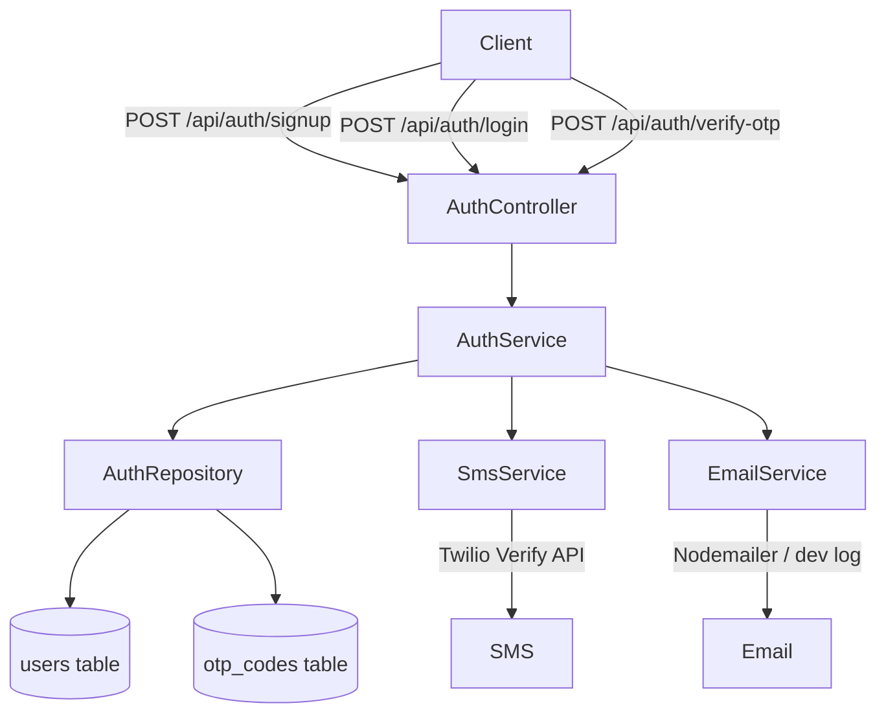

# Design Document: Customer Authentication Flow

## Overview

This document describes the technical design for the Customer Authentication Flow in the LocalLoom backend. The feature extends the existing `auth` module to support a dedicated customer signup endpoint, multi-channel OTP delivery (SMS primary, email fallback), and email-based OTP login. It reuses the existing JWT token issuance, refresh, and logout infrastructure.

The flow is three steps:
1. **Signup** — `POST /api/auth/signup` — creates a user (customer or tradie) and sends an OTP via SMS (email fallback).
2. **Login (OTP initiation)** — `POST /api/auth/login` — sends an OTP to phone or email for an existing user.
3. **OTP Verification** — `POST /api/auth/verify-otp` — validates the OTP and returns a JWT Token_Pair.

Token refresh and logout reuse the existing `/api/auth/refresh-token` and `/api/auth/logout` endpoints unchanged.

---

## Architecture

The feature follows the existing layered architecture: Controller → Service → Repository → Model/DB, with a new `EmailService` added alongside the existing `SmsService`.



### Key Design Decisions

- **No new module** — all new endpoints are added to the existing `auth` module. New controller methods, service methods, validation schemas, and route registrations are added to the existing files.
- **EmailService mirrors SmsService** — same dev-mode pattern: if credentials are absent, log to console and return `true`. This keeps the two services symmetric and easy to swap.
- **OTP channel stored in DB** — the `otp_codes` table gains a nullable `email` column. Either `phone` or `email` is populated per record; the other is NULL. This allows the repository to query by the correct channel without ambiguity.
- **Nodemailer for email** — Nodemailer is the standard Node.js email library, requires no new paid service in dev, and supports SMTP providers (SendGrid, SES, etc.) in production via environment variables.

---

## Components and Interfaces

### New DTOs (`auth.interface.ts`)

```typescript
export interface UserSignupDto {
  fullName: string;
  phone: string;
  role: 'customer' | 'tradie';
  email?: string;
  profilePhotoUrl?: string; // resolved by controller from multer upload
}

export interface UserLoginDto {
  identifier: string;
  identifierType: 'phone' | 'email';
}

export interface UserVerifyOtpDto {
  identifier: string;
  identifierType: 'phone' | 'email';
  code: string;
}
```

### New Validation Schemas (`auth.validation.ts`)

```typescript
export const userSignupSchema = Joi.object({
  fullName: Joi.string().trim().min(2).max(100).required(),
  phone: Joi.string().pattern(/^\+[1-9]\d{6,14}$/).required(),
  role: Joi.string().valid('customer', 'tradie').required(),
  email: Joi.string().email().lowercase().trim().optional(),
});

export const userLoginSchema = Joi.object({
  identifier: Joi.string().required(),
  identifierType: Joi.string().valid('phone', 'email').required(),
}).when(Joi.object({ identifierType: 'phone' }).unknown(), {
  then: Joi.object({ identifier: Joi.string().pattern(/^\+[1-9]\d{6,14}$/).required() }),
}).when(Joi.object({ identifierType: 'email' }).unknown(), {
  then: Joi.object({ identifier: Joi.string().email().required() }),
});

export const userVerifyOtpSchema = Joi.object({
  identifier: Joi.string().required(),
  identifierType: Joi.string().valid('phone', 'email').required(),
  code: Joi.string().length(6).required(),
});
```

### New Controller Methods (`auth.controller.ts`)

```typescript
userSignup = asyncHandler(async (req: Request, res: Response) => {
  const dto: UserSignupDto = {
    fullName: req.body.fullName,
    phone: req.body.phone,
    role: req.body.role,
    email: req.body.email,
    profilePhotoUrl: req.file ? buildFileUrl(req) : undefined,
  };
  const result = await this.authService.userSignup(dto);
  ApiResponse.created(res, result, 'OTP sent successfully');
});

userLogin = asyncHandler(async (req: Request, res: Response) => {
  const dto: UserLoginDto = req.body;
  const result = await this.authService.userLogin(dto);
  ApiResponse.success(res, result, AUTH_MESSAGES.OTP_SENT);
});

userVerifyOtp = asyncHandler(async (req: Request, res: Response) => {
  const dto: UserVerifyOtpDto = req.body;
  const result = await this.authService.userVerifyOtp(dto);
  ApiResponse.success(res, result, AUTH_MESSAGES.LOGIN_SUCCESS);
});
```

### New Service Methods (`auth.service.ts`)

```typescript
async userSignup(dto: UserSignupDto): Promise<{ phone: string; email?: string }>
async userLogin(dto: UserLoginDto): Promise<{ identifierType: string; maskedIdentifier: string }>
async userVerifyOtp(dto: UserVerifyOtpDto): Promise<{ user: User; tokens: TokenPair }>
```

### New Repository Methods (`auth.repository.ts`)

```typescript
async findUserByEmail(email: string): Promise<User | null>  // already exists
async createOtpWithEmail(data: { email: string; code: string; purpose: string; expiresAt: Date }): Promise<OtpCode>
async findLatestValidOtpByEmail(email: string, purpose: string): Promise<OtpCode | null>
async invalidateOtpsForEmail(email: string, purpose: string): Promise<void>
```

### EmailService (`src/services/email.service.ts`)

```typescript
export class EmailService {
  async sendOtp(email: string, code: string): Promise<boolean>
}
```

Mirrors `SmsService` pattern:
- If `EMAIL_HOST` / `EMAIL_USER` / `EMAIL_PASS` env vars are set → use Nodemailer SMTP transport.
- Otherwise → log `[DEV] OTP for <email>: <code>` and return `true`.

### New Routes (`auth.routes.ts`)

```
POST /api/auth/signup     — multer upload (profilePhoto), validate(userSignupSchema), controller.userSignup
POST /api/auth/login      — authLimiter, validate(userLoginSchema), controller.userLogin
POST /api/auth/verify-otp — authLimiter, validate(userVerifyOtpSchema), controller.userVerifyOtp
```

---

## Data Models

### `otp_codes` table — schema extension

A new migration adds a nullable `email` column. The existing `phone` column is changed to `allowNull: true` so that email-only OTP records can be created.

**New migration file:** `20260416100004-add-email-to-otp-codes.js`

```javascript
module.exports = {
  async up(queryInterface, Sequelize) {
    await queryInterface.addColumn('otp_codes', 'email', {
      type: Sequelize.STRING(255),
      allowNull: true,
      after: 'phone',
    });
    await queryInterface.changeColumn('otp_codes', 'phone', {
      type: Sequelize.STRING(20),
      allowNull: true,
    });
    await queryInterface.addIndex('otp_codes', ['email']);
  },
  async down(queryInterface, Sequelize) {
    await queryInterface.removeIndex('otp_codes', ['email']);
    await queryInterface.removeColumn('otp_codes', 'email');
    await queryInterface.changeColumn('otp_codes', 'phone', {
      type: Sequelize.STRING(20),
      allowNull: false,
    });
  },
};
```

### `OtpCode` model — updated attributes

```typescript
export interface IOtpCodeAttributes {
  id: string;
  phone: string | null;   // nullable — populated for SMS OTPs
  email: string | null;   // new — populated for email OTPs
  code: string;
  purpose: string;
  attempts: number;
  maxAttempts: number;
  isUsed: boolean;
  expiresAt: Date;
  createdAt: Date;
}
```

### `users` table — no schema changes

The `users` table already has `email` (nullable), `avatar` (nullable), `phone` (unique), `name`, `role`, `status`, `isPhoneVerified`, `lastLogin`, and `refreshToken`. No migration needed.

### Environment variables — additions

```
# Email (optional — dev mode if absent)
EMAIL_HOST=smtp.sendgrid.net
EMAIL_PORT=587
EMAIL_USER=apikey
EMAIL_PASS=<sendgrid_api_key>
EMAIL_FROM=noreply@localloom.com.au
```

---

## Correctness Properties

*A property is a characteristic or behavior that should hold true across all valid executions of a system — essentially, a formal statement about what the system should do. Properties serve as the bridge between human-readable specifications and machine-verifiable correctness guarantees.*

### Property 1: Signup creates user with correct initial state

*For any* valid `(fullName, phone, role)` triple where `role` is `'customer'` or `'tradie'`, calling `userSignup` SHALL produce a user record where `role` equals the submitted role, `status = 'active'`, and `isPhoneVerified = false`.

**Validates: Requirements 1.1**

---

### Property 2: Signup stores email when provided, NULL when absent

*For any* valid signup input, if `email` is provided then `users.email` equals the submitted email; if `email` is omitted then `users.email` is NULL.

**Validates: Requirements 1.2**

---

### Property 3: Signup maps fullName to users.name

*For any* valid `fullName` string (2–100 chars), after a successful signup, `users.name` equals the submitted `fullName`.

**Validates: Requirements 1.9**

---

### Property 4: Duplicate phone returns 409

*For any* phone number already present in the `users` table, a signup attempt with that phone SHALL return a 409 Conflict with message `'Phone number already registered'`.

**Validates: Requirements 1.4**

---

### Property 5: Duplicate email returns 409

*For any* email address already present in the `users` table, a signup attempt with that email SHALL return a 409 Conflict with message `'Email already registered'`.

**Validates: Requirements 1.5**

---

### Property 6: Signup response is 201 with no tokens

*For any* successful signup, the HTTP response status SHALL be 201 and the response body SHALL contain `phone` but SHALL NOT contain `accessToken` or `refreshToken`.

**Validates: Requirements 1.8**

---

### Property 7: Invalid fullName is rejected

*For any* string with length < 2 or > 100 characters (including empty string), a signup request with that `fullName` SHALL be rejected with a 400 validation error.

**Validates: Requirements 1.10**

---

### Property 8: Invalid phone format is rejected at signup and login

*For any* string that does not match the E.164 pattern `^\+[1-9]\d{6,14}$`, a signup or login request using that string as `phone` / `identifier` SHALL be rejected with a 400 validation error.

**Validates: Requirements 1.11, 2.9**

---

### Property 9: Login invalidates old OTPs and creates a new one

*For any* registered user with N existing unused OTPs for purpose `'login'`, after a successful `userLogin` call, all N previous OTPs SHALL have `isUsed = true` and exactly one new OTP record SHALL exist with `isUsed = false`.

**Validates: Requirements 2.1, 2.2**

---

### Property 10: Login for non-existent identifier returns 404

*For any* phone or email not present in the `users` table, a `userLogin` request SHALL return 404 with the appropriate message (`'No account found with this phone number'` or `'No account found with this email address'`).

**Validates: Requirements 2.3, 2.4**

---

### Property 11: Login for suspended or deleted account returns 403

*For any* user with `status = 'suspended'` or `status = 'deleted'`, a `userLogin` request SHALL return 403 with the corresponding message.

**Validates: Requirements 2.5, 2.6**

---

### Property 12: Login response contains masked identifier

*For any* valid login request, the response body SHALL contain `identifierType` and a masked version of the identifier where the masking pattern is applied (phone: `+XX****YYYY`, email: `XX***@domain`).

**Validates: Requirements 2.7**

---

### Property 13: OTP expiry is set to configured expiryMinutes

*For any* OTP created by `userSignup` or `userLogin`, `otp_codes.expiresAt` SHALL equal the creation time plus `env.otp.expiryMinutes` minutes (within a 1-second tolerance).

**Validates: Requirements 2.11**

---

### Property 14: OTP max_attempts is always 3

*For any* OTP record created by the system, `otp_codes.max_attempts` SHALL equal 3.

**Validates: Requirements 2.12**

---

### Property 15: Successful OTP verification returns Token_Pair and marks OTP used

*For any* valid `(identifier, identifierType, code)` triple where the OTP is unused and unexpired, `customerVerifyOtp` SHALL return an object containing `accessToken`, `refreshToken`, and `user`, and the OTP record SHALL have `isUsed = true` afterwards.

**Validates: Requirements 3.1**

---

### Property 16: Wrong OTP code increments attempts by exactly 1

*For any* OTP record with `attempts < max_attempts`, submitting an incorrect code SHALL increment `otp_codes.attempts` by exactly 1 and return 400 with `'Invalid or expired OTP'`.

**Validates: Requirements 3.2**

---

### Property 17: Exhausted OTP attempts returns specific error without further increment

*For any* OTP record where `attempts >= max_attempts`, submitting any code SHALL return 400 with `'Maximum OTP attempts exceeded. Please request a new code'` and SHALL NOT increment `attempts` further.

**Validates: Requirements 3.3**

---

### Property 18: Expired OTP returns expiry error

*For any* OTP record where `expiresAt < now`, `customerVerifyOtp` SHALL return 400 with `'OTP has expired. Please request a new code'`.

**Validates: Requirements 3.4**

---

### Property 19: Successful phone OTP verification sets isPhoneVerified = true

*For any* user verified via `identifierType = 'phone'`, after successful OTP verification, `users.isPhoneVerified` SHALL be `true`.

**Validates: Requirements 3.5**

---

### Property 20: JWT payload contains correct fields

*For any* user after successful OTP verification, decoding the returned `accessToken` with `env.jwt.accessSecret` SHALL yield a payload containing `userId = user.id`, `role = user.role`, and `userType = 'user'`.

**Validates: Requirements 3.7, 3.8**

---

### Property 21: OTP channel exclusivity invariant

*For any* OTP record created by the system, exactly one of `phone` or `email` SHALL be non-NULL; the other SHALL be NULL.

**Validates: Requirements 4.1**

---

### Property 22: Email OTP lookup uses email field with correct filters

*For any* email-based OTP record, `findLatestValidOtpByEmail` SHALL return the record when it is unused and unexpired, and SHALL NOT return it when it is used or expired.

**Validates: Requirements 4.3**

---

### Property 23: Email OTP invalidation marks all prior unused records

*For any* email with N unused OTP records for purpose `'login'`, calling `invalidateOtpsForEmail` SHALL set `isUsed = true` on all N records.

**Validates: Requirements 4.4**

---

### Property 24: EmailService throws on provider error

*For any* provider-level error thrown by the SMTP transport, `EmailService.sendOtp` SHALL catch it, log it, and re-throw an exception with a descriptive message.

**Validates: Requirements 5.4**

---

### Property 25: Email body contains OTP code and expiry notice

*For any* `(email, code)` pair, the email body generated by `EmailService` SHALL contain the `code` string and text indicating the expiry duration (e.g., "5 minutes").

**Validates: Requirements 5.5**

---

### Property 26: Token refresh returns new Token_Pair for valid token

*For any* user with a valid, unexpired refresh token and `status = 'active'`, calling `/api/auth/refresh-token` SHALL return a new `accessToken` and `refreshToken`.

**Validates: Requirements 6.1**

---

### Property 27: Invalid or expired refresh token returns 401

*For any* string that is not a valid, unexpired refresh token signed with `env.jwt.refreshSecret`, `/api/auth/refresh-token` SHALL return 401 with `'Invalid token'`.

**Validates: Requirements 6.2**

---

### Property 28: Logout sets refresh_token to NULL

*For any* authenticated user, calling `/api/auth/logout` SHALL set `users.refresh_token` to NULL in the database.

**Validates: Requirements 6.3**

---

### Property 29: Suspended user cannot refresh token

*For any* user with `status = 'suspended'`, a token refresh request SHALL return 403 with `'Account has been suspended'`.

**Validates: Requirements 6.4**

---

## Error Handling

| Scenario | HTTP Status | Message |
|---|---|---|
| Phone already registered | 409 | `'Phone number already registered'` |
| Email already registered | 409 | `'Email already registered'` |
| Phone not found at login | 404 | `'No account found with this phone number'` |
| Email not found at login | 404 | `'No account found with this email address'` |
| Account suspended | 403 | `'Account has been suspended'` |
| Account deleted | 403 | `'Account has been deleted'` |
| Invalid/expired OTP | 400 | `'Invalid or expired OTP'` |
| OTP max attempts exceeded | 400 | `'Maximum OTP attempts exceeded. Please request a new code'` |
| OTP expired | 400 | `'OTP has expired. Please request a new code'` |
| Invalid refresh token | 401 | `'Invalid token'` |
| Validation failure | 400 | Joi validation message |
| SMS delivery failure (no email fallback available) | 500 | `'Failed to send OTP'` |
| Email delivery failure | 500 | `'Failed to send OTP via email'` |

**SMS → Email fallback logic (signup only):**

```
try {
  await smsService.sendOtp(phone);
} catch (smsError) {
  if (dto.email) {
    await emailService.sendOtp(dto.email, code);  // fallback
  } else {
    throw smsError;  // no fallback available
  }
}
```

All exceptions propagate through the existing `asyncHandler` wrapper and are caught by the global error handler in `app.ts`.

---

## Testing Strategy

### Unit Tests

Focus on specific examples, edge cases, and error conditions:

- `AuthService.userSignup` — duplicate phone, duplicate email, missing email, SMS failure with email fallback, SMS failure without fallback, role = 'customer', role = 'tradie'.
- `AuthService.userLogin` — phone not found, email not found, suspended user, deleted user.
- `AuthService.userVerifyOtp` — wrong code, max attempts, expired OTP, dev mode bypass.
- `EmailService.sendOtp` — dev mode (no credentials), provider error.
- Identifier masking utility — phone masking, email masking.
- Validation schemas — boundary values for `fullName` length, E.164 format, email format, code length, valid role values.

### Property-Based Tests

Property-based testing is appropriate here because the feature contains pure business logic functions (OTP generation, JWT payload construction, identifier masking, validation) with large input spaces where edge cases matter.

**Library:** [fast-check](https://github.com/dubzzz/fast-check) (TypeScript-native, no additional runtime dependency needed in devDependencies).

**Configuration:** Minimum 100 runs per property (`{ numRuns: 100 }`).

**Tag format:** `// Feature: customer-auth, Property N: <property_text>`

Each correctness property in this document maps to a single property-based test. Key generators needed:

- `fc.string({ minLength: 2, maxLength: 100 })` — valid fullName
- `fc.string({ minLength: 0, maxLength: 1 })` and `fc.string({ minLength: 101 })` — invalid fullName
- E.164 phone generator: `fc.string({ minLength: 7, maxLength: 15 }).map(s => '+1' + s.replace(/\D/g, '').slice(0, 10))`
- `fc.emailAddress()` — valid email
- `fc.string({ minLength: 6, maxLength: 6 }).filter(s => s !== env.otp.devCode)` — wrong OTP code
- `fc.string({ minLength: 1, maxLength: 5 }).or(fc.string({ minLength: 7 }))` — invalid code length

### Integration Tests

- Full signup → login → verify-otp flow against a test database, for both `role = 'customer'` and `role = 'tradie'`.
- Email delivery with a real SMTP test account (e.g., Ethereal) or mocked transport.
- Migration: verify `otp_codes.email` column exists after running migrations.
